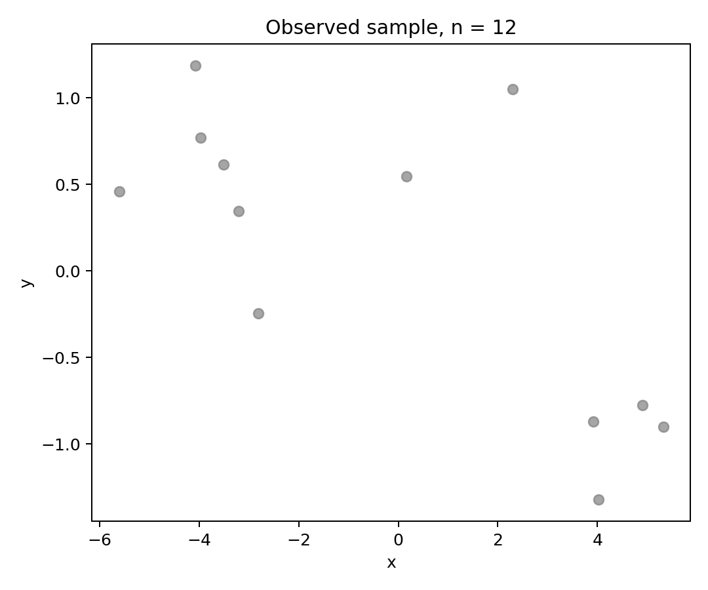
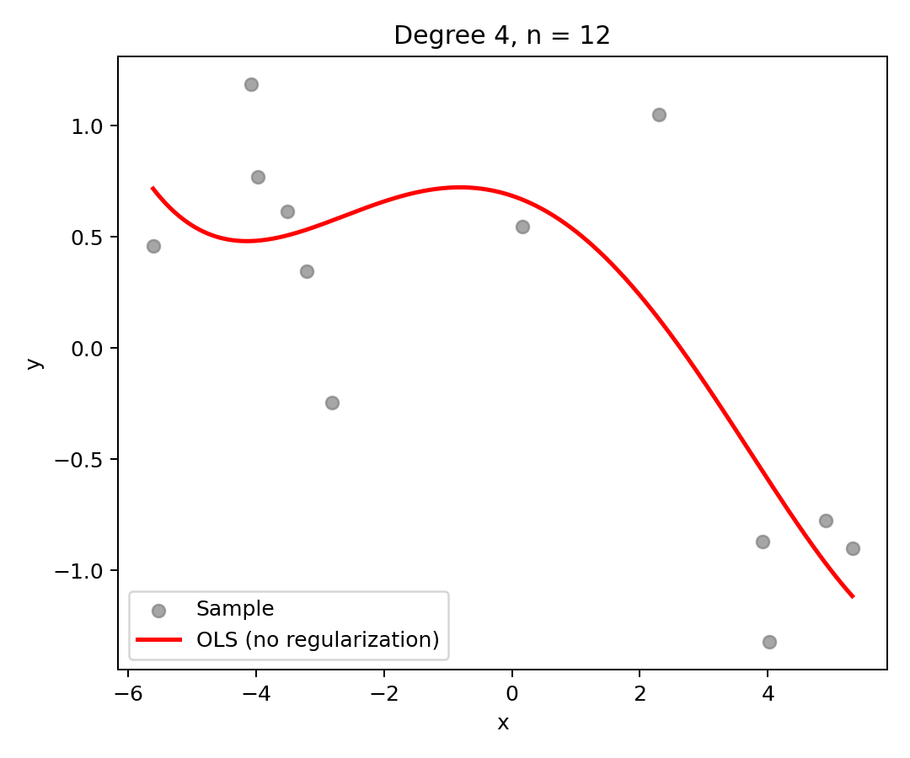
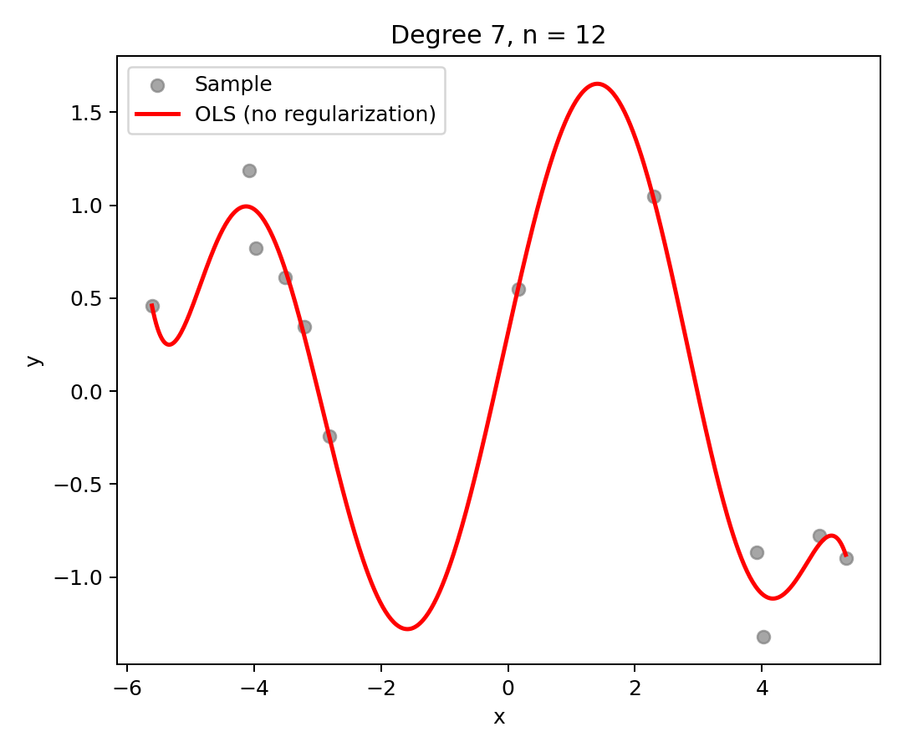
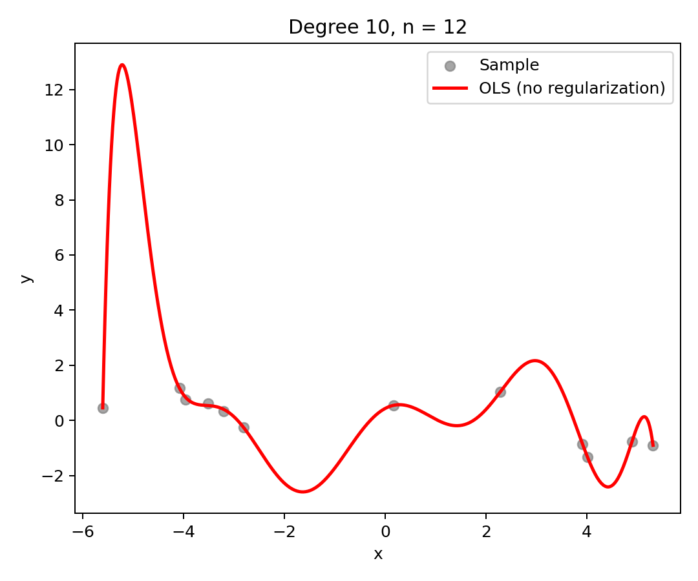
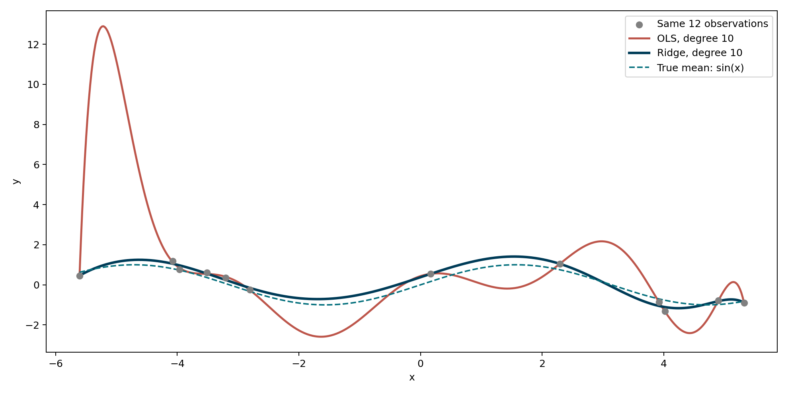
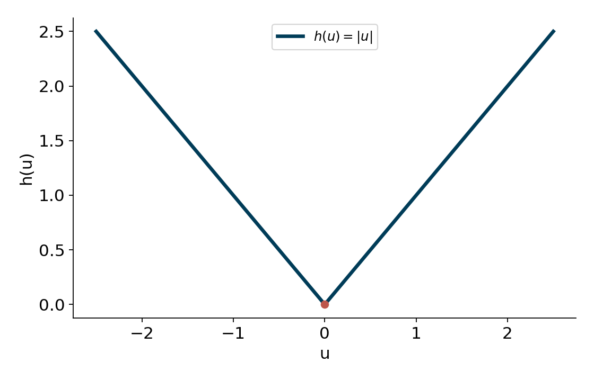
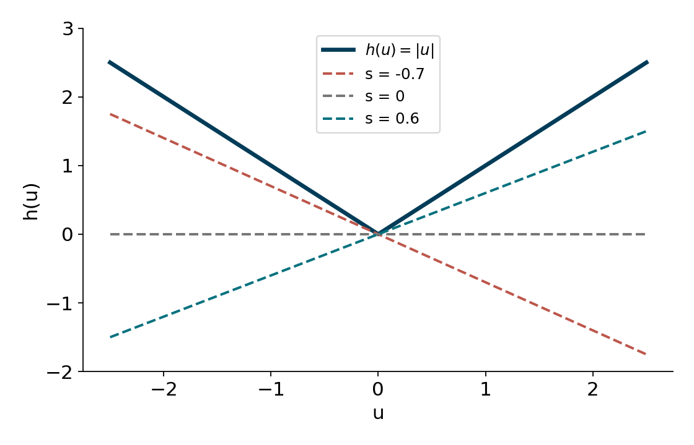
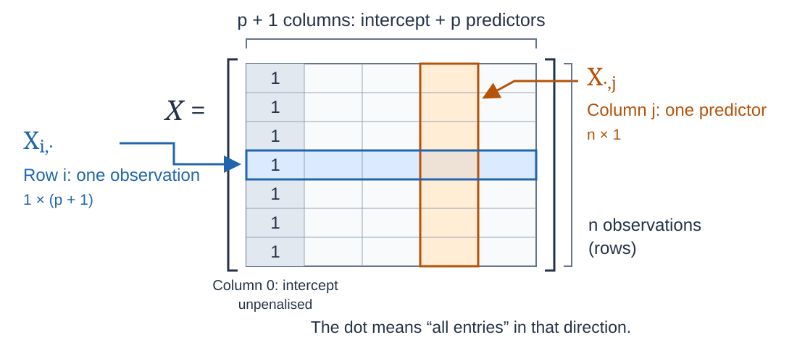
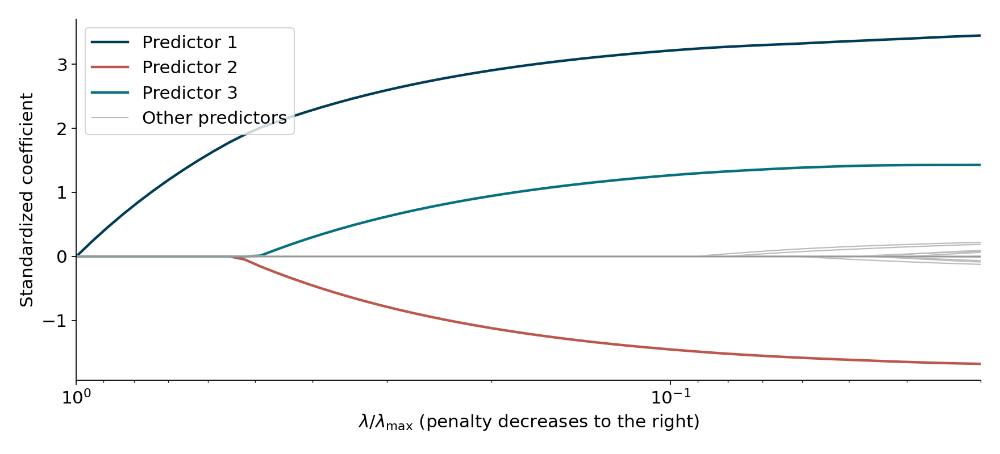
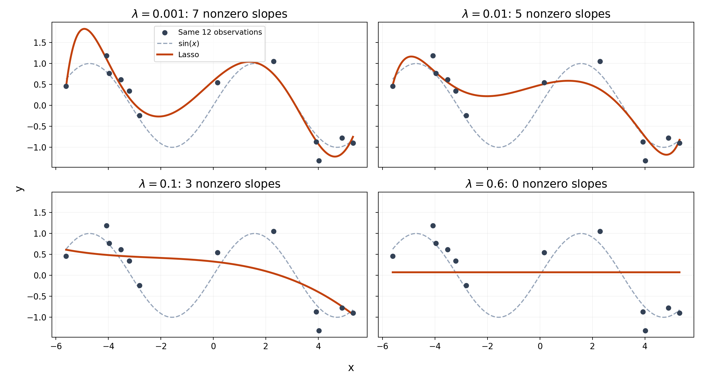

$\newcommand{\R}{\mathbb{R}}$

# Fundamentals of Nonlinear Optimization I: Basic Multivariate Calculus

## Euclidian Norm

::: {#def-euclidean-norm name="Euclidean Norm -$L_2$ Norm"}
For a vector ${x} = (x_1, x_2, \dots, x_n) \in \R^n$, the **Euclidean norm** (or $2$-norm) is defined as:


$$ \|{x}\|_2 = \sqrt{\sum_{i=1}^{n} x_i^2} = \sqrt{x_1^2 + x_2^2 + \cdots + x_n^2} $$

Some people writes $\| \cdot \|$ if it is clear from the context that we are using the Euclidean norm
:::

::: {.box title = "Properties"}

For any ${x}, {y} \in \R^n$ and scalar $\alpha \in \R$:

1.  **Non-negativity:** $\|{x}\|_2 \ge 0$, and $\|{x}\|_2 = 0 \iff {x} = \mathbf{0}$.
2.  **Absolute Homogeneity:** $\|\alpha {x}\|_2 = |\alpha| \|{x}\|_2$.
3.  **Triangle Inequality:** $\|{x} + {y}\|_2 \le \|{x}\|_2 + \|\mathbf{y}\|_2$.

:::

## Inner Product

::: {#def-inner-product name="Inner Product (Dot Product)"}
For two vectors ${x} = (x_1, x_2, \dots, x_n)$ and ${y} = (y_1, y_2, \dots, y_n)$ in $\R^n$, the **inner product** (or **dot product**) is defined as:

$$\langle {x}, {y} \rangle
=
\sum_{i=1}^{n} x_i y_i
=
x_1y_1 + x_2y_2 + \cdots + x_ny_n.$$

The Euclidean norm is induced by the inner product:


$$\|{x}\|_2 = \sqrt{\langle {x}, {x}\rangle }.$$
:::

::: {.box title="Properties"}
For any ${x}, {y}, {z} \in \R^n$ and scalar $\alpha \in \R$:

1.  **Symmetry:** $\langle {x}, {y} \rangle = \langle {y}, {x} \rangle$.
2.  **Linearity:** $\langle \alpha {x} + {y}, {z} \rangle = \alpha \langle {x}, {z} \rangle + \langle {y}, {z} \rangle$.
3.  **Positive Definiteness:** $\langle {x}, {x} \rangle \ge 0$, and $\langle {x}, {x} \rangle = 0 \iff {x} = \mathbf{0}$.
4.  **Cauchy--Schwarz Inequality:** $|\langle {x}, {y} \rangle| \le \|{x}\|_2 \|{y}\|_2$.
:::

## Smoothness: Continuity

::: {#def-Continuity name="Continuity"}
A function $F:U\subseteq \R^n \to \R^m$ is called continuous in $x$ if for every sequence $x_k\in \R^n$ wuch that $\lim_{k\to \infty}\|x_k-x\|= 0$, then $$\lim_{k\to \infty} \|F(X_k)- F(x)\|=0$$
:::

A stronger notion is being Lipschitz continuous

::: {#def-Lipschitz-Continuity name="Lipschitz Continuity"}
A function $F:U\subseteq \R^n \to \R^m$ is called Lispchitz continuous if there exists $L>0$ such that $$ \|F(x_k)- F(x)\|\leq L \|x_k-x\|$$
:::

The notion of Lipschitz continuity is a sort of **practical continuity**: while nobody discuss that jumps are clear discontinuities, there are other type of discontinuities

## 2. The Pathological Case

Consider the function $f(t) = \sin\left(\frac{1}{1-t}\right)$ on $[0,1)$. Define $f(1) = 0$.

Even without a jump, as $t \to 1$, the function compresses an infinite number of waves into a finite space. It lacks a limit at $1$. <br> <br> <br> <br>

```{ojs}
//| echo: false
//| fig-align: center

html`<div style="display: flex; justify-content: center; width: 100%;">
${Plot.plot({
  width: 900,
  height: 420,
  y: {domain: [-1.2, 1.2], label: "f(t)"},
  x: {domain: [0.9, 1], label: "t"},
  marks: [
    Plot.line(d3.range(0.9, 0.9995, 0.0001).map(t => ({t, y: Math.sin(1/(1-t))})), {
      x: "t", y: "y", stroke: "#333", strokeWidth: 1
    }),
    Plot.ruleX([1], {stroke: "red", strokeDasharray: "4,4"})
  ]
})}
</div>`
```

In practice, we won't find functions as bad as the previous one, but still function can be very wavy, making it hard of us to predict the behaviour in a vecinity. This is awful for algorithm that work locally, as they need a predictable of the function around the current point.

## Intuition for Lipschitz continuity

Consider the function $t\to \sin(ct)$

```{ojs}
//| echo: false

// 1. The Inputs (Stacked at the top)
viewof c = Inputs.range([0.1, 5], {
  value: 1.0, step: 0.1, label: "Wave Frequency (c):"
});

viewof L = Inputs.range([0.1, 5], {
  value: 1.5, step: 0.1, label: "Lipschitz Limit (L):"
});

viewof x0 = Inputs.range([0, 10], {
  value: 5, step: 0.1, label: "Test Point (x₀):"
});

// 2. The Math for f(t) = sin(c * t)
// The maximum derivative of sin(ct) is exactly c.
maxSlope = c; 
isLipschitz = maxSlope <= L;

data = d3.range(0, 10.05, 0.05).map(t => {
  let ft = Math.sin(c * t);
  let coneUpper = Math.sin(c * x0) + L * Math.abs(t - x0);
  let coneLower = Math.sin(c * x0) - L * Math.abs(t - x0);
  return { t, ft, coneUpper, coneLower };
});

// 3. The Plot (Centered below the sliders)
html`<div style="display: flex; justify-content: center; width: 100%; margin-top: 15px;">
  ${Plot.plot({
    width: 900,
    height: 420, 
    
    style: {
      fontSize: "18px",     
      fontFamily: "system-ui, sans-serif" 
    },
    
    // Domain widened to [-2, 2] so the standard sine wave (-1 to 1) fits nicely
    y: {domain: [-2, 2], label: "f(t)", labelOffset: 45},
    x: {domain: [0, 10], label: "t"},
    grid: true,
    
    marks: [
      Plot.areaY(data, {
        x: "t", y1: "coneLower", y2: "coneUpper", 
        fill: isLipschitz ? "#bfdbfe" : "#fecaca", fillOpacity: 0.5
      }),
      Plot.line(data, {
        x: "t", y: "ft", 
        stroke: isLipschitz ? "#16a34a" : "#dc2626", strokeWidth: 3
      }),
      Plot.dot([{t: x0, y: Math.sin(c * x0)}], {
        x: "t", y: "y", r: 8, fill: "#1e293b"
      }),
      Plot.text([{t: 0.2, y: 1.8}], {
        x: "t", y: "y", 
        text: () => `Max Slope: ${maxSlope.toFixed(2)} | Threshold: ${L.toFixed(2)}`,
        fontSize: 22, 
        fontWeight: "bold", 
        textAnchor: "start"
      }),
      Plot.text([{t: 0.2, y: 1.5}], {
        x: "t", y: "y", 
        text: () => isLipschitz ? "Status: L-Lipschitz Maintained" : "Status: Cone Pierced! (Function too wavy)",
        fontSize: 22, 
        fontWeight: "bold", 
        textAnchor: "start",
        fill: isLipschitz ? "#16a34a" : "#dc2626"
      })
    ]
  })}
</div>`
```

## Smoothness: Derivative - Jacobian

::: {#def-Jacobian name="Differentiability and Jacobian"}
A function $F:U\subseteq \R^n \to \R^m$ is called differentiable in $x$ if there exists a linear mapping $F'_x:\R^n \to \R^m$ with

$$\lim_{\|h\|\to 0} \frac{\|F(x+h)-F(x)-F'_x(h)\|}{\|h\|}=0$$

The matrix representation of $F'_x$ is called the Jacobi matrix of $F$, or **Jacobian**, which is given by

$$J_F = \begin{bmatrix}
\frac{\partial f_1}{\partial x_1} & \frac{\partial f_1}{\partial x_2} & \cdots & \frac{\partial f_1}{\partial x_n} \\[1ex]
\frac{\partial f_2}{\partial x_1} & \frac{\partial f_2}{\partial x_2} & \cdots & \frac{\partial f_2}{\partial x_n} \\[1ex]
\vdots & \vdots & \ddots & \vdots \\[1ex]
\frac{\partial f_m}{\partial x_1} & \frac{\partial f_m}{\partial x_2} & \cdots & \frac{\partial f_m}{\partial x_n}
\end{bmatrix}$$
:::

Then $F'_x = J_F(x)$.

## Smoothness: Gradient and Hessian

In the particular case that $m=1$, the transpose of the Jacobian is the so-called **gradient** $\nabla$:

::: {.box title = "Gradient"}

$$\nabla f = \begin{bmatrix} \frac{\partial f}{\partial x_1} \\[1ex] \frac{\partial f}{\partial x_2} \\[1ex] \vdots \\[1ex] \frac{\partial f}{\partial x_n} \end{bmatrix}$$

:::

but in general writting gradient as a row or column has little importance.

- We say that $f$ is continuously differentiable if $\nabla f$ is a continuous function
- We say that $f$ is $L$-smooth if $\nabla f$ is Lipschitz continuous with constant $L$

## Smoothness: Directional Derivative

Another important concept is the **Directional Derivative**

::: {.box title = "Directional Derivative"}

Given a vector $v\in \R^n$ we can show that $$\lim_{\lambda\to 0} \frac{f(x+\lambda v)-f(x)}{\lambda} = \langle \nabla f(x) , v\rangle$$

which is called the **directional derivative** in the direction of $v$. 

:::

## Smoothness: Gradient and Hessian

Let $f:\R^n \to\R$. The **Hessian** of $f$ is the matrix of second-order partial derivatives. Equivalently, it is the **Jacobian of the gradient**:

::: eqbox
$$(Hf)(x)=J(\nabla f)(x)=
\begin{bmatrix}
\frac{\partial^2 f}{\partial x_1^2} &
\frac{\partial^2 f}{\partial x_1\partial x_2} &
\cdots &
\frac{\partial^2 f}{\partial x_1\partial x_n} \\[0.4em]
\frac{\partial^2 f}{\partial x_2\partial x_1} &
\frac{\partial^2 f}{\partial x_2^2} &
\cdots &
\frac{\partial^2 f}{\partial x_2\partial x_n} \\
\vdots & \vdots & \ddots & \vdots \\
\frac{\partial^2 f}{\partial x_n\partial x_1} &
\frac{\partial^2 f}{\partial x_n\partial x_2} &
\cdots &
\frac{\partial^2 f}{\partial x_n^2}
\end{bmatrix}.$$
:::

::: {.box title="Remark"}
1.  Some people writes $\nabla^2$ instead of $H$.
2.  If $f$ has **continuous** second-order partial derivatives, then the Hessian is **symmetric**:

$$H f(x)=\big(Hf(x)\big)^\top,$$

i.e.,

$$\frac{\partial^2 f}{\partial x_i\partial x_j}=\frac{\partial^2 f}{\partial x_j\partial x_i}.$$
:::

## Smoothness: Key Results

::: {#thm-mvt-1 name="Mean Value Theorem I"}
Let $f : \R^n \to \R$ be smooth. Then for any $x, y \in \R^n$, there exists a $\xi := y + \gamma(x - y)$ with $\gamma \in (0,1)$ such that:

$$ f(y) = f(x) + \langle \nabla f(\xi), y - x \rangle $$
:::

::: {#thm-mvt-2 name="Mean Value Theorem II: Integral Form"}
Let $F : \R^n \to \R^m$ be continuously differentiable. Then for any $x, y \in \R^n$:

$$ F(y) = F(x) + \int_0^1 J_F(x + \gamma(y - x))(y - x) d\gamma $$

and for $m=1$, the previous equations reads

$$F(y) - F(x) = \int_0^1 \langle \nabla F(y + t(x-y)), x-y \rangle \, dt$$
:::

## Smoothness: Key Results {.scrollable}

::: {#cor-descent-lemma name="Descent Lemma"}
Let $f : \R^n \to \R$ be $L$-smooth. Then for any $x, y \in \R^n$,

$$ f(x) \le f(y) + \langle \nabla f(y), x - y \rangle + \frac{L}{2} \|x - y\|^2 $$
:::

::: proofbox
By the mean value theorem II (exchaing the role of $x$ and $y$), we can write the exact difference as an integral: $$ f(x) - f(y) = \int_0^1 \langle \nabla f(y + t(x-y)), x-y \rangle \, dt $$

We can subtract and add $\langle \nabla f(y), x-y \rangle$ inside the integral: $$ f(x) - f(y) = \langle \nabla f(y), x-y \rangle + \int_0^1 \langle \nabla f(y + t(x-y)) - \nabla f(y), x-y \rangle \, dt $$

Applying the Cauchy-Schwarz inequality to the integral term gives: $$ f(x) - f(y) - \langle \nabla f(y), x-y \rangle \le \int_0^1 \|\nabla f(y + t(x-y)) - \nabla f(y)\| \|x-y\| \, dt $$

By the definition of $L$-smoothness, the gradient is $L$-Lipschitz continuous, meaning: $$ \|\nabla f(y + t(x-y)) - \nabla f(y)\| \le L \|t(x-y)\| = Lt \|x-y\| $$

Substituting this upper bound into our integral: $$ \dots \le \int_0^1 Lt \|x-y\|^2 \, dt = L \|x-y\|^2 \int_0^1 t \, dt $$

Finally, evaluating the integral $\int_0^1 t \, dt = \frac{1}{2}$ yields the required result: $$ f(x) - f(y) - \langle \nabla f(y), x-y \rangle \le \frac{L}{2} \|x-y\|^2 $$
:::

# Fundamentals of Nonlinear Optimization II: Convex Analysis

## Open Set

:::::: columns
:::: {.column width="50%"}
We define the $\varepsilon$-ball around the point $x\in \R^n$ by

$$B_\varepsilon(x) = \{y\in \R^n: \|x-y\|\leq \varepsilon\}$$

::: {#def-open-set name="Open Sets"}
1.  We say that a point $x \in U\subseteq \R^n$ is an **interior point of** $U$ if there exists $\varepsilon > 0$ such that $B_{\varepsilon}(x) \subseteq U$

2.  We say $U\subseteq \R^n$ is an **open set** if every $x\in U$ is an interior point of $U$.
:::
::::

::: {.column .fragment width="50%"}
```{ojs}
//| echo: false

viewof openSetDemo = {
  // 1. Create the HTML layout 
  const container = html`
    <div>
      <div style="display: flex; justify-content: center; margin-bottom: 1rem;">
        <!-- touch-action: none prevents the page from scrolling while dragging -->
        <svg width="700" height="400" viewBox="0 0 300 250" style="background: #f8fafc; border-radius: 8px; border: 1px solid #e2e8f0; cursor: crosshair;">
        <text x="120" y="10" font-family="sans-serif" font-size="10" fill="#64748b" font-weight="bold">Example</text>
           <text x="15" y="42" font-family="sans-serif" font-size="10" fill="#64748b">Top & Left: Open (dashed) | Bottom & Right: Closed (solid)</text>
          
          <!-- The Set (Fill) -->
          <polygon points="60,70 240,70 240,200 60,200" fill="#bfdbfe" opacity="0.4" />
          
          <!-- Dashed (Excluded) Borders -->
          <path d="M 60 200 L 60 70 L 240 70" fill="none" stroke="#3b82f6" stroke-width="3" stroke-dasharray="6,6" />
          
          <!-- Solid (Included) Borders -->
          <path d="M 240 70 L 240 200 L 60 200" fill="none" stroke="#1d4ed8" stroke-width="4" />
          
          <!-- Dynamic Epsilon Ball and Point -->
          <circle id="ball" cx="150" cy="135" r="20" fill="#bbf7d0" opacity="0.6" stroke="#22c55e" stroke-width="1.5" />
          <circle id="point-x" cx="150" cy="135" r="3" fill="#0f172a" />
          <text id="point-label" x="156" y="139" font-style="italic" font-family="serif" font-weight="bold" font-size="12" fill="#0f172a">x</text>
          
          <!-- Status Text at the bottom -->
          <text id="status-text" x="15" y="235" font-family="sans-serif" font-size="12" font-weight="bold" fill="#16a34a"></text>
        </svg>
      </div>
      
      <!-- The Radius Slider -->
      <div style="display: flex; align-items: center; justify-content: center; gap: 15px; margin: 0 auto; max-width: 200px;">
        <span style="font-family: sans-serif; font-size: 2rem; white-space: nowrap; color: #334155;">Radius (ε):</span>
        <input id="radius-slider" type="range" min="2" max="50" step="1" value="20" style="width: 400px; margin: 0; cursor: pointer;">
      </div>
    </div>
  `;
  
  // 2. Select elements to update them dynamically
  const svg = container.querySelector("svg");
  const slider = container.querySelector("#radius-slider");
  const ball = container.querySelector("#ball");
  const pt_x = container.querySelector("#point-x");
  const pt_label = container.querySelector("#point-label");
  const statusText = container.querySelector("#status-text");
  
  // Start the point safely inside the set
  let currentPt = {x: 180, y: 135}; 
  
  // 3. The Math Engine: Calculates colors and text based on position
  function updateVisuals() {
    const r = slider.valueAsNumber;
    
    // Update graphic positions
    ball.setAttribute("cx", currentPt.x);
    ball.setAttribute("cy", currentPt.y);
    ball.setAttribute("r", r);
    pt_x.setAttribute("cx", currentPt.x);
    pt_x.setAttribute("cy", currentPt.y);
    pt_label.setAttribute("x", currentPt.x + 6);
    pt_label.setAttribute("y", currentPt.y + 4);
    
    // MATHEMATICS CHECK:
    // The set S is defined as X in (60, 240] and Y in (70, 200]
    const inSet = currentPt.x > 60 && currentPt.x <= 240 && currentPt.y > 70 && currentPt.y <= 200;
    
    // The ball is completely inside if all its edges are inside the boundary 
    // (Notice it must be STRICTLY less than the solid borders to not include boundary points)
    const ballContained = (currentPt.x - r > 60) && (currentPt.x + r < 240) && 
                          (currentPt.y - r > 70) && (currentPt.y + r < 200);
    
    if (!inSet) {
       ball.setAttribute("fill", "#e2e8f0"); // Gray
       ball.setAttribute("stroke", "#94a3b8");
       statusText.textContent = "Point x is outside the set S.";
       statusText.setAttribute("fill", "#64748b");
    } else if (ballContained) {
       ball.setAttribute("fill", "#bbf7d0"); // Green
       ball.setAttribute("stroke", "#22c55e");
       statusText.textContent = "✓ Ball is inside S, the point is an interior point";
       statusText.setAttribute("fill", "#16a34a");
    } else {
       ball.setAttribute("fill", "#fca5a5"); // Red
       ball.setAttribute("stroke", "#ef4444");
       statusText.textContent = "✗ Ball spills out.";
       statusText.setAttribute("fill", "#dc2626");
    }
  }
  
  // 4. Mouse / Touch Dragging Logic
  let isDragging = false;
  
  function handlePointer(e) {
    const rect = svg.getBoundingClientRect();
    // Convert physical screen pixels to internal SVG coordinates
    let x = (e.clientX - rect.left) * (300 / rect.width);
    let y = (e.clientY - rect.top) * (250 / rect.height);
    
    // MAGNETIC SNAP: If they drag near a border, snap it exactly onto the border!
    if (Math.abs(x - 240) < 8 && y >= 70 && y <= 200) x = 240; // Right solid border
    if (Math.abs(y - 200) < 8 && x >= 60 && x <= 240) y = 200; // Bottom solid border
    if (Math.abs(x - 60) < 8 && y >= 70 && y <= 200) x = 60;   // Left dashed border
    if (Math.abs(y - 70) < 8 && x >= 60 && x <= 240) y = 70;   // Top dashed border
    
    currentPt.x = x;
    currentPt.y = y;
    updateVisuals();
  }
  
  // Wire up the event listeners
  slider.addEventListener("input", updateVisuals);
  
  svg.addEventListener("pointerdown", (e) => {
    isDragging = true;
    svg.setPointerCapture(e.pointerId); // Keeps tracking even if mouse leaves the box slightly
    handlePointer(e);
  });
  
  svg.addEventListener("pointermove", (e) => {
    if (isDragging) handlePointer(e);
  });
  
  svg.addEventListener("pointerup", () => isDragging = false);
  svg.addEventListener("pointercancel", () => isDragging = false);
  
  updateVisuals(); // Paint the first frame
  
  return container;
}
```
:::
::::::

## Convex Sets

:::: {#def-convex-set name="Convex Sets"}
A set $C \subseteq \R^n$ is **convex** if, for every $x, y \in C$ and every $\lambda \in [0,1]$,

::: eqbox
$$\lambda x + (1-\lambda)y \in C.$$
:::

Equivalently, the line segment joining any two points of the set lies entirely inside the set.
::::

```{ojs}
//| echo: false

// 1. The images are now first so they render on top
html`
<div style="display: flex; gap: 2rem; justify-content: center; margin-bottom: 1.5rem;">
  
  <!-- CONVEX SET (Modify width="450" and height="305" below to change size) -->
  <svg width="900" height="500" viewBox="0 0 300 250" style="background: #f8fafc; border-radius: 8px; border: 1px solid #e2e8f0;">
    <text x="15" y="45" font-family="sans-serif" font-weight="bold" fill="#334155"> Convex Set</text>
    <g transform="translate(0, 20)">
      <ellipse cx="150" cy="130" rx="100" ry="80" fill="#bbf7d0" opacity="0.7" stroke="#22c55e" stroke-width="2"/>
      <line x1="100" y1="100" x2="200" y2="160" stroke="#64748b" stroke-dasharray="4"/>
      <circle cx="100" cy="100" r="4" fill="#0f172a" />
      <text x="85" y="95" font-style="italic" font-family="serif">x</text>
      <circle cx="200" cy="160" r="4" fill="#0f172a" />
      <text x="210" y="165" font-style="italic" font-family="serif">y</text>
      <circle cx="${100 * lambda + 200 * (1 - lambda)}" cy="${100 * lambda + 160 * (1 - lambda)}" r="6" fill="#ef4444" />
    </g>
  </svg>

  <!-- NON-CONVEX SET (Modify width="450" and height="375" below to match) -->
  <svg width="450" height="500" viewBox="0 0 300 250" style="background: #f8fafc; border-radius: 8px; border: 1px solid #e2e8f0;">
    <text x="15" y="45" font-family="sans-serif" font-weight="bold" fill="#334155">Non-Convex Set</text>
    <polygon points="80,50 140,50 140,150 220,150 220,210 80,210" fill="#fecaca" opacity="0.7" stroke="#ef4444" stroke-width="2" />
    <line x1="110" y1="100" x2="180" y2="180" stroke="#64748b" stroke-dasharray="4"/>
    <circle cx="110" cy="100" r="4" fill="#0f172a" />
    <text x="95" y="95" font-style="italic" font-family="serif">x</text>
    <circle cx="180" cy="180" r="4" fill="#0f172a" />
    <text x="190" y="185" font-style="italic" font-family="serif">y</text>
    <circle cx="${110 * lambda + 180 * (1 - lambda)}" cy="${100 * lambda + 180 * (1 - lambda)}" r="6" fill="#ef4444" />
  </svg>

</div>
`

// 2. The slider is now at the bottom
viewof lambda = {
  const slider = Inputs.range([0, 1], {value: 0.5, step: 0.01, label: "λ:"});
  slider.style.width = "fit-content";
  slider.style.margin = "0 auto";
  return slider;
}
```

## Convexity

:::::: columns
:::: {.column width="50%"}
::: {#def-convex-function}
Let $U \subset \R^n$ be convex. A function $f : U \to \R$ is called:

i.  **convex** on $U$, if for all $x, y \in U$ and all $\lambda \in [0,1]$, $$f (\lambda x + (1 - \lambda)y) \le \lambda f (x) + (1 - \lambda)f (y)$$

ii. **strictly convex** on $U$, if for all $x, y \in U$ with $x \neq y$ and all $\lambda \in (0,1)$, $$f (\lambda x + (1 - \lambda)y) < \lambda f (x) + (1 - \lambda)f (y)$$

iii. **strongly convex** on $U$, if there exists $\mu > 0$ (called the modulus of convexity) such that for all $x, y \in X$ and all $\lambda \in [0,1]$, $$f (\lambda x + (1 - \lambda)y) + \frac{\mu}{2} \lambda(1 - \lambda) \|x - y \|^2 \le \lambda f (x) + (1 - \lambda)f (y).$$
:::
::::

::: {.column width="50%"}

:::
::::::

## Gradient Inequalities {.scrollable}

::: {#thm-gradient}
Let $U \subset \R^n$ be open and convex and let $f:U \to \R$ be smooth (differentiable). Then $f$ is:

i.  **convex** if and only if for all $x,y \in U$, $$\langle \nabla f(y), x-y\rangle \leq f(x) - f(y)$$
ii. **strictly convex** if and only if for all $x,y \in U$ with $x\neq y$ $$\langle \nabla f(y), x-y\rangle < f(x) - f(y)$$
iii. **strongly convex** if and only if for all $x,y \in U$ we have $$\langle \nabla f(y), x-y\rangle+\frac{\mu}{2}\|x-y\|^2 \leq f(x) - f(y),$$ where $\mu$ is the modulus of convexity
:::

::: proofbox
**Proof of (i): Convexity**

**(**$\implies$): By convexity, for any $\lambda \in (0, 1]$: $$f(y + \lambda(x-y)) \le (1-\lambda)f(y) + \lambda f(x)$$ Rearranging and dividing by $\lambda$ gives: $$\frac{f(y + \lambda(x-y)) - f(y)}{\lambda} \le f(x) - f(y)$$ Taking the limit as $\lambda \to 0$, the left side becomes the directional derivative, yielding $\langle \nabla f(y), x-y \rangle$.

**(**$\impliedby$): Let $z = \lambda x + (1-\lambda)y$. Apply the assumption at $z$ for points $x$ and $y$: 1. $f(x) \ge f(z) + \langle \nabla f(z), x-z \rangle$ 2. $f(y) \ge f(z) + \langle \nabla f(z), y-z \rangle$

Multiply (1) by $\lambda$, (2) by $(1-\lambda)$, and add them. The gradient terms perfectly cancel since $\lambda(x-z) + (1-\lambda)(y-z) = 0$, leaving the definition of convexity.

**Proof of (ii): Strict Convexity**

**(**$\implies$): Suppose for contradiction that equality holds for $x \neq y$: $$f(x) - f(y) = \langle \nabla f(y), x-y \rangle$$ Let $z = y + \lambda(x-y)$. Strict convexity requires: $$f(z) < f(y) + \lambda(f(x) - f(y))$$ Substitute our equality assumption into this: $$f(z) < f(y) + \lambda\langle \nabla f(y), x-y \rangle = f(y) + \langle \nabla f(y), z-y \rangle$$ This strictly contradicts part (i), which states $f(z) - f(y) \ge \langle \nabla f(y), z-y \rangle$.

**(**$\impliedby$): This follows the exact same steps as the backward proof for (i). Because the assumed gradient inequalities are strict for $x \neq y$, adding them together produces a strictly convex inequality.

**Proof of (iii): Strong Convexity**

**Key insight:** A function $f(x)$ is strongly convex if and only if the function $g(x) = f(x) - \frac{\mu}{2}\|x\|^2$ is standardly convex.

Since $g(x)$ is convex, we can directly apply **part (i)** to it: $$g(x) - g(y) \ge \langle \nabla g(y), x-y \rangle$$

Substitute $g(x)$ and its gradient $\nabla g(y) = \nabla f(y) - \mu y$: $$f(x) - \frac{\mu}{2}\|x\|^2 - \left(f(y) - \frac{\mu}{2}\|y\|^2\right) \ge \langle \nabla f(y) - \mu y, x-y \rangle$$

Rearranging to isolate $f(x) - f(y)$ gives: $$f(x) - f(y) \ge \langle \nabla f(y), x-y \rangle + \mu \left( \frac{1}{2}\|x\|^2 - \frac{1}{2}\|y\|^2 - \langle y, x-y \rangle \right)$$

Using the Euclidean expansion $\|x-y\|^2 = \|x\|^2 - 2\langle x, y \rangle + \|y\|^2$, the terms inside the parenthesis perfectly collapse to $\frac{1}{2}\|x-y\|^2$, completing the proof.
:::

## Minimisers

::: {#def-minima name="Local and Global Minimum"}
- Let $f:U\subseteq \R^n \to \R$. We say that $x^* \in U$ is a local minumum if there exists a $\varepsilon$ such that $$f(x^*) \leq f(x) \text{ for all $x \in B_\varepsilon(x^*) \cap U$}.$$

- A point $x^*\in U$ is a global minumum if $$f(x^*) \leq f(x) \text{ for all $x \in U$} $$

- Analogously, we define **strict** global/local minimum if we replace $\leq$ with $<$.

- We define global/local **maxima** is a similar fashion.
:::

- In general a local minimum is not a global minimum.
- In general we don't care about maxima because $\max_{x\in U}f(x)$ is equivalent to find $\min_{x\in U}-f(x)$.

## Convexity and optimization

Convexity is very relevant for optimization due to the following fact.

::: {#thm-uniquemin}
Let $U\subseteq \R^n$ be a convex set and let $f:\R^n\to \R$. If $x^* \in U$ is a local minimum then is a global minimum. Moreover, if $f$ is strictly convex, then $f$ has at most one local minimum.
:::

We have to remember the usual criteria for minimum/maximum in differentiable function

::: {#thm-nablaequal0 name="First order condition"}
Let $f:\R^n \to R$ be differentiable. If $x^*$ is a local minimum or maximum of $f$, then $\nabla f(x^*)=0$
:::

Points with $\nabla f(x)= 0$ are called stationary or critical points.

# Gradient Descent

## Gradient Descent

To find pointw with $\nabla f(x)=0$ that are local minimum the most well-known idea is the gradient descent algorithm which apply the following recursion

:::{#def-gradientdescent name = "Gradient Descent Iteration"}

$$x^{k+1} = x^k - \gamma_k \nabla f(x)$$

:::

. . .

When performing the update $x_{k+1} = x_k - \gamma_k \nabla f(x_k)$, the step size $\gamma_k$ (also known as learning rate) can be determined using several strategies:

. . .

::: {.box title="Strategies for choosing the step size"}
**1. Predetermined Sequence** The sequence $\{\gamma_k\}_{k=0}^\infty$ is chosen in advance. For example:

<p>

</p>

- **Constant step:** $\gamma_k = \gamma > 0$
- **Decaying step:** $\gamma_k = \frac{\gamma}{\sqrt{k+1}}$

**2. Full Relaxation (Exact Line Search)** Choose the step size that strictly minimizes the function along the search direction: $\gamma_k = \arg\min_{\gamma \ge 0} f(x_k - \gamma \nabla f(x_k))$

**3. The Armijo-Goldstein Rule** Find $x_{k+1} = x_k - \gamma_k \nabla f(x_k)$ with $\gamma_k > 0$ such that it satisfies the sufficient decrease conditions:

$$f(x_k)-f(x_{k+1})\geq \alpha \langle \nabla f(x_k), x_k - x_{k+1} \rangle
\qquad \alpha \in [0,1]$$

$$f(x_k)-f(x_{k+1})\leq \beta \langle \nabla f(x_k), x_k - x_{k+1} \rangle
\qquad \beta \in [0,1]$$

where $0 < \alpha < \beta < 1$ are fixed parameters.
:::

In practice, options 1 and 3 are fine. Option 2 is too theoretical and essentially involves solving the optimisation problem, which is what we want to do.

## Visualization: The Armijo-Goldstein Conditions on $f(x) = ax^3+bx^2+cx+d$



## Data Science Application: Constant vs. Armijo-Goldstein Rule {.scrollable}

Let's train a simple Linear Regression model $$y_i = (ax_i+b)$$ based on data $(x_i,y_i)\in \R^2$. We write $\theta = (a,b)$, and we want to minimise the Mean Squared Error (MSE) $$L(\theta) =\frac{1}{2n}\sum_{i=1}^n (y_i-ax_i-b)^2$$

The parameter to optimize is $\theta = (a,b)$. We can write the loss function as: $$L(\theta) = \frac{1}{2n}({Y} - X{\theta})^\top ({Y} - X{\theta})$$ where $X\in \R^{n\times 2}$ represents the design matrix and $Y = [y_1,\ldots, y_n]^\top$ is the vector with all the observations. The gradient is

$$\nabla L(\theta) = \frac{1}{n}X^\top (X{\theta}-{Y}).$$

We will race two strategies:

1.  **Constant Step:** $\gamma = 0.05$ (small and safe)
2.  **Armijo-Goldstein Rule:**

### Let's see the code



# Newton's Method for Optimization

## From step size to direction

Recall the generic update

$$x_{k+1} = x_k + \alpha_k p_k.$$

We already know how to choose the **step size** $\alpha_k$ using a line search.

Now ask:

> How should we choose the direction $p_k$?

## Gradient descent

Gradient descent uses

$$p_k = -\nabla f(x_k).$$

Why?

Because, whenever $\nabla f(x_k)\neq 0$,

$$\nabla f(x_k)^\top p_k
=
-\|\nabla f(x_k)\|^2 < 0.$$

So $-\nabla f(x_k)$ is always a descent direction.

But it uses only **first-order information**.

## Can we use curvature?

Suppose $f:\mathbb R^d\to\mathbb R$ is twice differentiable.

Near $x_k$, use the second-order Taylor approximation

$$f(x_k+p)
\approx
f(x_k)
+
\nabla f(x_k)^\top p
+
\frac12 p^\top \nabla^2 f(x_k)p.$$

Define the local quadratic model

$$m_k(p)
=
f(x_k)
+
g_k^\top p
+
\frac12 p^\top H_kp,$$

where

$$g_k=\nabla f(x_k),
\qquad
H_k=\nabla^2 f(x_k).$$

## The Newton direction

Instead of minimizing $f$ directly, minimize the local quadratic model:

$$p_k
=
\arg\min_p m_k(p).$$

Differentiate with respect to $p$:

$$\nabla_p m_k(p)
=
g_k + H_kp.$$

At its minimum,

$$g_k + H_kp_k = 0.$$

Therefore,

$$\boxed{
p_k = -H_k^{-1}g_k
}$$

when $H_k$ is invertible.

## Newton's update

With a full Newton step,

$$x_{k+1}
=
x_k + p_k,$$

so

$$\boxed{
x_{k+1}
=
x_k
-
[\nabla^2f(x_k)]^{-1}\nabla f(x_k)
}$$

This is Newton's method for optimization.

## Another interpretation

At the optimum $x^\star$,

$$\nabla f(x^\star)=0.$$

So we can think of optimization as solving the nonlinear system

$$g(x)=\nabla f(x)=0.$$

Apply Newton's root-finding method to $g(x)$:

$$x_{k+1}
=
x_k
-
[J_g(x_k)]^{-1}g(x_k).$$

But

$$J_g(x)=\nabla^2 f(x).$$

Hence

$$x_{k+1}
=
x_k
-
[\nabla^2 f(x_k)]^{-1}\nabla f(x_k).$$

[**BE CAREFUL:** from this interpretation we can see that Newton's method can also find local maxima]{.red}

## A one-dimensional example

Consider

$$f(x)=x^4-3x^2+2.$$

Then

$$f'(x)=4x^3-6x,$$

and

$$f''(x)=12x^2-6.$$

The Newton iteration is therefore

$$x_{k+1}
=
x_k
-
\frac{4x_k^3-6x_k}
     {12x_k^2-6}.$$

## Newton's method in R

```{=html}
<style>
.reveal div.sourceCode {
  width: 100% !important;
  max-width: 100% !important;
  margin: 0 auto !important;
}

.reveal div.sourceCode pre code {
  font-size: 32px !important;
  line-height: 1.25 !important;
  max-height: 800px !important;
  display: block !important;
  white-space: pre !important;
  overflow: auto !important;
}
</style>
```

``` r
#| echo: true

newton_1d <- function(f, grad, hess, x0,
                      tol = 1e-8,
                      max_iter = 100) {

  x <- x0

  history <- data.frame(
    iter = 0,
    x = x,
    fx = f(x)
  )

  for (k in 1:max_iter) {

    g <- grad(x)
    H <- hess(x)

    step <- -g / H
    x_new <- x + step

    history <- rbind(
      history,
      data.frame(
        iter = k,
        x = x_new,
        fx = f(x_new)
      )
    )

    if (abs(g) < tol)
      break

    x <- x_new
  }

  list(
    par = x,
    value = f(x),
    history = history
  )
}

f <- function(x) x^4 - 3*x^2 + 2
grad <- function(x) 4*x^3 - 6*x
hess <- function(x) 12*x^2 - 6

fit <- newton_1d(
  f = f,
  grad = grad,
  hess = hess,
  x0 = 2
)

print(fit$history)
```

## What is the Hessian doing?

For gradient descent,

$$p_k=-g_k.$$

For Newton,

$$p_k=-H_k^{-1}g_k.$$

So the Hessian **rescales and rotates the gradient**.

Newton's method adapts the step to the local curvature of the objective.

## A quadratic function

Consider

$$f(x)
=
\frac12 x^\top A x - b^\top x,$$

with $A$ positive definite.

Then

$$\nabla f(x)=Ax-b$$

and

$$\nabla^2 f(x)=A.$$

The Newton direction is

$$p_k
=
-A^{-1}(Ax_k-b).$$

Therefore

$$x_{k+1}
=
x_k-A^{-1}(Ax_k-b)
=
A^{-1}b.$$


Newton reaches the optimum in **one iteration**, while standard gradient descent would take a few iterations.

## Why one iteration?

For a quadratic objective, the second-order Taylor approximation is not an approximation.

It is the function itself.

$$f(x_k+p)
=
f(x_k)
+
g_k^\top p
+
\frac12p^\top H_kp.$$

So minimizing the quadratic model is exactly the same as minimizing $f$.

## Newton in several dimensions

In practice, do **not** compute

$$H_k^{-1}.$$

Instead solve

$$H_k p_k=-g_k.$$

In R:

``` r
p <- solve(H, -g)
```

rather than

``` r
p <- -solve(H) %*% g #solve(H) gives the inverse
```

The first formulation is both conceptually and computationally preferable.

## A multivariate implementation

``` r
newton <- function(f, grad, hess, x0,
                   tol = 1e-8,
                   max_iter = 100) {

  x <- x0

  history <- data.frame(
    iter = 0,
    value = f(x),
    grad_norm = sqrt(sum(grad(x)^2))
  )

  for (k in 1:max_iter) {

    g <- grad(x)

    if (sqrt(sum(g^2)) < tol)
      break

    H <- hess(x)

    p <- solve(H, -g)

    x <- x + p

    history <- rbind(
      history,
      data.frame(
        iter = k,
        value = f(x),
        grad_norm = sqrt(sum(grad(x)^2))
      )
    )
  }

  list(
    par = x,
    value = f(x),
    history = history
  )
}
```

## Is the Newton direction a descent direction?

Recall that $p_k$ is a descent direction when

$$g_k^\top p_k<0.$$

For Newton,

$$p_k=-H_k^{-1}g_k.$$

Therefore

$$g_k^\top p_k
=
-g_k^\top H_k^{-1}g_k.$$

If $H_k$ is **positive definite**, then

$$g_k^\top H_k^{-1}g_k>0$$

for every $g_k\neq0$.

Hence

$$\boxed{
g_k^\top p_k<0
}$$

and the Newton direction is a descent direction.

## Connection with convexity

For a twice differentiable function,

$$f \text{ convex}
\quad\Longleftrightarrow\quad
\nabla^2 f(x)\succeq0.$$

If

$$\nabla^2f(x)\succ0,$$

then the local quadratic approximation is strictly convex.

So the Newton direction points toward the unique minimizer of the local quadratic model.

## But there is a problem

Newton's method naturally proposes

$$x_{k+1}=x_k+p_k.$$

That corresponds to a jump size / learning rate 1.

But a full Newton step is not necessarily a good step when we are far from the optimum.

In particular:

- the quadratic approximation may be poor;
- the Hessian may not be positive definite;
- $p_k$ may not even be a descent direction;
- the objective may increase.

## We already know how to fix this

:::: columns
::: {.column width="50%"}

Instead of automatically taking

$$x_{k+1}=x_k+p_k,$$

use

$$\boxed{
x_{k+1}
=
x_k+\lambda_kp_k
}$$

with

$$p_k=-H_k^{-1}g_k.$$

Choose $\lambda_k$ using the **Armijo–Goldstein line search**.

This is called **damped Newton's method**.

:::

::: {.column .fragment width="50%"}

### Damped Newton

At iteration $k$:

1.  Compute

    $$g_k=\nabla f(x_k),
    \qquad
    H_k=\nabla^2f(x_k).$$

2.  Solve

    $$H_kp_k=-g_k.$$

    Require $g_k^\top p_k<0$ (guaranteed if $H_k\succ0$ and $g_k\ne0$).

3.  Choose $\lambda_k>0$ satisfying **Armijo–Goldstein**, with $0<c_1<c_2<1$:

    $$\begin{aligned}
    f(x_k+\lambda_kp_k)&\le f(x_k)+c_1\lambda_k g_k^\top p_k,\\
    f(x_k+\lambda_kp_k)&\ge f(x_k)+c_2\lambda_k g_k^\top p_k.
    \end{aligned}$$

4.  Update

    $$x_{k+1}=x_k+\lambda_kp_k.$$

:::
::::

## Newton + Armijo in R

Assume we already have an Armijo routine:

``` r
armijo <- function(f, grad, x, p,
                   lambda0 = 1,
                   rho = 0.5,
                   c = 1e-4) {

  lambda <- lambda0
  g <- grad(x)

  while (
    f(x + lambda * p) >
      f(x) + c * lambda * sum(g * p)
  ) {
    lambda <- rho * lambda
  }

  lambda
}
```

## Damped Newton implementation

``` r
newton_armijo <- function(f, grad, hess, x0,
                          tol = 1e-8,
                          max_iter = 100) {

  x <- x0

  history <- data.frame(
    iter = 0,
    value = f(x),
    grad_norm = sqrt(sum(grad(x)^2)),
    lambda = NA
  )

  for (k in 1:max_iter) {

    g <- grad(x)

    if (sqrt(sum(g^2)) < tol)
      break

    H <- hess(x)

    p <- solve(H, -g)

    lambda <- armijo(
      f = f,
      grad = grad,
      x = x,
      p = p
    )

    x <- x + lambda * p

    history <- rbind(
      history,
      data.frame(
        iter = k,
        value = f(x),
        grad_norm = sqrt(sum(grad(x)^2)),
        lambda = lambda
      )
    )
  }

  list(
    par = x,
    value = f(x),
    history = history
  )
}
```

## The important distinction

We now have two separate decisions:

$$\underbrace{p_k}_{\text{where?}}
\qquad\text{and}\qquad
\underbrace{\alpha_k}_{\text{how far?}}$$

Gradient descent:

$$p_k=-g_k.$$

Newton:

$$p_k=-H_k^{-1}g_k.$$

Armijo:

$$\alpha_k
\quad\text{chosen to ensure sufficient decrease.}$$

## What have we gained?

Gradient descent uses

$$\nabla f(x_k).$$

Newton uses

$$\nabla f(x_k)
\quad\text{and}\quad
\nabla^2f(x_k).$$

The extra curvature information can make Newton dramatically faster near the optimum.

But there is a price:

$$\text{compute Hessian}
+
\text{solve a linear system}.$$

This tradeoff will become important later.

## Take-away

Newton's method comes from minimizing a local quadratic approximation:

$$p_k=-H_k^{-1}g_k.$$

If $H_k\succ0$, the Newton direction is a descent direction.

A full Newton step uses

$$\alpha_k=1.$$

A safer version combines Newton with the line-search machinery we already developed:

$$\boxed{
x_{k+1}
=
x_k
+
\alpha_k
\left[
-\nabla^2f(x_k)^{-1}\nabla f(x_k)
\right]
}$$

This is **damped Newton's method**.

# Logistic Regression

## The binary-response model

For independent observations $(y_i,x_i)$, let

$$y_i\in\{0,1\},\qquad x_i\in\mathbb R^p,
\qquad
y_i\mid x_i\sim\operatorname{Bernoulli}(p_i).$$

Logistic regression relates $p_i$ to a linear predictor:

$$\eta_i=x_i^\top\beta,
\qquad
p_i=\sigma(\eta_i)=\frac{1}{1+e^{-\eta_i}}.$$

Equivalently, the log-odds are linear:

$$\boxed{
\log\left(\frac{p_i}{1-p_i}\right)=x_i^\top\beta
}$$

An intercept is included by making the first component of every $x_i$ equal to $1$.

## Maximum likelihood estimation

The likelihood and log-likelihood are

$$L(\beta)=\prod_{i=1}^n
p_i^{y_i}(1-p_i)^{1-y_i},$$

$$\ell(\beta)
=\sum_{i=1}^n\left[y_i\log p_i+(1-y_i)\log(1-p_i)\right]
=\sum_{i=1}^n\left[y_i x_i^\top\beta-
\log(1+e^{x_i^\top\beta})\right].$$

Therefore,

$$\widehat\beta_{\mathrm{MLE}}
=\arg\max_\beta \ell(\beta)
=\arg\min_\beta f(\beta),
\qquad
f(\beta)=-\frac{1}{n}\ell(\beta).$$

Unlike ordinary least squares, there is generally **no closed-form solution**.

## Score, gradient, and Hessian

Let $X\in\mathbb R^{n\times p}$, $y=(y_1,\ldots,y_n)^\top$, and $p(\beta)=\sigma(X\beta)$, with the sigmoid applied componentwise. Then

$$\nabla f(\beta)=\frac{1}{n}X^\top\{p(\beta)-y\},$$

$$\nabla^2f(\beta)=\frac{1}{n}X^\top W(\beta)X,
\qquad
W(\beta)=\operatorname{diag}\{p_i(1-p_i)\}.$$

Because $W(\beta)\succeq0$ [Explain](#matrix-order){.explanation-link},

::: {#matrix-order .explanation title="Matrix inequality"}
For symmetric matrices, $A\preceq B$ means that $B-A$ is **positive semidefinite**. Equivalently,

$$v^\top A v\leq v^\top B v\quad\text{for every }v.$$

This is the **Loewner order**: it compares quadratic forms, not individual entries. In particular, $W(\beta)\succeq0$ means $v^\top W(\beta)v\geq0$ for every $v$.

One important consequence is that the larger eigenvalue of $B$ is larger of equal to the larger eigenvalue of $A$
:::

$$v^\top\nabla^2f(\beta)v
=\frac{1}{n}(Xv)^\top W(\beta)(Xv)\geq0.$$

Thus the negative log-likelihood is **convex**. If the design has enough rank and the data are not separated, its minimizer is unique.

## Logistic regression by gradient descent

Substituting the logistic gradient into the usual update gives

$$\boxed{
\beta^{(k+1)}
=\beta^{(k)}-\frac{\gamma_k}{n}
X^\top\left\{\sigma(X\beta^{(k)})-y\right\}
}$$

Since $0<p_i(1-p_i)\leq1/4$,

::: {.explained-equation}
$$\nabla^2f(\beta)\preceq\frac{1}{4n}X^\top X.$$
[Explain](#curvature-bound){.explanation-link}
:::

::: {#curvature-bound .explanation title="Curvature bound"}
The matrix inequality means that, for **every direction** $v$,

$$v^\top\nabla^2f(\beta)v\leq\frac{1}{4n} v^{\top}X^\top X v.$$

Indeed, writing $z=Xv$,

$$\frac{1}{n}\sum_i p_i(1-p_i)z_i^2
\leq\frac{1}{4n}\sum_i z_i^2.$$

This means that we can bound the larger eigenvalue of $\nabla^2f(\beta)$ by the larger eigenvalue of $X^\top X$ which does not change with $\beta$

:::

Consequently, the gradient is Lipschitz with

$$L\leq\frac{\lambda_{\max}(X^\top X)}{4n},$$
where $\lambda_{\max}(A)$ represent the largest eigenvalue of the matrix $A$.

A convenient constant step is $\gamma=1/L$; feature scaling usually makes the iterations much better conditioned.

## Logistic regression by Newton's method

At iteration $k$, compute $p_k=\sigma(X\beta^{(k)})$ and $W_k=\operatorname{diag}\{p_{ki}(1-p_{ki})\}$. The Newton step solves

$$\left(X^\top W_kX\right)d_k=X^\top(p_k-y),$$

and updates

$$\boxed{\beta^{(k+1)}=\beta^{(k)}-d_k.}$$

The factors $1/n$ cancel. We solve the linear system; we do **not** form a matrix inverse.


This is also called **Fisher scoring** or **iteratively reweighted least squares (IRLS)** for logistic regression. A damped step can be used if a full Newton step does not decrease $f$.


## Vanilla gradient descent in Python {.scrollable}

::: logistic-code
``` python
import numpy as np


def sigmoid(z):
    """Numerically stable logistic sigmoid."""
    out = np.empty_like(z, dtype=float)
    positive = z >= 0
    out[positive] = 1.0 / (1.0 + np.exp(-z[positive]))
    ez = np.exp(z[~positive])
    out[~positive] = ez / (1.0 + ez)
    return out


def logistic_nll(beta, X, y):
    """Average negative log-likelihood."""
    eta = X @ beta
    return np.mean(np.logaddexp(0.0, eta) - y * eta)


def logistic_gradient_descent(X, y, beta0=None,
                              learning_rate=None,
                              tol=1e-8, max_iter=100_000):
    n, p = X.shape
    beta = np.zeros(p) if beta0 is None else np.array(beta0, dtype=float)

    # Hessian <= X.T @ X / (4n), so 1/L is a safe constant step.
    if learning_rate is None:
        L = 0.25 * np.linalg.eigvalsh(X.T @ X / n).max()
        learning_rate = 1.0 / L

    history = []
    for iteration in range(max_iter):
        probabilities = sigmoid(X @ beta)
        gradient = X.T @ (probabilities - y) / n
        history.append(logistic_nll(beta, X, y))

        if np.linalg.norm(gradient, ord=2) < tol:
            break

        beta = beta - learning_rate * gradient
    else:
        raise RuntimeError("Gradient descent did not converge")

    return beta, np.asarray(history), iteration + 1
```
:::

## Full comparison in Python {.scrollable}

All three fits below use an intercept and the **same unregularized likelihood**. The predictors are standardized once, before fitting any of the methods.

::: logistic-code
``` python
import numpy as np
import pandas as pd
import statsmodels.api as sm
from sklearn.linear_model import LogisticRegression

rng = np.random.default_rng(2026)
n = 2_000

# ----- Simulate data from a correctly specified logistic model -----
features = rng.normal(size=(n, 3))
features = (features - features.mean(axis=0)) / features.std(axis=0)
X = np.column_stack((np.ones(n), features))       # explicit intercept
beta_true = np.array([-0.40, 1.25, -0.80, 0.55])
y = rng.binomial(1, sigmoid(X @ beta_true))

# ----- 1. Our gradient-descent estimator -----
beta_gd, loss_history, gd_iterations = logistic_gradient_descent(
    X, y, tol=1e-10, max_iter=200_000
)

# ----- 2. scikit-learn: explicitly turn regularization off -----
sk_fit = LogisticRegression(
    C=np.inf,              # zero penalty in current scikit-learn
    solver="lbfgs",
    fit_intercept=False,     # X already contains the intercept column
    tol=1e-12,
    max_iter=10_000,
)
sk_fit.fit(X, y)
beta_sklearn = sk_fit.coef_.ravel()

# ----- 3. statsmodels: Logit is unregularized by default -----
sm_fit = sm.Logit(y, X).fit(
    method="newton", disp=False, maxiter=200, tol=1e-12
)
beta_statsmodels = np.asarray(sm_fit.params)

# ----- Compare coefficients and fitted objectives -----
estimates = pd.DataFrame(
    {
        "truth": beta_true,
        "our_GD": beta_gd,
        "sklearn": beta_sklearn,
        "statsmodels": beta_statsmodels,
    },
    index=["intercept", "x1", "x2", "x3"],
)

def accuracy(beta):
    predictions = (sigmoid(X @ beta) >= 0.5).astype(int)
    return np.mean(predictions == y)

diagnostics = pd.DataFrame(
    {
        "average_NLL": [
            logistic_nll(beta_gd, X, y),
            logistic_nll(beta_sklearn, X, y),
            logistic_nll(beta_statsmodels, X, y),
        ],
        "accuracy": [
            accuracy(beta_gd),
            accuracy(beta_sklearn),
            accuracy(beta_statsmodels),
        ],
    },
    index=["our_GD", "sklearn", "statsmodels"],
)

print(estimates.round(6))
print(diagnostics.round(8))
print("GD iterations:", gd_iterations)
print(
    "largest coefficient difference:",
    np.ptp(
        estimates[["our_GD", "sklearn", "statsmodels"]].to_numpy(),
        axis=1,
    ).max(),
)
print(sm_fit.summary())
```
:::

## What should the comparison show?

Up to numerical tolerances, the three estimated coefficient vectors and negative log-likelihoods should agree:

$$\widehat\beta_{\mathrm{GD}}
\approx
\widehat\beta_{\texttt{sklearn}}
\approx
\widehat\beta_{\texttt{statsmodels}}.$$

- Our routine exposes every gradient-descent operation.
- `scikit-learn` emphasizes prediction and provides an estimator API.
- `statsmodels` emphasizes statistical inference and reports standard errors, tests, and confidence intervals.

The comparison is meaningful only because regularization is disabled with `C=np.inf` in `scikit-learn`; its default is regularized.

```{=html}
<style>
.reveal .logistic-code div.sourceCode pre code {
  font-size: 22px !important;
  line-height: 1.15 !important;
  max-height: 650px !important;
}
</style>
```

# Regularization

## Regularization

Consider the linear model

$$y = X\beta + \varepsilon,$$

with $X \in \mathbb{R}^{n\times p}$ and $\beta\in\mathbb{R}^p$.

Ordinary least squares solves

$$\min_{\beta}
\frac{1}{2n}\|y-X\beta\|_2^2.$$

This is an **optimization problem**, and

:::{#exr-label name="OLS normal equations"}
Show that the minimiser $\beta_{\text{OLS}}$ of the minimisation problem  $\frac{1}{2n}\|y-X\beta\|_2^2$ satisfies:

$$X^\top X\hat\beta_{\text{OLS}} = X^\top y.$$

and If $X^\top X$ is invertible, then the solution $\beta_{\text{OLS}}$ is  $$\hat\beta_{\text{OLS}}
=
(X^\top X)^{-1}X^\top y.$$
:::


## So why not just use least squares?

Least squares can behave poorly when

- predictors are strongly correlated;
- $p$ is large relative to $n$;
- $p > n$;
- many predictors contain little useful information;
- we care more about prediction than unbiased estimation.

A common solution is to deliberately introduce **bias**.

------------------------------------------------------------------------

## Polynomial regression without regularization: the sample

$n=12$ observations: $x_i\sim\mathrm{Uniform}(-2\pi,2\pi)$ and $y_i=\sin(x_i)+\varepsilon_i$, with independent $\varepsilon_i\sim N(0,0.25^2)$.

The model is

$$y_i = \beta_0 + \beta_1x_i + \beta_2 x_i^2 + \ldots + \beta_p x_i^p+ \varepsilon_i$$
where $\varepsilon_i$ has mean 0 and some variance $\sigma$. We just minimise

$$\beta \to \frac{1}{n}\sum_{i=1}^n (y_i-\sum_{k=0}^p \beta_k x_i^k)^2$$


{height=580}

## Polynomial regression without regularization: coefficients

Same $n=12$ observations for every degree. Coefficients use standardized polynomial columns, with an unchanged intercept.

::: {#polynomial-ols-coefficients}

| Degree $p$ | $\beta_{0}$ | $\beta_{1}$ | $\beta_{2}$ | $\beta_{3}$ | $\beta_{4}$ | $\beta_{5}$ | $\beta_{6}$ | $\beta_{7}$ | $\beta_{8}$ | $\beta_{9}$ | $\beta_{10}$ |
|:--|--:|--:|--:|--:|--:|--:|--:|--:|--:|--:|--:|
| 1 | 0.072 | -0.590 | — | — | — | — | — | — | — | — | — |
| 2 | 0.072 | -0.567 | -0.239 | — | — | — | — | — | — | — | — |
| 3 | 0.072 | -0.280 | -0.252 | -0.306 | — | — | — | — | — | — | — |
| 4 | 0.072 | -0.374 | -0.559 | -0.204 | 0.326 | — | — | — | — | — | — |
| 5 | 0.072 | 2.916 | -0.447 | -8.614 | 0.439 | 5.494 | — | — | — | — | — |
| 6 | 0.072 | 2.891 | -0.655 | -8.559 | 1.073 | 5.443 | -0.443 | — | — | — | — |
| 7 | 0.072 | 5.970 | -0.568 | -23.630 | 1.214 | 30.915 | -0.859 | -13.600 | — | — | — |
| 8 | 0.072 | 5.269 | 0.063 | -20.360 | -3.048 | 25.530 | 7.169 | -10.861 | -4.399 | — | — |
| 9 | 0.072 | 2.597 | -0.182 | -1.948 | -0.945 | -24.609 | 2.292 | 48.813 | -1.544 | -25.248 | — |
| 10 | 0.072 | 3.822 | -15.544 | -8.268 | 163.618 | 14.703 | -534.115 | -32.288 | 688.900 | 19.763 | -303.913 |

:::

Rounded to three decimals; — denotes a term absent from the model.

```{=html}
<style>
#polynomial-ols-coefficients table {
  font-size: 22px;
  width: 100%;
  font-variant-numeric: tabular-nums;
}
#polynomial-ols-coefficients th,
#polynomial-ols-coefficients td {
  padding: 0.3em 0.35em;
}
</style>
```

## Polynomial regression: fitted curves

Same $n=12$ observations; degrees $p=4$, $p=7$, and $p=10$.

:::: columns
::: {.column width="33.33%"}

{width=100%}

:::
::: {.column width="33.33%"}

{width=100%}

:::
::: {.column width="33.33%"}

{width=100%}

:::
::::

## Reproduce the polynomial regression example {.scrollable}

The code fits one polynomial regression. Change `p` to choose the degree. It standardises the design columns except the intercept, which is especially useful when adding regularization.

``` python
import numpy as np

# Simulate the sample.
rng = np.random.default_rng(123)
n = 12
x = rng.uniform(-2 * np.pi, 2 * np.pi, size=n)
y = np.sin(x) + rng.normal(0.0, 0.25, size=n)

# Choose the polynomial degree.
p = 10
X = np.polynomial.polynomial.polyvander(x, p)

# Standardize all columns except the intercept.
X_mean = X[:, 1:].mean(axis=0)
X_std = X[:, 1:].std(axis=0)
X[:, 1:] = (X[:, 1:] - X_mean) / X_std

# Fit ordinary least squares and compute fitted values.
beta_ols = np.linalg.lstsq(X, y, rcond=None)[0]
y_hat = X @ beta_ols

print(beta_ols)
```

## Regularisation

To avoid the problems with those huge coeffiecient, instead of minimizing only the data-fitting term:

$$\frac{1}{2n}\|y-X\beta\|_2^2,$$

we solve the following problem:

::: {.box title = "Regularisation Equation"}

$$\min_\beta
\left\{
\frac{1}{2n}\|y-X\beta\|_2^2
+
\lambda P(\beta)
\right\}.$$
:::

The first term asks:

> How well do we fit the observations?

The second asks:

> How complicated a model are we willing to accept?


## The regularisation parameter

The parameter $\lambda\geq 0$ determines the tradeoff.

When

$$\lambda = 0,$$

we recover ordinary least squares.

As $\lambda$ increases, the penalty becomes increasingly important.

Thus,

$$\text{fit}
\quad\longleftrightarrow\quad
\text{complexity}.$$


## Two important penalties

Two particularly important choices are

$$P(\beta)
=
\frac12\|\beta\|_2^2
=
\frac12\sum_{j=1}^p \beta_j^2,$$

and

$$P(\beta)
=
\|\beta\|_1
=
\sum_{j=1}^p |\beta_j|.$$

They lead to

- **Ridge regression**: $L_2$ regularisation;
- **Lasso**: $L_1$ regularisation.


## Ridge regression

Ridge solves

$$\min_\beta
\left\{
\frac{1}{2n}\|y-X\beta\|_2^2
+
\frac{\lambda}{2}\|\beta\|_2^2
\right\}.$$

Unlike ordinary least squares, large coefficients are explicitly penalized.


The objective is

$$f(\beta)
=
\frac{1}{2n}\|y-X\beta\|_2^2
+
\frac{\lambda}{2}\beta^\top\beta.$$

Therefore

$$\nabla f(\beta)
=
-\frac1nX^\top(y-X\beta)
+
\lambda\beta.$$

Setting the gradient equal to zero gives

$$(X^\top X+n\lambda I)\beta
=
X^\top y.$$

Hence

$$\boxed{
\hat\beta_{\text{ridge}}
=
(X^\top X+n\lambda I)^{-1}X^\top y
}$$


## What did regularisation do?

Compare

$$\hat\beta_{\text{OLS}}
=
(X^\top X)^{-1}X^\top y$$

with

$$\hat\beta_{\text{ridge}}
=
(X^\top X+n\lambda I)^{-1}X^\top y.$$

Ridge replaces

$$X^\top X$$

by

$$\boxed{X^\top X+n\lambda I}$$

This makes the problem numerically more stable. [Comment](#comment-yee){.explanation-link}

:::{#comment-yee .explanation title="A comment"}

Before regularisation was an established tool, some people used to say: "add a bit to the diagonal to $X^\top X$"
:::


## An optimisation interpretation

Ridge can equivalently be written as

$$\min_\beta
\frac{1}{2n}\|y-X\beta\|_2^2$$

subject to

$$\|\beta\|_2^2 \leq t.$$

So instead of adding a penalty, we can constrain $\beta$ to lie inside an $L_2$ ball. The values of $t$ and $\lambda$ correspond to one another.


## Polynomial regression with Ridge: Python {.scrollable}

Return to the same $n=12$ observations and fit a degree-$p=10$ polynomial. 


``` python
import matplotlib.pyplot as plt
import numpy as np


def main():
    # simulate (x_i, y_i) with a non-linear relation.
    rng = np.random.default_rng(123)
    n = 12
    x = rng.uniform(-2 * np.pi, 2 * np.pi, size=n)
    y = np.sin(x) + rng.normal(0.0, 0.25, size=n)

    # Choose the polynomial degree.
    p = 10
    X = np.polynomial.polynomial.polyvander(x, p)
    
    # Estandarizamos cada columna excepto el intercepto.
    X_mean = X[:, 1:].mean(axis=0)
    X_std = X[:, 1:].std(axis=0)

    X_standardized = X.copy()
    X_standardized[:, 1:] = (
        X[:, 1:] - X_mean
    ) / X_std

    # Parámetro de regularización Ridge multiplicado por n
    nlambda_ridge = 0.0001 

    # Matriz de penalización.
    # El primer elemento es cero para no penalizar el intercepto.
    penalty = np.eye(p + 1)
    penalty[0, 0] = 0.0

    # Estimador Ridge:
    # beta = (X'X + nlambda_ridge * P)^(-1) X'y
    #
    # Usamos solve() en lugar de calcular explícitamente la inversa.
    beta_ridge = np.linalg.solve(
        X_standardized.T @ X_standardized
        + nlambda_ridge * penalty,
        X_standardized.T @ y,
    )

    print(
        f"Coeficientes Ridge para un polinomio de grado {p} "
        f"con lambda = {nlambda_ridge/n}:"
    )
    for j, beta_j in enumerate(beta_ridge):
        print(f"beta_{j} = {beta_j:.6f}")

    # Construimos la matriz de diseño para la grilla.
    x_grid = np.linspace(x.min(), x.max(), 500)
    X_grid = np.polynomial.polynomial.polyvander(x_grid, p)

    # Aplicamos la estandarización calculada con la muestra.
    X_grid_standardized = X_grid.copy()
    X_grid_standardized[:, 1:] = (
        X_grid[:, 1:] - X_mean
    ) / X_std

    # Predicciones Ridge.
    y_hat_ridge = X_grid_standardized @ beta_ridge

    # Gráfico.
    plt.clf()

    plt.scatter(
        x,
        y,
        color="gray",
        alpha=0.7,
        label="Muestra",
    )

   

    plt.plot(
        x_grid,
        y_hat_ridge,
        color="red",
        linewidth=2,
        label=f"Ridge ($\\lambda={nlambda_ridge / n:.3g}$)",
    )

    plt.xlabel("x")
    plt.ylabel("y")
    plt.title(f"Regresión polinómica Ridge de grado {p}")
    plt.legend()
    plt.tight_layout()
    plt.show()


if __name__ == "__main__":
    main()
```


## Degree 10: OLS and Ridge coefficients

Both fits use the same standardized polynomial columns. The intercept is unchanged; values below are rounded to three decimals.

:::: columns
::: {.column width="48%"}

::: {#polynomial-ridge-coefficients}

| Coefficient | OLS | Ridge |
|:--|--:|--:|
| $\beta_{0}$ | 0.072 | 0.072 |
| $\beta_{1}$ | 3.822 | 3.958 |
| $\beta_{2}$ | -15.544 | 0.035 |
| $\beta_{3}$ | -8.268 | -12.524 |
| $\beta_{4}$ | 163.618 | -2.063 |
| $\beta_{5}$ | 14.703 | 7.263 |
| $\beta_{6}$ | -534.115 | 2.238 |
| $\beta_{7}$ | -32.288 | 7.579 |
| $\beta_{8}$ | 688.900 | 3.368 |
| $\beta_{9}$ | 19.763 | -6.738 |
| $\beta_{10}$ | -303.913 | -3.837 |

:::
:::
::: {.column width="52%"}

| Quantity | OLS | Ridge |
|:--|--:|--:|
| Training MSE | 0.00150 | 0.01347 |
| $\|\hat\beta_{1:10}\|_2$ | 938.600 | 19.064 |

Ridge substantially reduces the **joint magnitude of the slopes**, at the cost of a larger training error.

With correlated polynomial columns, individual coefficients can change sign or increase in magnitude. Shrinkage of the whole vector does not mean that every coefficient must shrink individually.

The intercept remains $\bar y$ because the other columns are centered and the intercept is unpenalized.

:::
::::

```{=html}
<style>
#polynomial-ridge-coefficients table {
  font-size: 25px;
  width: 100%;
  font-variant-numeric: tabular-nums;
}
#polynomial-ridge-coefficients th,
#polynomial-ridge-coefficients td {
  padding: 0.25em 0.4em;
}
</style>
```

## Degree 10: comparing the fitted curves

{height=540}

The penalty changes the fit between observations as well as at the sample points. This illustrates the effect of regularization; choosing its strength for prediction still requires validation.

# Lasso

## From shrinkage to variable selection

Ridge shrinks coefficients, but generally does not make them exactly zero. Can a penalty also **select variables**?

::: {.eqbox title="Least absolute shrinkage and selection operator (Lasso)"}
$$\min_{\beta\in\R^{p+1}} F(\beta),
\qquad F(\beta)=\underbrace{\frac{1}{2n}\|y-X\beta\|_2^2}_{\ell(\beta)}
+\lambda\underbrace{\sum_{j=1}^p|\beta_j|}_{h(\beta)},\qquad \lambda\geq0.$$
:::

Here $\beta=(\beta_0,\beta_1,\ldots,\beta_p)^\top$: $\beta_0$ is the **unpenalised intercept**, and only the $p$ slopes enter $h(\beta)$. A zero slope removes that predictor from the fitted linear model. This is called a **sparse** solution.

We will explain why zeros appear, then build an algorithm that computes them.

## Our convention: intercept and predictor scale

Use $X\in\R^{n\times(p+1)}$, with rows indexed by $i=1,\ldots,n$ and columns by $j=0,1,\ldots,p$. The **first column is indexed by 0**:
$$X_{\cdot,0}=\mathbf{1}_n,\qquad
 y_i=\beta_0+\sum_{j=1}^p X_{i,j}\beta_j+\varepsilon_i.$$

We keep $\beta_0$ in the coefficient vector and **differentiate and update it**, but do not penalise it:
$$h(\beta)=\sum_{j=1}^p|\beta_j|,\qquad \frac{\partial h}{\partial\beta_0}=0.$$

In the numerical example, center and scale only the predictor columns $j=1,\ldots,p$, so $\sum_i X_{i,j}/n=0$ and $\sum_i X_{i,j}^2/n=1$. Remove constant predictors before scaling; keep column 0 equal to one and keep $y$ in its original units.

The derivations also apply to uncentered predictors. For new observations, reuse the training means and scales and prepend the column of ones.

## The obstacle is a corner

:::: columns
::: {.column width="50%"}
For $h(t)=|t|$,
$$h'(t)=\begin{cases}-1,&t<0,\\1,&t>0.\end{cases}$$

At zero, the left and right derivatives disagree. There is no derivative there.

Yet $t=0$ is the unique global minimizer!
:::
::: {.column .centered-caption width="50%"}
{width=100%}
:::
::::

The rule “set the gradient equal to zero” needs a replacement that also works at corners.

## Recall the first-order inequality for convex functions

For a differentiable convex function $h:\R^p\to\R$,
$$h(v)\geq h(u)+\nabla h(u)^\top(v-u)\qquad\text{for every }v.$$

The tangent plane is a **global affine lower bound**, touching the graph at $u$.

. . .

At a corner, we may still find such lower bounds even though there is no unique tangent.

This suggests defining a slope by its lower-bound property, rather than by a limit of difference quotients.

## Definition: subgradient and subdifferential

::: {.box title="Subgradient of a convex function"}
Let $h:\R^p\to\R$ be convex. A vector $s\in\R^p$ is a **subgradient at $u$** if
$$h(v)\geq h(u)+s^\top(v-u)\qquad\text{for every }v\in\R^p.$$
The set of all such vectors is the **subdifferential**, denoted $\partial h(u)$.
:::

Distinguish the vector $s$ from the set $\partial h(u)$: we write $s\in\partial h(u)$.

At a differentiable point, $\partial h(u)=\{\nabla h(u)\}$, a set containing one vector. At a corner, several slopes can satisfy the inequality.

## Deriving the subdifferential of absolute value


:::: columns

::: {.column width="50%"}

At $u=0$, the definition requires
$$|v|\geq sv\qquad\text{for every }v\in\R.$$

For $v>0$: $v\geq sv$, so $s\leq1$.

For $v<0$: $-v\geq sv$, so $s\geq-1$.

Both hold exactly when $s\in[-1,1]$.

Thus
$$\partial|u|=\begin{cases} \{-1\} & u<0\\ [-1,1] & u=0\\ \{1\} & u>0, \end{cases}$$

:::
::: {.column width="50%"}
{width=100%}
:::
::::

## The replacement for a zero gradient

::: {#prp-unconstrain-convex-optimality title="Unconstrained convex optimality" }
Let $h:\R^d \to \R$ be convex. Then $u^*$ is a global minimiser of $h$ if and only if $0\in\partial h(u^*)$
:::

::: {.proofbox}
Suppose that for a point $u^*$ we have that  $0\in\partial h(u^*)$ then
$$h(v)\geq h(u^*)+0^\top(v-u^*)=h(u^*)\qquad\text{for every }v,$$
and thus $u^*$ is a minimiser.

Now, suppose that $u^*$ is the minimiser (hence) unique, but suppose that $0\not\in \partial h(u^*)$. This mean that for some $v\in \R^d$ we have that

$$h(v)<h(u^*)+0^\top(v-u^*)=h(u^*),$$
then $u^*$ is not a minimiser.

:::

## Exercise: subdifferential calculus {.scrollable}

:::: {#exr-subdifferential-calculus name="Subdifferential calculus"}
Let $f,g:\R^d\to\R$ be finite convex functions. For sets $A,B\subseteq\R^d$, define the **Minkowski sum** and positive scaling by
$$A+B=\{a+b:a\in A,\ b\in B\},\qquad cA=\{ca:a\in A\},\quad c>0.$$

Using the definition of a subgradient, prove the following properties:

1. **Convexity:** if $s,t\in\partial f(u)$ and $\theta\in[0,1]$, then $\theta s+(1-\theta)t\in\partial f(u)$.
2. **Positive scaling:** $\partial(cf)(u)=c\,\partial f(u)$ for $c>0$.

   ::: {.explained-label}
   [Multiplying a set by a constant](#scaling-a-set){.explanation-link}
   :::

   ::: {#scaling-a-set .explanation title="Multiplying a set by a constant"}
   Multiplying a set by $c$ means multiplying **each element** by $c$:
   $$cA=\{ca:a\in A\}.$$
   For example, if $A=[-1,1]$ and $c=2$, then $2A=[-2,2]$.

   Thus $c\,\partial f(u)=\{cs:s\in\partial f(u)\}$ is the set of all scaled subgradient vectors. In contrast, $cf$ is the function defined by $(cf)(v)=c\,f(v)$.
   :::

3. **Sum rule, one inclusion:** $\partial f(u)+\partial g(u)\subseteq\partial(f+g)(u)$. Hint: add the two supporting inequalities.

   ::: {.explained-label}
   [Adding two sets: the Minkowski sum](#minkowski-sum){.explanation-link}
   :::

   ::: {#minkowski-sum .explanation title="Adding two sets: the Minkowski sum"}
   The **Minkowski sum** adds one vector from each set, taking all possible pairs:
   $$A+B=\{a+b:a\in A,\ b\in B\}.$$
   This differs from the union $A\cup B$, which collects the elements of either set without adding them. For example,
   $$\{1\}+\{2\}=\{3\},\qquad \{1\}\cup\{2\}=\{1,2\}.$$

   Here $\partial f(u)+\partial g(u)$ consists of every vector $s+t$ with $s\in\partial f(u)$ and $t\in\partial g(u)$. The inclusion says that each such sum is a subgradient of $f+g$ at $u$.
   :::

4. **Sum rule, reverse inclusion (challenge):** using the assumption that $f$ and $g$ are finite and convex on all of $\R^d$, prove that
   $$\partial(f+g)(u)\subseteq\partial f(u)+\partial g(u).$$
   Together with part 3, deduce the **sum rule**:
   $$\partial(f+g)(u)=\partial f(u)+\partial g(u).$$

5. **Differentiable functions:** if $f$ is differentiable at $u$, prove that
   $$\partial f(u)=\{\nabla f(u)\}.$$
   Thus the gradient is the unique subgradient. Hint: for $s\in\partial f(u)$, apply the defining inequality at $u+tv$ and $u-tv$, with $t>0$, and let $t\downarrow0$.

6. **Separable functions:** if $h(u)=\sum_{j=1}^d h_j(u_j)$ with each $h_j:\R\to\R$ convex, show that
   $$s\in\partial h(u)\quad\Longleftrightarrow\quad s_j\in\partial h_j(u_j)\text{ for every }j.$$

::::

## Exercise: compute the subdifferential

::: {#exr-computing-subdifferentials name="Compute the subdifferential"}
For each convex function below, compute the **entire subdifferential** at every point, including points where the function is not differentiable. Justify your answers using the definition or the properties from the previous exercise.

1. **Positive part:** $h(t)=\max\{0,t\}$, for $t\in\R$. Treat $t<0$, $t=0$, and $t>0$ separately.

2. **Quadratic plus absolute value:** $h(t)=\frac12(t-2)^2+3|t|$, for $t\in\R$. Use the sum rule and positive scaling.

3. **The $L_1$ norm:** $h(u)=\|u\|_1=\sum_{j=1}^d|u_j|$, for $u\in\R^d$. Use separability and distinguish zero from nonzero coordinates. Write out your answer for $u=(2,0,-1)$.

4. **The Euclidean norm:** $h(u)=\|u\|_2$, for $u\in\R^d$. Treat $u\ne0$ and $u=0$ separately. At the origin, use the defining inequality and Cauchy–Schwarz to characterize all admissible vectors.
:::

## Combining a smooth loss with the penalty

For differentiable convex $\ell$ and finite convex $h$,
$$\partial(\ell+\lambda h)(\beta)
=\{\nabla\ell(\beta)+\lambda s:s\in\partial h(\beta)\},\qquad\lambda\geq0.$$

Our penalty is $h(\beta)=\sum_{j=1}^p|\beta_j|$. It separates across coordinates and is constant in $\beta_0$:
$$s\in\partial h(\beta)\quad\Longleftrightarrow\quad
s_0=0,\qquad s_j\in\partial|\beta_j|\quad(j=1,\ldots,p).$$

Therefore the Lasso optimality condition means that **there exists** such a vector $s\in\R^{p+1}$ with
$$0=\nabla\ell(\hat\beta)+\lambda s.$$

Coordinate 0 requires $\partial\ell/\partial\beta_0=0$. For each slope, we choose a penalty subgradient to balance the loss derivative. The set notation does not say that every subgradient is zero.

## Solve one coefficient first

Consider a scalar problem with $\lambda>0$:
$$\min_{b\in\R} q(b),\qquad q(b)=\frac12(b-z)^2+\lambda|b|.$$

Here $b$ represents a **penalised slope**, and $z$ is its estimate without a penalty. For the intercept, the corresponding scalar problem has no absolute-value term and its solution is simply $b=z$. The quadratic term makes $q$ strictly convex, so its minimizer is unique.

Our new rule gives
$$0\in b-z+\lambda\partial|b|.$$

We can solve this by examining three cases: $b>0$, $b<0$, and $b=0$.

## Three cases, one exact solution

| Candidate | Optimality condition | When it is valid |
|:--|:--|:--|
| $b>0$ | $b-z+\lambda=0$, hence $b=z-\lambda$ | $z>\lambda$ |
| $b<0$ | $b-z-\lambda=0$, hence $b=z+\lambda$ | $z<-\lambda$ |
| $b=0$ | $0\in-z+\lambda[-1,1]$ | $|z|\leq\lambda$ |

At $z=\pm\lambda$, the unique solution is also zero.

. . .

The interval of subgradients at zero can balance any smooth-loss slope between $-\lambda$ and $\lambda$. This is the mechanism behind exact zeros.

## Soft thresholding

::: {.eqbox title="The solution of the scalar problem"}
$$S_\lambda(z)=\begin{cases}
z-\lambda,&z>\lambda,\\
0,&|z|\leq\lambda,\\
z+\lambda,&z<-\lambda.
\end{cases}
\qquad
S_\lambda(z)=\operatorname{sign}(z)\max\{|z|-\lambda,0\}.$$
:::





## Back to several predictors

Let $X\in\R^{n\times(p+1)}$ be the **design matrix**: $n$ observations (rows), a first column $X_{\cdot,0}=\mathbf{1}_n$ for the intercept, and $p$ predictor columns. We use the notation $X_{i,\cdot}$ and $X_{\cdot, j}$

{width=85% fig-alt="The design matrix X has n rows and p+1 columns, with column 0 containing ones for the intercept. An arrow points to a blue row labeled X subscript i comma dot; another points to an orange column labeled X subscript dot comma j."}

The **first index selects a row**, and the **second selects a column**. A dot means take **all** entries: $X_{i,\cdot}$ is row $i$; $X_{\cdot,j}$ is column $j$. A single entry $X_{i,j}$ is the value of predictor $j$ for observation $i$.

The position of $i$ matters: in $X_{i,\cdot}$ it labels an **observation**; in $X_{\cdot,j}$ it labels a **predictor**.

From now on, $i=1,\ldots,n$ indexes rows and $j=0,\ldots,p$ indexes columns. A row $X_{i,\cdot}$ has shape $1\times(p+1)$; a column $X_{\cdot,j}$ has shape $n\times1$.

## From rows and columns to predictions

Let $\beta=(\beta_0,\beta_1,\ldots,\beta_p)^\top$ be the $(p+1)\times1$ coefficient vector, and $y$ the $n\times1$ response vector.

Using **row $i$**, the prediction for observation $i$ is
$$(X\beta)_i=X_{i,\cdot}\beta=\sum_{j=0}^p X_{i,j}\beta_j=\beta_0+\sum_{j=1}^p X_{i,j}\beta_j.$$

Using **columns**, the vector of all predictions is
$$X\beta=\sum_{j=0}^p X_{\cdot,j}\beta_j=\mathbf{1}_n\beta_0+\sum_{j=1}^p X_{\cdot,j}\beta_j.$$

At a candidate solution $\hat\beta$, define the **residual** (observed minus predicted):
$$r=y-X\hat\beta,\qquad
r_i=y_i-X_{i,\cdot}\hat\beta.$$

Each $r_i$ is one prediction error; $r$ collects all $n$ errors.

## How does one coefficient change the loss?

Recall the Lasso objective, with $\lambda>0$:
$$F(\beta)=\ell(\beta)+\lambda\sum_{j=1}^p|\beta_j|,
\qquad \ell(\beta)=\frac{1}{2n}\sum_{i=1}^n
\left(y_i-\sum_{k=0}^p X_{i,k}\beta_k\right)^2.$$

For any $j=0,\ldots,p$, hold the other coefficients fixed. The derivative of the residual for observation $i$ with respect to $\beta_j$ is $-X_{i,j}$. By the chain rule,
$$\frac{\partial\ell}{\partial\beta_j}(\beta)
=-\frac1n\sum_{i=1}^n X_{i,j}
\left(y_i-\sum_{k=0}^p X_{i,k}\beta_k\right).$$

At $\hat\beta$, the expression in parentheses is $r_i$, so
$$\frac{\partial\ell}{\partial\beta_j}(\hat\beta)
=-\frac1n\sum_{i=1}^n X_{i,j}r_i
=-\frac{X_{\cdot,j}^{\top}r}{n}.$$

The product $X_{\cdot,j}^{\top}r$ is a **scalar**: multiply each predictor value by its residual and add over observations.

## Balance the loss slope and the penalty slope

For each **slope** $j=1,\ldots,p$, the subgradient rule requires
$$0\in\frac{\partial\ell}{\partial\beta_j}(\hat\beta)+\lambda\partial|\hat\beta_j|
=-\frac{X_{\cdot,j}^{\top}r}{n}+\lambda\partial|\hat\beta_j|.$$

Equivalently, choose $s_j\in\partial|\hat\beta_j|$ so that $X_{\cdot,j}^{\top}r/n=\lambda s_j$. The available slopes are

$$\partial|\hat\beta_j|=\begin{cases}
\{1\},&\hat\beta_j>0,\\
\{-1\},&\hat\beta_j<0,\\
[-1,1],&\hat\beta_j=0.
\end{cases}$$

For the **intercept**, the penalty derivative is zero, so
$$0=\frac{\partial F}{\partial\beta_0}(\hat\beta)
=\frac{\partial\ell}{\partial\beta_0}(\hat\beta)
=-\frac{X_{\cdot,0}^{\top}r}{n}=-\frac1n\sum_{i=1}^n r_i.$$

Stacking **all $p+1$ loss derivatives**, including the intercept, gives
$$\nabla\ell(\hat\beta)=-X^\top r/n\in\R^{p+1}.$$

## What does the intercept gradient tell us?

Because $X_{i,0}=1$, differentiating the loss with respect to $\beta_0$ gives
$$\frac{\partial F}{\partial\beta_0}(\beta)
=-\frac1n\sum_{i=1}^n\left(y_i-\beta_0-\sum_{j=1}^p X_{i,j}\beta_j\right).$$

Set this derivative to zero and rearrange:
$$\hat\beta_0=\bar y-\sum_{j=1}^p\bar X_j\hat\beta_j,
\qquad \bar X_j=\frac1n\sum_{i=1}^n X_{i,j}.$$

Thus the fitted residuals have **mean zero**. If the predictor columns are centered, $\bar X_j=0$ and $\hat\beta_0=\bar y$.

There is no $\lambda$ term in this equation. With uncentered predictors, the intercept can still change with $\lambda$ because the fitted slopes change.

## Isolate the coefficient we want to solve for

The residual $r=y-X\beta$ **depends on $\beta_j$**. To solve for this coefficient, fix all the others (including $\beta_0$), and call its proposed value $b_j$.

Separate its contribution from the residual:
$$r(b_j)=\underbrace{y-\sum_{\substack{k=0\\k\ne j}}^p X_{\cdot,k}\beta_k}_{r^{(j)}}-X_{\cdot,j}b_j.$$

The **partial residual** $r^{(j)}$ stays fixed while we vary $b_j$. Define
$$z_j=\frac{X_{\cdot,j}^{\top}r^{(j)}}{n},\qquad
 a_j=\frac{X_{\cdot,j}^{\top}X_{\cdot,j}}{n}>0.$$

Then the residual association in our subgradient condition becomes
$$\frac{X_{\cdot,j}^{\top}r(b_j)}{n}=z_j-a_jb_j.$$

## Three cases for each slope

Substituting into the subgradient condition gives a scalar equation to solve:
$$0\in a_jb_j-z_j+\lambda\partial|b_j|,\qquad \lambda>0.$$

**If $b_j>0$**, the only penalty subgradient is $1$:
$$0=a_jb_j-z_j+\lambda
\quad\Longrightarrow\quad b_j=\frac{z_j-\lambda}{a_j}.
\qquad b_j>0\ \Longleftrightarrow\ z_j>\lambda.$$

**If $b_j<0$**, the only penalty subgradient is $-1$:
$$0=a_jb_j-z_j-\lambda
\quad\Longrightarrow\quad b_j=\frac{z_j+\lambda}{a_j}.
\qquad b_j<0\ \Longleftrightarrow\ z_j<-\lambda.$$

**If $b_j=0$**, we can choose any subgradient in $[-1,1]$:
$$0\in-z_j+\lambda[-1,1]
\quad\Longleftrightarrow\quad z_j\in[-\lambda,\lambda]
\quad\Longleftrightarrow\quad |z_j|\leq\lambda.$$

## Putting the cases together: soft thresholding

The minimizer over this one coefficient is therefore
$$b_j^*=\begin{cases}
(z_j-\lambda)/a_j,&z_j>\lambda,\\
0,&|z_j|\leq\lambda,\\
(z_j+\lambda)/a_j,&z_j<-\lambda.
\end{cases}$$

This is exactly the soft-thresholding formula:
$$\boxed{b_j^*=\frac{S_\lambda(z_j)}{a_j}
=S_{\lambda/a_j}\!\left(\frac{z_j}{a_j}\right).}$$

Without the penalty, the update would be $z_j/a_j$. The penalty shrinks its magnitude by $\lambda/a_j$, stopping at zero. With our predictor scaling, $a_j=1$, so $b_j^*=S_\lambda(z_j)$.

This solves **one coefficient with the others fixed**. Since $z_j$ depends on their current values through $r^{(j)}$, we must repeat these updates: this is coordinate descent.

## From a coordinate update to a Lasso solution

At a full solution, every slope already equals its coordinate minimizer:
$$\hat\beta_j=\frac{S_\lambda(z_j)}{a_j},\qquad
z_j=\frac{X_{\cdot,j}^{\top}}{n}
\left(y-\sum_{\substack{k=0\\k\ne j}}^p X_{\cdot,k}\hat\beta_k\right).$$

Equivalently, using the **full residual** $r=y-X\hat\beta$,
$$\begin{cases}
X_{\cdot,j}^{\top}r/n=\lambda,&\hat\beta_j>0,\\
X_{\cdot,j}^{\top}r/n=-\lambda,&\hat\beta_j<0,\\
|X_{\cdot,j}^{\top}r/n|\leq\lambda,&\hat\beta_j=0.
\end{cases}$$

These slope conditions **and the intercept condition $\sum_i r_i/n=0$** must hold simultaneously. Since the objective is convex, they are **necessary and sufficient** for a global minimum: the Lasso KKT conditions.

## Interpreting the zero-coefficient condition

The quantity $X_{\cdot,j}^\top r/n$ measures how much predictor $j$ aligns with the **remaining residual**, after accounting for all fitted predictors.

At an optimum, for $\lambda>0$ and **slope indices $j=1,\ldots,p$**:

- If $|X_{\cdot,j}^\top r/n|<\lambda$, then $\hat\beta_j=0$.
- If $\hat\beta_j\ne0$, then $|X_{\cdot,j}^\top r/n|=\lambda$.
- At equality, a coefficient can be zero or nonzero.

Thus zero coefficients are compatible with a range of residual associations. We cannot select variables simply by thresholding their raw associations with $y$.
## Coordinate descent: solve one coefficient at a time

Start from a coefficient vector, for example $\beta=0$.

1. Hold the slopes fixed and minimize over the unpenalised intercept $\beta_0$.
2. Update each slope $\beta_1,\ldots,\beta_p$ using the latest values of all other coefficients, including $\beta_0$.
3. Updating all $p+1$ coefficients completes one **sweep**.
4. Repeat until the optimality conditions are satisfied to a chosen tolerance.

Each update solves an exact one-dimensional minimisation, so the objective cannot increase.

For this convex quadratic loss plus a separable $L_1$ penalty, cyclic coordinate descent converges to the optimal objective value. If $X$ has full column rank, the minimizer is unique; otherwise coefficients need not be unique.

## Deriving the coordinate subproblem

When updating a **slope** $j\in\{1,\ldots,p\}$, remove the contribution of all other columns, including the intercept:
$$r^{(j)}=y-\sum_{\substack{k=0\\k\ne j}}^p X_{\cdot,k}\beta_k=r+X_{\cdot,j}\beta_j,
\qquad r=y-X\beta.$$

The terms depending on a proposed new value $b$ are
$$\frac{1}{2n}\|r^{(j)}-X_{\cdot,j}b\|_2^2+\lambda|b|
=\text{constant}+\frac{a_j}{2}b^2-z_jb+\lambda|b|,$$
where
$$a_j=\frac{X_{\cdot,j}^\top X_{\cdot,j}}{n}>0,
\qquad z_j=\frac{X_{\cdot,j}^\top r^{(j)}}{n}.$$

The partial residual restores the **old** contribution of predictor $j$ before fitting its new coefficient.

## Coordinate descent: update the intercept

Hold the slopes fixed and let $r=y-X\beta$ be the **current residual**. Increasing the intercept by $\delta$ changes every prediction by $\delta$, so the new residual is $r-\mathbf{1}_n\delta$.

Since the intercept is unpenalised, choose $\delta$ to minimize
$$q_0(\delta)=\frac{1}{2n}\|r-\mathbf{1}_n\delta\|_2^2,
\qquad q_0'(\delta)=\delta-\operatorname{mean}(r).$$

Setting the derivative to zero gives the simple update:
$$\boxed{\delta\leftarrow\operatorname{mean}(r),\qquad
\beta_0\leftarrow\beta_0+\delta,\qquad
r\leftarrow r-\mathbf{1}_n\delta.}$$

Compute $\delta$ **before** changing $r$. The residual is updated once and now has mean zero.

Equivalently, $\beta_0^{\mathrm{new}}=\bar y-\sum_{j=1}^p\bar X_j\beta_j$. For centered predictors, this gives $\beta_0^{\mathrm{new}}=\bar y$. No soft thresholding is applied.

## Completing the square gives the update

For a **slope** $j=1,\ldots,p$, divide the coordinate objective by $a_j$ and complete the square:
$$\frac12\left(b-\frac{z_j}{a_j}\right)^2
+\frac{\lambda}{a_j}|b|+\text{constant}.$$

This is the scalar problem we already solved. Therefore

::: {.eqbox title="Exact coordinate minimizer"}
$$\beta_j\leftarrow S_{\lambda/a_j}(z_j/a_j)
=\frac{S_\lambda(z_j)}{a_j}.$$
:::

With our scaling, $a_j=1$, so $\beta_j\leftarrow S_\lambda(z_j)$.

For example, $a_j=2$, $z_j=-3$, and $\lambda=1$ give $\beta_j=(-3+1)/2=-1$.

## Lasso coordinate descent: pseudocode

**Input:** $X\in\R^{n\times(p+1)}$ with $X_{\cdot,0}=\mathbf{1}_n$, response $y$, penalty $\lambda\geq0$, tolerance $\texttt{tol}$, and maximum sweeps $M$.

```pseudocode
#| html-line-number: true
#| html-indent-lines: true

\begin{algorithm}
\caption{Lasso coordinate descent}
\begin{algorithmic}
\State $\beta \gets (\bar y,0,\ldots,0)^\top$, $r \gets y-X\beta$
\State $a_j \gets X_{\cdot,j}^{\top}X_{\cdot,j}/n > 0$ for $j=1,\ldots,p$
\For{$m=1$ \To $M$}
  \State $\delta \gets \operatorname{mean}(r)$
  \State $\beta_0 \gets \beta_0+\delta$ \Comment{Unpenalised intercept}
  \State $r \gets r-\mathbf{1}_n\delta$
  \For{$j=1$ \To $p$}
    \State $r \gets r+X_{\cdot,j}\beta_j$ \Comment{Partial residual}
    \State $z_j \gets X_{\cdot,j}^{\top}r/n$
    \State $\beta_j \gets S_\lambda(z_j)/a_j$
    \State $r \gets r-X_{\cdot,j}\beta_j$
  \EndFor
  \State $c \gets X^{\top}r/n$ \Comment{Check the residual after the full sweep}
  \State $v_0 \gets |c_0|$ \Comment{Intercept gradient error}
  \State $v_j \gets |c_j-\lambda\operatorname{sign}(\beta_j)|$ for $j=1,\ldots,p$ with $\beta_j\ne0$
  \State $v_j \gets \max\{|c_j|-\lambda,0\}$ for $j=1,\ldots,p$ with $\beta_j=0$
  \If{$\max_{0\leq j\leq p}v_j \leq \texttt{tol}$}
    \Return $\beta$
  \EndIf
\EndFor
\State Report that the tolerance was not reached.
\end{algorithmic}
\end{algorithm}
```

The errors $v_0,\ldots,v_p$ measure violations of the intercept and slope optimality conditions; the next slide explains them.

## How do we know when to stop?

A small change in coefficients is useful, but we can directly check the optimality conditions.

For the current residual $r=y-X\beta$, set $c_j=X_{\cdot,j}^\top r/n$. Check the intercept with $v_0=|c_0|=|\sum_i r_i/n|$. For the slopes $j=1,\ldots,p$, define
$$v_j=\begin{cases}
|c_j-\lambda\operatorname{sign}(\beta_j)|,&\beta_j\ne0,\\
\max\{|c_j|-\lambda,0\},&\beta_j=0.
\end{cases}$$

At an exact optimum, every $v_j=0$. Our code stops when $\max_{0\leq j\leq p}v_j\leq\texttt{tol}$.

This is an absolute tolerance on the optimality residual, not a bound on coefficient error. It also provides a diagnostic if the maximum number of sweeps is reached.

## Python: thresholding and optimality check {.scrollable}

The code requires a first column of ones and fits its intercept explicitly. Predictor centering is optional for the solver; the example standardises only columns 1 through $p$. NumPy is the only dependency.

``` python
import numpy as np


def soft_threshold(z, lam):
    return np.sign(z) * np.maximum(np.abs(z) - lam, 0.0)


def kkt_error(X, y, beta, lam):
    c = X.T @ (y - X @ beta) / len(y)
    violation = np.empty_like(beta)
    violation[0] = abs(c[0])  # Intercept: its loss derivative must be zero.
    violation[1:] = np.where(
        beta[1:] != 0,
        np.abs(c[1:] - lam * np.sign(beta[1:])),
        np.maximum(np.abs(c[1:]) - lam, 0.0),
    )
    return np.max(violation)
```

## Python: coordinate descent {.scrollable}

Each sweep updates `beta[0]` without a penalty, then soft-thresholds the slopes. The residual is updated after every coordinate. `beta_init` denotes the full initial vector, including its intercept.

``` python
def lasso_cd(X, y, lam, beta_init=None, tol=1e-7, max_sweeps=10000):
    """Minimize ||y-X beta||^2/(2n) + lam*sum(abs(beta[1:])).

    X[:, 0] must be ones. beta_init is the full starting vector.
    """
    X = np.asarray(X, dtype=float)
    y = np.asarray(y, dtype=float)
    if X.ndim != 2:
        raise ValueError("X must be a matrix with an intercept column.")
    n, n_columns = X.shape  # n_columns = p + 1
    if y.shape != (n,) or n == 0 or n_columns == 0:
        raise ValueError("Use a nonempty X and a response vector y.")
    if not np.all(X[:, 0] == 1):
        raise ValueError("The first column of X must contain ones.")
    if lam < 0 or tol <= 0 or max_sweeps < 1:
        raise ValueError("Require lam >= 0, tol > 0, max_sweeps >= 1.")

    a = np.sum(X ** 2, axis=0) / n
    if np.any(a[1:] == 0):
        raise ValueError("Remove zero predictor columns before fitting.")
    beta = (np.zeros(n_columns) if beta_init is None
            else np.array(beta_init, dtype=float, copy=True))
    if beta.shape != (n_columns,):
        raise ValueError("beta_init must include the intercept and all slopes.")
    r = y - X @ beta

    for sweep in range(1, max_sweeps + 1):
        # Coordinate 0: add the mean residual to the intercept.
        delta = r.mean()
        beta[0] += delta
        r -= delta

        # Coordinates 1,...,p: soft-threshold the slope updates.
        for j in range(1, n_columns):
            r += X[:, j] * beta[j]          # Restore the old contribution.
            z = X[:, j] @ r / n
            beta[j] = soft_threshold(z, lam) / a[j]
            r -= X[:, j] * beta[j]          # Subtract the new contribution.

        if kkt_error(X, y, beta, lam) <= tol:
            return beta, sweep

    raise RuntimeError("Lasso did not reach the requested KKT tolerance.")
```

## Python: simulate and fit {.scrollable}

Only three predictors have nonzero slopes in the data-generating model. Center and scale the predictors using this training sample, prepend the intercept column, and keep $y$ uncentered.

``` python
rng = np.random.default_rng(123)
n, p = 100, 20
X_raw = rng.normal(size=(n, p))
beta_true = np.r_[3.0, -2.0, 1.5, np.zeros(p - 3)]
y = 2.0 + X_raw @ beta_true + rng.normal(0.0, 1.5, n)

x_mean = X_raw.mean(axis=0)
x_scale = X_raw.std(axis=0)  # ddof=0 gives mean squared predictor values = 1.
X = np.column_stack((np.ones(n), (X_raw - x_mean) / x_scale))
# X has p+1 columns; y is not centered. beta[0] is fitted explicitly.

lam = 0.25
beta, sweeps = lasso_cd(X, y, lam)
print("Intercept:", beta[0])
print("Standardized slopes:", np.round(beta[1:], 3))
print("Sweeps:", sweeps, "KKT error:", kkt_error(X, y, beta, lam))

# Recover coefficients and predictions in the original predictor units.
beta_original = beta[1:] / x_scale
intercept = beta[0] - x_mean @ beta_original
y_hat = intercept + X_raw @ beta_original  # Same predictions as X @ beta.
```

[Download the complete Python example](computer_code/lasso.py). The returned vector contains the intercept followed by the slopes for the standardized predictors. On the original predictor scale, $\hat\beta_j^{\mathrm{original}}=\hat\beta_j/\mathrm{scale}_j$ and $\hat\beta_0^{\mathrm{original}}=\hat\beta_0-\sum_{j=1}^p\mathrm{mean}_j\hat\beta_j^{\mathrm{original}}$.

## The largest penalty needed for an all-zero fit

Here **all-zero** refers to the slopes. If $\beta_1=\cdots=\beta_p=0$, the intercept gradient requires $\beta_0=\bar y$, giving $r=y-\bar y\mathbf{1}_n$.

The remaining optimality conditions are
$$\frac{|X_{\cdot,j}^\top(y-\bar y\mathbf{1}_n)|}{n}\leq\lambda,
\qquad j=1,\ldots,p.$$

::: {.eqbox title="Starting point for the regularisation path"}
$$\lambda_{\max}=\max_{1\leq j\leq p}
\frac{|X_{\cdot,j}^\top(y-\bar y\mathbf{1}_n)|}{n}.$$
:::

The maximum excludes column 0. For $\lambda\geq\lambda_{\max}$, $(\bar y,0,\ldots,0)^\top$ is optimal and the model predicts the training mean of $y$.

## A path of models and warm starts

Solve for a decreasing sequence $\lambda_1=\lambda_{\max}>\cdots>\lambda_m>0$.

Start the first fit at $\beta=(\bar y,0,\ldots,0)^\top$; initialize each subsequent fit at the previous solution. This is a **warm start**, often reducing the number of sweeps.

``` python
lambda_max = np.max(np.abs(X[:, 1:].T @ (y - y.mean()))) / len(y)
lambdas = lambda_max * np.geomspace(1.0, 0.03, 60)
beta = np.r_[y.mean(), np.zeros(X.shape[1] - 1)]
path = []
for lam in lambdas:
    beta, _ = lasso_cd(X, y, lam, beta_init=beta)
    path.append(beta.copy())
path = np.array(path)
```

Here $\lambda_{\max}>0$; if it is zero, $(\bar y,0,\ldots,0)^\top$ is already an OLS solution. As the penalty decreases, variables can enter **and leave** the active set of nonzero coefficients.

## Reading a Lasso path

{height=530}

Each curve is one slope coefficient; the unpenalised intercept is omitted (plot `path[:, 1:]`). A zero segment means that predictor is absent from that fitted model. Smaller penalties allow more flexible fits; the path alone does not identify the best predictive model.

## Polynomial regression with Lasso: Python {.scrollable}

Return to the **same 12 observations and degree-10 polynomial** used for OLS and Ridge. Standardize each polynomial column using the sample means and scales; leave the intercept unpenalised.

Here $\lambda$ multiplies $\sum_{j=1}^{10}|\beta_j|$ in the objective $\|y-X\beta\|_2^2/(2n)+\lambda\sum_{j=1}^{10}|\beta_j|$.

``` python
import numpy as np
from lasso import lasso_cd  # Save lasso.py in the same directory.

rng = np.random.default_rng(123)
n, p = 12, 10
x = rng.uniform(-2 * np.pi, 2 * np.pi, size=n)
y = np.sin(x) + rng.normal(0.0, 0.25, size=n)

X = np.polynomial.polynomial.polyvander(x, p)
X_mean = X[:, 1:].mean(axis=0)
X_std = X[:, 1:].std(axis=0)
X[:, 1:] = (X[:, 1:] - X_mean) / X_std
beta_ols = np.linalg.lstsq(X, y, rcond=None)[0]

lambdas = [0.6, 0.1, 0.01, 0.001]  # Strongest penalty first.
beta = np.r_[y.mean(), np.zeros(p)]
fits = {}
for lam in lambdas:
    beta, sweeps = lasso_cd(
        X, y, lam, beta_init=beta, tol=1e-8, max_sweeps=200000
    )
    fits[lam] = beta.copy()
    print(f"lambda={lam:g}", np.round(beta, 3))
    print("Zero slope indices:", np.flatnonzero(beta[1:] == 0) + 1)
```

Small penalties can require many sweeps because polynomial columns are strongly correlated. Each fit must satisfy the optimality tolerance before it is returned.

[Download the self-contained polynomial example, including the coefficient table and plots](computer_code/polynomial_lasso.py). Run it from top to bottom; plots are displayed without saving files.

## Degree 10: which Lasso coefficients become zero?

Same standardized polynomial columns as OLS and Ridge. **Bold zeros are exact zeros from soft thresholding**; other coefficients are rounded to three decimals.

::: {#polynomial-lasso-coefficients}

| Coefficient | OLS | $\lambda=0.001$ | $\lambda=0.01$ | $\lambda=0.1$ | $\lambda=0.6$ |
|:--|--:|--:|--:|--:|--:|
| $\beta_{0}$ | 0.072 | 0.072 | 0.072 | 0.072 | 0.072 |
| $\beta_{1}$ | 3.822 | 2.143 | 0.630 | -0.268 | **0** |
| $\beta_{2}$ | -15.544 | -0.606 | -0.308 | -0.157 | **0** |
| $\beta_{3}$ | -8.268 | -5.759 | -2.092 | -0.222 | **0** |
| $\beta_{4}$ | 163.618 | **0** | **0** | **0** | **0** |
| $\beta_{5}$ | 14.703 | 1.593 | **0** | **0** | **0** |
| $\beta_{6}$ | -534.115 | 1.616 | 0.244 | **0** | **0** |
| $\beta_{7}$ | -32.288 | 1.691 | **0** | **0** | **0** |
| $\beta_{8}$ | 688.900 | **0** | **0** | **0** | **0** |
| $\beta_{9}$ | 19.763 | **0** | 1.093 | **0** | **0** |
| $\beta_{10}$ | -303.913 | -1.077 | **0** | **0** | **0** |
| Nonzero slopes | 10 | 7 | 5 | 3 | 0 |

:::

The intercept stays at $\bar y\approx0.072$. Here $\lambda_{\max}\approx0.5901$, so $\lambda=0.6$ removes every slope.

```{=html}
<style>
#polynomial-lasso-coefficients table {
  font-size: 25px;
  width: 100%;
  font-variant-numeric: tabular-nums;
}
#polynomial-lasso-coefficients th,
#polynomial-lasso-coefficients td {
  padding: 0.25em 0.4em;
}
#polynomial-lasso-coefficients strong {
  color: #c2410c;
}
</style>
```

## Degree 10: Lasso fitted curves

{height=580}

The polynomial basis still contains ten possible powers, but only the nonzero slopes contribute to each fitted curve.

## Exercise: which polynomial terms survive?

::: {#exr-polynomial-lasso name="Which polynomial terms survive?"}

Using the coefficient table and the Python code:

1. For each $\lambda$, list the surviving powers of $x$. At $\lambda=0.01$, is the fitted polynomial degree equal to the number of nonzero slopes?
2. Follow $\beta_9$ as $\lambda$ increases from $0.001$ to $0.01$ to $0.1$. Once a coefficient becomes zero, must it stay zero at every larger penalty?
3. Explain why $\beta_0$ is unchanged and why the $\lambda=0.6$ fit is a horizontal line.
4. Add $\lambda=0.03$ to the code. Report which slopes are exactly zero and compare the fitted curve with its neighbours in the table.

:::

## Choosing the penalty and interpreting selection

Choose $\lambda$ using held-out predictive performance, usually **cross-validation**: fit on training folds and evaluate on the corresponding validation fold.

Estimate centering and scaling within each training fold, then apply them to its validation fold. Keep a final test set separate when reporting predictive performance.

Training error alone favors weaker penalties. Validation balances fit against performance on unseen observations.

A selected variable is not automatically scientifically important or causal. Correlated predictors may substitute for one another, and selection can change across samples. A zero coefficient does not establish absence of an association with the outcome.

## Ridge and Lasso: what changed?

| Property | Ridge | Lasso |
|:--|:--|:--|
| Penalty (slopes only) | $\lambda\sum_{j=1}^p\beta_j^2/2$ | $\lambda\sum_{j=1}^p|\beta_j|$ |
| Objective | Smooth and convex | Convex with corners |
| Optimality | Zero gradient | Zero belongs to the subdifferential |
| Effect | Shrinkage; generally no exact zeros | Shrinkage and exact zeros |
| Computation | Solve a linear system | E.g. coordinate descent |
| Uniqueness | Yes for $\lambda>0$ on the slopes | Guaranteed if $X$ has full column rank |

Both methods introduce bias. Lasso's corners are what make exact variable selection possible.

## A bridge to proximal gradient

We have used coordinate descent to update the intercept and slopes. We can also take a gradient step on the smooth loss in **all $p+1$ coordinates**:
$$z^{(k)}=\beta^{(k)}-t\nabla\ell(\beta^{(k)}),\qquad
\nabla\ell(\beta)=X^\top(X\beta-y)/n.$$

Then leave the intercept at its gradient-step value and threshold only the slopes:
$$\beta_0^{(k+1)}=z_0^{(k)},\qquad
\beta_j^{(k+1)}=S_{t\lambda}(z_j^{(k)}),\quad j=1,\ldots,p.$$

This second step exactly minimizes, over $b\in\R^{p+1}$,
$$\frac{1}{2t}\|b-z^{(k)}\|_2^2+\lambda\sum_{j=1}^p|b_j|.$$

This is **proximal gradient**, also called **ISTA** here. For our quadratic loss, $0<t\leq1/L$ with $L=\|X\|_2^2/n>0$ is a standard safe choice; $\|X\|_2$ is the largest singular value of the full design matrix, including column 0.

## Check your understanding

::: {#exr-lasso-understanding name="Lasso: check your understanding"}

1. Use the defining inequality to show that $s=2$ is not a subgradient of $|u|$ at zero.
2. Find $S_{0.5}(-0.2)$ and $S_{0.5}(-2)$.
3. For a slope $j\geq1$, at a Lasso solution with $\lambda>0$, does $|X_{\cdot,j}^\top r/n|=\lambda$ force $\hat\beta_j\ne0$?
4. Why is applying soft thresholding to the OLS slopes generally wrong for correlated predictors?
5. Why must the intercept gradient be zero, and what is its coordinate descent update?

:::


# Further Reading
## Further reading

:::: columns
::: {.column width="48%"}

**Optimisation**

- Boyd and Vandenberghe, [*Convex Optimization*](https://web.stanford.edu/~boyd/cvxbook/): convexity, optimality conditions, duality, and Newton methods. The authors provide a free PDF.
- Nocedal and Wright (2006), [*Numerical Optimization*, 2nd edition](https://link.springer.com/book/10.1007/978-0-387-40065-5): line searches, Newton and quasi-Newton methods, and constrained optimisation.
- [Boyd, Duchi, Pilanci, and Vandenberghe: Subgradients](https://web.stanford.edu/class/ee364b/lectures/subgradients_notes.pdf): supporting affine bounds, calculus rules, and convex optimality.

:::
::: {.column width="48%"}

**Statistics and statistical learning**

- James, Witten, Hastie, Tibshirani, and Taylor (2023), [*An Introduction to Statistical Learning with Applications in Python*](https://www.statlearning.com/): an accessible starting point for regression, and regularisation.
- Hastie, Tibshirani, and Wainwright (2015), [*Statistical Learning with Sparsity: The Lasso and Generalizations*](https://hastie.su.domains/StatLearnSparsity/): a deeper treatment of sparse models, Lasso algorithms, and statistical theory.
- [Friedman, Hastie, and Tibshirani (2010): Regularisation Paths for Generalized Linear Models via Coordinate Descent](https://doi.org/10.18637/jss.v033.i01): coordinate updates and efficient regularization paths.

:::
::::
