$\newcommand{\R}{\mathbb{R}}$

<!-- Teaching allocation for 70-minute sessions (including discussion):
1: model and notation 24; worked forward pass and activations 18; exercises 28.
2: observation models 14; graphs and backpropagation 30; exercises 26.
3: optimisation and implementation 40; empirical examples 10; exercises 20.
4: risk, regularisation and empirical comparison 42; exercises 28.
5: representation, approximation and risk bounds 40; exercises 30.
6: convolutions, architecture and empirical example 48; symmetry 10; exercise 12.
For longer discussions, leave the indicated follow-up parts for independent work.
Exercise solution sketches are in speaker notes, not on the student slides.
-->

# 1. From regression to neural networks {section-time="70"}

## Recall: a linear predictor

For predictors $x\in\R^d$, consider the score

::: {.eqbox}
$$s(x)=\beta_0+\beta^\top x.$$
:::

- **Regression:** use $s(x)$ to model the conditional mean of $Y$.
- **Binary classification:** use $\Pr(Y=1\mid X=x)=\operatorname{sigmoid}(s(x))$.
- In either case, the [score is affine in the predictors]{.blue}.

**Question:** how can we model a curved relationship or a nonlinear decision boundary?

::: {.notes}
Recall sigmoid from Unit 1. Distinguish the affine score from the nonlinear probability.
For binary classification, the probability threshold 1/2 corresponds to score zero.
:::

## A familiar answer: construct features

Replace $x$ by a feature vector $\phi(x)\in\R^m$:

::: {.eqbox}
$$s(x)=\beta_0+\beta^\top\phi(x).$$
:::

- For a scalar predictor, we previously used $\phi(x)=(x,x^2,\ldots,x^m)^\top$.
- The score can be [nonlinear in $x$]{.purple}, while remaining **linear in $\beta$**.
- We choose the features before fitting the coefficients.

::: {.box title="The next step"}
Can we learn the features from the data as well?
:::

## Learned features

A neural network replaces the fixed map $\phi$ with a parametrised map $h_{\vartheta}$:

::: {.eqbox colour="purple"}
$$s_{\theta}(x)=c+v^\top h_{\vartheta}(x),
\qquad \theta=(\vartheta,v,c).$$
:::

- $h_{\vartheta}(x)$ is a **representation** of the input.
- The parameters $\vartheta$ determine the features; $v$ and $c$ combine them.
- Training adjusts [both parts together]{.purple} using a loss function.

## The building block: a neuron

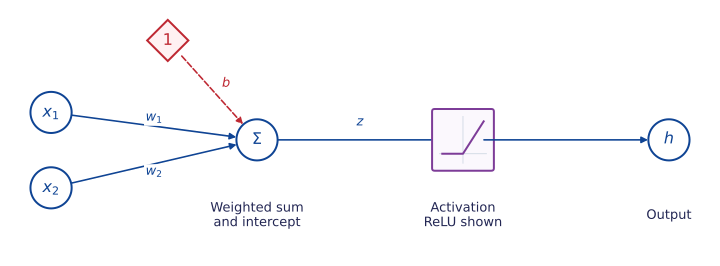{height=350px fig-alt="Weighted inputs and a fixed constant input enter an affine sum, followed by a ReLU activation and an output."}

::: {#def-nn-neuron name="Artificial neuron"}
A neuron forms an [affine score]{.blue} and applies an [activation function]{.purple}:

$$z=w^\top x+b,\qquad h=\sigma(z).$$

$w$ contains the weights, $b$ is the intercept, and $\sigma:\R\to\R$ is the activation.
:::

The diamond contains a fixed **1**; its connection weight $b$ is trainable.

::: {.notes}
Follow a signal from left to right. The summation node and the activation are
separate operations; the latter receives the scalar z. ReLU is shown as one
example, not as part of the general definition. A compact shaped neuron in the
following diagrams combines this affine sum with its displayed activation.
Bias shifts the threshold; weights determine its orientation. Artificial neurons
are mathematical components, not detailed biological models.
:::

## Common activation functions

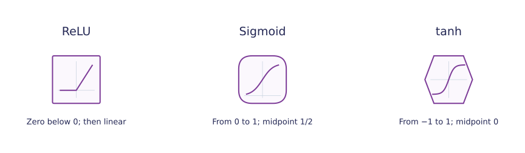{height=310px fig-alt="A square and kink for ReLU; a rounded box and sigmoid curve; a hexagon and centred tanh curve."}

| Activation | Output range | Behaviour |
|:--|:--|:--|
| **ReLU** | $[0,\infty)$ | Zero on one side; linear on the other |
| **Sigmoid** | $(0,1)$ | Smooth transition centred at $1/2$ |
| **tanh** | $(-1,1)$ | Smooth transition centred at $0$ |

These shapes are the [diagram convention used here]{.purple}; the small curve identifies the activation.
[Formulae](#nn-activation-formulae){.explanation-link}

::: {#nn-activation-formulae .explanation title="Activation formulae"}
$$\begin{aligned}
\operatorname{ReLU}(z)&=\max\{0,z\},\\
\operatorname{sigmoid}(z)&=\frac{1}{1+e^{-z}},\\
\tanh(z)&=\frac{e^z-e^{-z}}{e^z+e^{-z}}.
\end{aligned}$$
ReLU is not differentiable at zero. Sigmoid and tanh flatten in both tails.
:::

::: {.notes}
Use the shape together with its internal curve, not colour alone, to identify
the activation. The axes inside sigmoid put zero at the lower level; tanh's
horizontal axis passes through its centre. These are lecture-specific visual
symbols rather than a universal notation. A circle with Sigma is an affine sum.
:::

## Weights and intercepts reshape an activation



- The **weight** stretches or reverses the graph.
- The **intercept** moves the transition: for $w\ne0$, its centre or bend is at $x=-b/w$.

::: {.notes}
Compare all three activations, then reverse w and set w=0. Changing b alone
shifts the transition while preserving its shape. The intercept is represented
explicitly by the connection from a fixed one. This is an illustration of learned
features; the controls do not fit a model to data.
:::

## One hidden layer

:::: {.columns}
::: {.column width="38%"}

::: {#def-nn-hidden-layer name="Network with one hidden layer"}
Each hidden unit forms its own weighted sum and applies an activation. The output combines the hidden values into an affine score.

$$s_\theta(x)=c+\sum_{j=1}^m v_jh_j(x).$$
:::

- [Blue connections]{.blue}: input weights $w_{jk}$.
- [Purple connections]{.purple}: output weights $v_j$.
- [Red dashed connections]{.red}: intercepts $b_j,c$.

:::
::: {.column width="62%"}

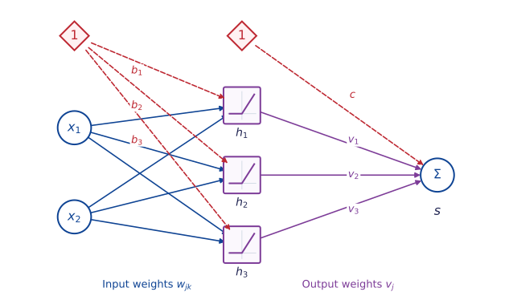{width=100% fig-alt="Two inputs feed three square ReLU units. Their outputs feed an affine summation. Red diamond nodes fixed at one supply hidden and output intercepts. Blue input edges carry w_jk and purple output edges carry v_j."}

:::
::::

::: {.notes}
The picture shows d=2, m=3 and ReLU; the definition permits other activations.
A shaped hidden node includes its incoming affine sum followed by the indicated
activation. Only the output is drawn as a separate Sigma because it has no
nonlinear activation. The constant nodes are not hidden neurons or parameters.
Hidden values are computed, rather than observed in the dataset; fully connected
means every input connects to every hidden unit.
:::

## One hidden layer: multivariate responses

::::: {.columns}
:::: {.column width="38%"}

A neural network can also predict a [multivariate response]{.purple},
$Y=(Y_1,\ldots,Y_k)^\top$.

- The outputs $s_1,\ldots,s_k$ use the **same hidden features**.
- Each output has its own [weights $v_{rj}$]{.purple} and [intercept $c_r$]{.red}.
- For regression, $s_r(x)$ predicts $\mathbb E[Y_r\mid X=x]$.

**Example:** predict temperature and humidity together from the same inputs.

[Output formula](#nn-multivariate-output){.explanation-link}

::::
:::: {.column width="62%"}

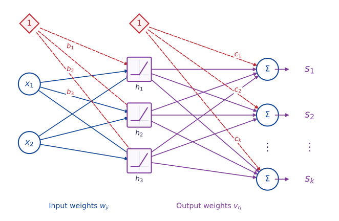{width=100% fig-alt="Two inputs feed three square ReLU hidden units through blue input weights. Purple output weights connect every hidden unit to affine outputs s_1, s_2, through s_k. Red diamond nodes fixed at one supply the hidden intercepts b_j and a separate intercept c_r for each output."}

::::
:::::

::: {#nn-multivariate-output .explanation title="One affine combination per response"}
For each output $r=1,\ldots,k$,

$$s_r(x)=c_r+\sum_{j=1}^m v_{rj}h_j(x).$$

Equivalently, $s(x)=Vh(x)+c$, where $V\in\R^{k\times m}$ and $c\in\R^k$.
Row $r$ of $V$ contains the weights for output $s_r$.
:::

::: {.notes}
The picture retains two inputs and three shared ReLU units, and replaces the
single output with k affine outputs. The dots indicate omitted output coordinates.
Each output combines every hidden feature with its own weights and intercept.
The two fixed-one nodes supply all the intercepts, including one c_r per output;
these constants are not additional response coordinates.
For a real-valued response vector, the scores can directly model its conditional
mean. Sharing hidden features does not assert that the response coordinates are
independent, nor does predicting their means specify their joint distribution.
:::

## Matrix notation for a scalar output

::: {.eqbox title="Forward propagation"}
$$h=\sigma(Wx+b),\qquad s_{\theta}(x)=v^\top h+c.$$
:::

| Quantity | Dimension | Meaning |
|:--|:--|:--|
| $x$ | $d\times 1$ | Input |
| $W$ | $m\times d$ | Row $j$ is $w_j^\top$ |
| $b$, $h$, $v$ | $m\times 1$ | Hidden biases, activations, output weights |
| $c$, $s_{\theta}(x)$ | Scalar | Output bias and score |

The activation $\sigma$ acts [coordinate by coordinate]{.purple} on a vector.

## Exercise: can parameters be recovered from predictions?

::: {#exr-nn-parameter-count name="Different parameters, the same function" block-style="6"}
Consider $s_\theta(x)=c+\sum_{j=1}^m v_j\operatorname{ReLU}(w_j^\top x+b_j)$.

1. Show how to permute the hidden units without changing $s_\theta$.
2. For $a>0$, replace $(w_j,b_j)$ by $(aw_j,ab_j)$. How must $v_j$ change to preserve the function? Prove the invariance.
3. Explain why even knowing $s_\theta(x)$ for every $x$ need not determine the parameters. What does this imply when comparing two fitted networks?
:::

::: {.notes}
Allow 8 minutes. Identifiability means that different parameter values give
different functions; this model does not have that property.
For any permutation pi, use (w'_j,b'_j,v'_j)=(w_pi(j),b_pi(j),v_pi(j)).
Positive homogeneity ReLU(az)=a ReLU(z), a>0, gives v'_j=v_j/a.
A unit with nonzero incoming parameters yields continuously many distinct
parameter vectors with the same function; degenerate units have further freedoms.
Parameter differences alone do not establish predictive differences. Conversely,
agreement on finitely many observations does not establish functional equality.
Do not equate the raw parameter count with the number of identifiable quantities.
:::

## A forward pass: active and inactive units

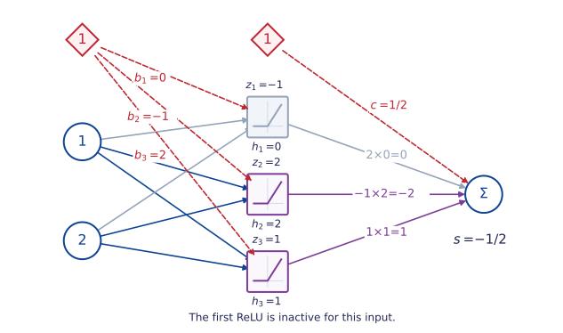{height=485px}

The input is $x=(1,2)^\top$. The first unit receives a negative score, so its contribution vanishes **for this input**.
[Weights and intercepts](#nn-forward-parameters){.explanation-link}

::: {#nn-forward-parameters .explanation title="Parameters of the illustrated network"}
$$W=\begin{pmatrix}1&-1\\1&1\\-1&0\end{pmatrix},\quad
b=\begin{pmatrix}0\\-1\\2\end{pmatrix}.$$

$$v=\begin{pmatrix}2\\-1\\1\end{pmatrix},\qquad c=\tfrac12.$$
The stored forward values are $z=(-1,2,1)^\top$ and $h=(0,2,1)^\top$.
:::

::: {.notes}
Trace contributions through the diagram rather than asking for matrix arithmetic.
The first hidden unit is inactive only for this input. Its zero output does not
mean its parameters or its outputs at other inputs are zero. The same parameters
and stored values are reused in the backward-pass illustration.
:::

## A score is not yet a probability

With $v=(2,-1,1)^\top$ and $c=\tfrac12$,

::: {.eqbox}
$$s_{\theta}(x)=v^\top h+c
=2(0)-1(2)+1(1)+\tfrac12=-\tfrac12.$$
:::

- **Regression:** the predicted conditional mean is $-\tfrac12$.
- **Binary classification:** apply a sigmoid to the score:

$$p_{\theta}(x)=\operatorname{sigmoid}(-\tfrac12)\approx 0.378.$$

At probability threshold $1/2$, the predicted class is **0**.

::: {.notes}
These are two possible interpretations of the same score, for different tasks.
The hidden activation and the output transformation serve different purposes.
:::

## Choose the output for the task

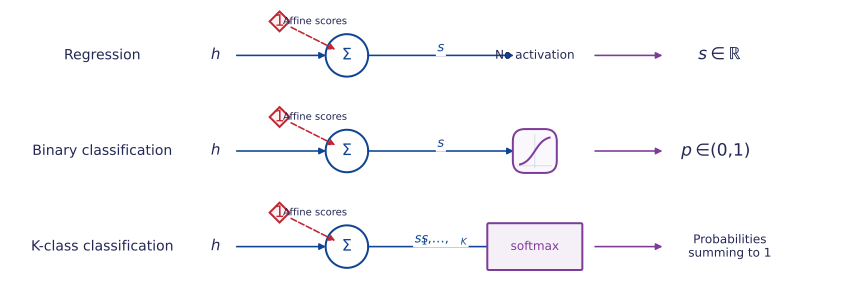{height=360px}

- **Regression:** model $\mathbb E[Y\mid X=x]$ with an unrestricted real score.
- **Binary classification:** transform one score to a probability.
- **Several classes:** softmax transforms **all $K$ scores together** into probabilities summing to one.

[Softmax formula](#nn-output-softmax){.explanation-link}

::: {#nn-output-softmax .explanation title="Softmax acts on a vector"}
$$p_{\theta,k}(x)=\frac{e^{s_{\theta,k}(x)}}{\sum_{r=1}^K e^{s_{\theta,r}(x)}}.$$
Changing one score affects every probability. Softmax is not a separate scalar activation on each output unit.
:::

::: {.notes}
The h at the start of each row denotes the same sort of hidden representation,
not a single scalar neuron. In the final row, the affine stage produces K scores
with K intercepts. Its Sigma symbol abbreviates that vector-valued stage. The
fixed one supplies those intercepts; it is never passed through softmax itself.
:::

## More hidden layers: composing representations

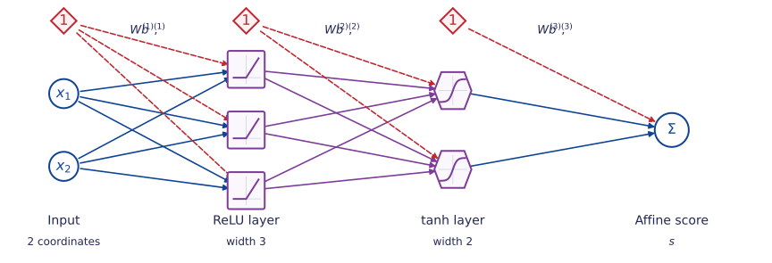{height=350px fig-alt="Two inputs feed a width-three ReLU layer, a width-two tanh layer and an affine scalar output. Each affine stage has a fixed constant input."}

- **Width:** the number of units in a hidden layer; here, $3$ and $2$.
- **Depth:** two hidden layers in this convention.
- Each layer builds a new representation of the previous layer's output.

[Indexed notation](#nn-layer-recursion){.explanation-link}

::: {#nn-layer-recursion .explanation title="Layer dimensions and forward recursion"}
With $h^{(0)}=x$ and $L$ hidden layers,

for $\ell=1,\ldots,L$,

$$h^{(\ell)}=\sigma_\ell\!\left(W^{(\ell)}h^{(\ell-1)}+b^{(\ell)}\right).$$
$$s_\theta(x)=W^{(L+1)}h^{(L)}+b^{(L+1)}.$$

For widths $m_\ell$, $W^{(\ell)}\in\R^{m_\ell\times m_{\ell-1}}$ with $m_0=d$.
The picture has $L=2$, $m_1=3$, $m_2=2$ and one output score.
:::

::: {.notes}
The mixed activations are an illustration of composition, not a recommendation
that every architecture should mix activations. Every shaped unit first forms
an affine sum, including its intercept. Depth conventions differ; count hidden
layers explicitly. Extra depth does not automatically improve prediction.
:::

## ReLU units create bends

For a scalar input and one hidden layer,

::: {.eqbox}
$$s_{\theta}(x)=c+\sum_{j=1}^{m}v_j\operatorname{ReLU}(w_jx+b_j).$$
:::

- If $w_j\ne0$, unit $j$ changes slope at $x=-b_j/w_j$.
- Between these points, every unit is affine or zero, so the sum is **affine**.
- The resulting function is [continuous and piecewise affine]{.purple}.
- Training can move the bends and change the slopes.

::: {.notes}
Often called piecewise linear. We use piecewise affine to include nonzero intercepts.
A zero input weight gives a constant unit. Coincident bends or cancellation can
reduce the number of visible bends; avoid asserting there are always exactly m.
:::

## Explore a sum of ReLU units

$$f(x)=\operatorname{ReLU}(x)-2\operatorname{ReLU}(x-t)+\operatorname{ReLU}(x-2).$$



::: {.notes}
Start at t=1. Predict the graph before changing the slider. The three terms have
weights 1,-2,1 and input weights 1,1,1; the hidden biases are 0,-t,-2.
Ask which parameter changes when the middle bend moves. Observe that f is constant
after x=2, and that this constant equals zero only when t=1.
:::

## Exercise: design a triangular response

::::: {.columns}
:::: {.column width="62%"}
::: {#exr-nn-relu-tent name="Choose the bends and their weights" block-style="6"}
The target is zero outside $[0,2]$, with a peak of height $1$ at $x=1$.

1. Design a one-hidden-layer ReLU network for the graph, using the **changes in slope**. How would you adapt its weights and intercepts to move the peak to $x=1/2$, keeping its height and both zero tails?
2. Could two hidden ReLU units reproduce all three bends? Explain, allowing arbitrary weights and intercepts.
3. Could all output weights be nonnegative, even if some input weights were negative? Explain using slope changes.
:::
::::
:::: {.column width="38%"}
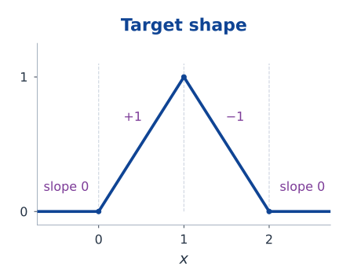{width=100% fig-alt="Triangular target: zero up to x=0, rising with slope 1 to height 1 at x=1, falling with slope -1 to zero at x=2, then remaining zero."}
::::
:::::

::: {.notes}
Allow 8–10 minutes. Read the slopes from left to right: 0, 1, -1, 0.
The changes are +1, -2, +1. Take input weights (1,1,1), hidden intercepts
(0,-1,-2), output weights (1,-2,1), and output intercept zero. Thus
T(x)=ReLU(x)-2 ReLU(x-1)+ReLU(x-2).
Moving the peak to 1/2 changes the slopes to 0, 2, -2/3, 0.
One choice keeps input weights (1,1,1), changes the hidden intercepts to
(0,-1/2,-2) and the output weights to (2,-8/3,2/3), with output intercept zero.
Changing only the middle intercept in the original construction does not keep
both the height and the zero right tail, as the preceding slider illustrates.
Each hidden unit can introduce at most one bend, so two cannot produce the
three distinct bends of this target. The output intercept changes no slopes.
For a positive input weight w, a ReLU slope changes from 0 to w;
for a negative w, it changes from w to 0. Either change is upward.
Multiplication by a nonnegative output weight preserves this property;
adding units cannot create the downward change at the peak. A negative output
weight is therefore necessary, even when negative input weights are allowed.
Use sketches of the two orientations; no result about general continuous
functions is required.
:::

## Affine layers alone collapse to one affine map

::: {#prp-nn-affine-composition name="Composition of affine maps" block-style="2"}
A finite composition of affine maps is affine. Adding hidden layers with identity
activations therefore does not introduce nonlinear features.
:::

::: {.eqbox}
$$W_2(W_1x+b_1)+b_2
=\underbrace{W_2W_1}_{A}x+\underbrace{(W_2b_1+b_2)}_{a}.$$
:::

[Nonlinear hidden activations]{.purple} allow the network to represent functions beyond an affine score.

## Exercise: what does an affine bottleneck lose?

::: {#exr-nn-affine-composition name="An affine bottleneck restricts rank" block-style="6"}
Let $h=W_1x+b_1\in\R^r$ and $s=W_2h+b_2\in\R^q$, with $x\in\R^d$.

1. Characterise **exactly** which affine maps $x\mapsto Ax+a$ this architecture represents. Give both a necessary condition and a construction proving sufficiency.
2. Extend the characterisation to several affine hidden layers of prescribed widths.
3. In binary classification, suppose only the final sigmoid is retained. Prove that no choice of widths can classify $(0,0),(1,1)$ as class 1 and $(1,0),(0,1)$ as class 0, at threshold $1/2$.
:::

::: {.notes}
Allow 8–10 minutes; the multi-layer sufficiency argument can be completed after class.
A=W_2 W_1 has rank at most r. Conversely, factor any rank-k A with k<=r as UV
using a basis of its column space, pad with zero rows/columns, and take b_1=0,b_2=a.
For several layers the rank cannot exceed the smallest intermediate width;
embed the rank-k coordinates through every hidden layer. Input and output
dimensions bound rank automatically. Arbitrary output intercepts remain available.
For part 3, a sigmoid threshold of 1/2 is an affine-score threshold of zero.
The sums of scores over the two diagonals are both A_1+A_2+2a. One sum would
have to be nonnegative and the other negative, a contradiction. This remains
true under the opposite tie convention, with the strict inequalities exchanged.
:::

# 2. Loss functions and backpropagation {section-time="70"}

## A prediction needs a criterion

Observe independent pairs $(x_i,y_i)$, $i=1,\ldots,n$. A network gives a prediction; a **loss** measures its disagreement with an observation.

::: {#def-nn-risk name="Empirical risk"}
For a prediction rule $f_\theta$ and loss $\ell$, define

$$\widehat R_n(\theta)=\frac1n\sum_{i=1}^n\ell(y_i,f_\theta(x_i)).$$
:::

- **Model:** the family of functions $f_\theta$.
- **Loss:** the criterion used to assess each prediction.
- **Optimisation algorithm:** the procedure used to adjust $\theta$.

The same network architecture can be fitted using different losses.

## Squared loss from a Gaussian model

Suppose $Y_i\mid X_i=x_i\sim N(s_\theta(x_i),\tau^2)$, with fixed $\tau^2>0$.

$$-\log p_\theta(y_i\mid x_i)
=\frac{(y_i-s_\theta(x_i))^2}{2\tau^2}+\frac12\log(2\pi\tau^2).$$

Terms constant in $\theta$ and positive constant factors do not change the minimisers.

::: {.eqbox title="Squared loss"}
$$\ell(y,s)=\frac12(s-y)^2,\qquad
\frac{\partial\ell}{\partial s}=s-y.$$
:::

- The factor $1/2$ simplifies derivatives.
- Squared loss remains useful without a Gaussian assumption.
- For finite conditional second moments, its conditional expected value is minimised by $\mathbb E[Y\mid X=x]$.

::: {.notes}
The variance is fixed here; estimating it would require keeping its log term.
Explain why multiplying a loss by a positive constant preserves minimisers but
changes gradient magnitudes and hence the interpretation of the learning rate.
:::

## Binary cross-entropy

For $Y\in\{0,1\}$, write $p=\operatorname{sigmoid}(s)$ and use a Bernoulli model:

$$p_\theta(y\mid x)=p^y(1-p)^{1-y}.$$

::: {.eqbox title="Negative log-likelihood" colour="purple"}
$$\ell(y,p)=-y\log p-(1-y)\log(1-p).$$
:::

- A confident incorrect prediction receives a large loss.
- With $y=1$, probabilities $0.9$ and $0.1$ give losses approximately $0.105$ and $2.303$.
- The conditional expected loss is minimised by the true conditional probability (allowing boundary probabilities).

## Example: Poisson regression

::::: {.columns}
:::: {.column width="48%"}

::: {#exm-nn-poisson name="Calls per hour" block-style="2"}
Let $Y$ count calls received in one hour, with predictors $x$ such as time and day of the week.

$$Y\mid X=x\sim\operatorname{Poisson}(\lambda_\theta(x)).$$

The parameter $\lambda_\theta(x)$ is the **conditional mean count**.
:::

::: {.eqbox title="Log link: the score models the log mean" colour="purple"}
$$\lambda_\theta(x)=\exp(s_\theta(x))>0.$$
:::

- The mean need not be an integer.
- Setting $\lambda_\theta(x)=s_\theta(x)$ requires a **positive constrained score**.
- [Softplus](#nn-poisson-softplus){.explanation-link} is another positive output map.

::::
:::: {.column width="52%"}

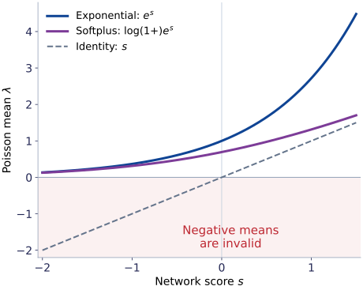{width=100% fig-alt="Exponential and softplus output maps stay positive for every network score. The identity map equals the score and enters the shaded invalid negative-mean region when the score is negative."}

::::
:::::

::: {#nn-poisson-softplus .explanation title="Another positive output map"}
$$\lambda_\theta(x)=\log\!\left(1+e^{s_\theta(x)}\right)>0.$$

Softplus grows approximately linearly for large positive scores; the exponential grows much faster.
Either map gives a positive mean, but the score derivative depends on the chosen map.
:::

::: {.notes}
The observation window is fixed at one hour, so lambda is the expected count
in that window. The usual log link sets log(lambda_theta(x))=s_theta(x).
Classical Poisson regression uses an affine score; here the neural network can
learn a nonlinear score. The Poisson mean may be fractional although Y is integer.
An unconstrained affine output can be negative, so it cannot directly be used
as lambda over all inputs. An identity link is possible if positivity is enforced.
The boundary lambda=0 gives a degenerate distribution concentrated at Y=0;
the positive output maps shown use the regular lambda>0 parametrisation.
For softplus, d lambda/ds=sigmoid(s), so the Poisson score gradient is
(1-y/lambda)*sigmoid(s), rather than lambda-y.
:::

## Poisson loss with the log link

For the model in @exm-nn-poisson, let $s=s_\theta(x)$ and $\lambda=e^s$.
The probability of observing $y\in\{0,1,2,\ldots\}$ is

$$p_\theta(y\mid x)=\frac{e^{-\lambda}\lambda^y}{y!}.$$

Hence $-\log p_\theta(y\mid x)=\lambda-y\log\lambda+\log(y!)$.
The term $\log(y!)$ does not depend on $\theta$.

::: {.eqbox title="Poisson loss and its score derivative" colour="purple"}
$$\ell(y,s)=e^s-ys,\qquad
\frac{\partial\ell}{\partial s}=e^s-y=\lambda-y.$$
:::

- The output gradient compares the [predicted mean]{.blue} with the [observed count]{.purple}.
- The Poisson model also assumes $\operatorname{Var}(Y\mid X=x)=\lambda_\theta(x)$.
- Changing the output map changes the derivative used to start backpropagation.

::: {.notes}
The displayed loss drops only the data-dependent constant log(y!). It can be
negative after this omission; it is then an optimisation objective rather than
the full negative log-probability. The derivative lambda-y is specific to the
exponential output map. Compare it with s-y for squared loss and p-y for the
Bernoulli model. These are derivatives with respect to the network score;
backpropagation must still multiply by the score's parameter derivatives.
Equal conditional mean and variance is a distributional assumption, not a
consequence of requiring positive means. If a Poisson likelihood is used only
as a loss for mean prediction, its minimising positive mean is E[Y|X=x] even
when that distributional assumption is false, provided the relevant expectations
exist. A conditional mean of zero is approached at the boundary.
:::

## Exercise: class weights in binary classification {#exercise-weighting-a-loss-changes-its-target}

::: {#exr-nn-weighted-loss name="Weighted binary cross-entropy" block-style="6"}
Consider **binary classification**, with $Y\in\{0,1\}$.
At a fixed input $x$, let $p=\Pr(Y=1\mid X=x)\in(0,1)$ be the **true class-1 probability** and $q\in(0,1)$ a **predicted probability**.
Give class 1 weight $\alpha>0$ in the Bernoulli cross-entropy loss:

$$\ell_\alpha(y,q)=-\alpha y\log q-(1-y)\log(1-q).$$

1. Find the unique minimiser $q_\alpha$ of the conditional expected loss. Is it the true probability $p$?
2. Express the rule $q_\alpha\geq1/2$ as a threshold on $p$. Explain how weighting changes the decision rule.
3. If a model estimates $q_\alpha$, how could $p$ be recovered? State why finite data and a restricted network class limit this interpretation.
:::

::: {.notes}
Allow 8 minutes. The conditional objective is -alpha*p*log(q)-(1-p)*log(1-q).
Its second derivative is positive, and it diverges at both endpoints, so its
unique minimiser is q_alpha=alpha*p/(alpha*p+1-p). It equals p only for alpha=1
under the stated interior assumption. Thresholding at 1/2 gives p>=1/(alpha+1).
This is the Bayes threshold when the cost of a false negative is alpha and the
cost of a false positive is one. Weighting can serve asymmetric decisions, but
its optimum is no longer the unweighted probability.
Inverting gives p=q_alpha/[alpha-(alpha-1)*q_alpha]. This identity describes the
population optimum for freely chosen probabilities at each x. Model misspecification,
finite samples and incomplete optimisation can prevent the fitted output from
being that optimum; the inverse does not by itself guarantee calibrated predictions.
:::

## Binary cross-entropy: differentiate the score {#differentiate-with-respect-to-the-score}

For **binary classification**, let $y\in\{0,1\}$, $s=s_\theta(x)$ be the network score,
and $p=\operatorname{sigmoid}(s)$ the **predicted class-1 probability**.

Use the **unweighted Bernoulli cross-entropy** ($\alpha=1$):

$$\ell(y,p)=-y\log p-(1-y)\log(1-p).$$

The chain rule uses

$$\frac{\partial\ell}{\partial p}
=\frac{p-y}{p(1-p)},\qquad \frac{\partial p}{\partial s}=p(1-p).$$

::: {.eqbox title="Sigmoid and cross-entropy"}
$$\frac{\partial\ell}{\partial s}=p-y.$$
:::

An equivalent expression computes the loss directly from the score:

$$\ell(y,s)=\log(1+e^s)-ys
=\max(s,0)-ys+\log(1+e^{-|s|}).$$

The last form avoids exponentiating large positive scores. Software often calls $s$ a **logit**.

## Several classes: softmax and cross-entropy

::::: {.columns}
:::: {.column width="46%"}

Each observation belongs to **exactly one** of $K$ classes: $Y\in\{1,\ldots,K\}$.
At input $x$, the network produces one real **score** $s_k=s_{\theta,k}(x)$ per class.

::: {#def-nn-softmax name="Softmax probabilities" block-style="2"}
$$p_k=\frac{e^{s_k}}{\sum_{r=1}^K e^{s_r}},\qquad k=1,\ldots,K.$$

$p_k$ is the model's predicted probability that $Y=k$ given $X=x$.
:::

- **Exponentiate:** obtain positive values.
- **Normalise:** divide by their shared total, so $\sum_k p_k=1$.
- All outputs act together: changing one score changes every probability.
- The class with the largest score also has the largest probability.

::::
:::: {.column width="54%"}

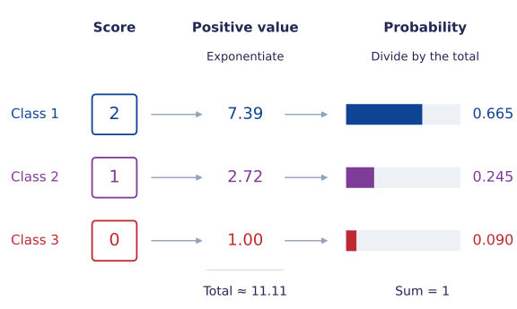{width=100% fig-alt="Class scores 2, 1 and 0 are exponentiated to approximately 7.39, 2.72 and 1.00. Dividing all three by their shared total, approximately 11.11, gives probabilities 0.665, 0.245 and 0.090, shown as bars."}

::::
:::::

::: {.notes}
The network outputs K unconstrained real scores, often called logits. Their
relative sizes describe preference for the classes; they are not probabilities.
Softmax turns the scores into positive values and divides by their shared total.
For finite scores and K>=2, every probability lies strictly between zero and one.
Increasing one score increases its probability and decreases all the others,
because every output uses the shared denominator. This is a model for one class
per observation; separate binary labels require a different output interpretation.
For K=2, p_2=exp(s_2)/(exp(s_1)+exp(s_2))=sigmoid(s_2-s_1), linking softmax to
binary classification. The usual single binary score represents this difference.
The picture is a worked construction, not a request for students to do arithmetic.
:::

## Multiclass cross-entropy: use the observed class

The observed label $y$ selects one class. Its model probability is $p_y$, so the
**categorical negative log-likelihood** is

::: {.eqbox title="Multiclass cross-entropy" colour="purple"}
$$\ell(y,s)=-\log p_y
=-s_y+\log\!\left(\sum_{r=1}^K e^{s_r}\right).$$
:::

**Example:** if the observed class in the picture is $y=2$, use $p_2\approx0.245$;
the loss is approximately $1.41$. Assigning more probability to the observed class reduces the loss.

Write $e_y$ for the **one-hot target**: a one at the observed class and zeros elsewhere.
For $K=3$ and $y=2$, $e_y=(0,1,0)^\top$.

::: {.eqbox title="Differentiate with respect to the class scores"}
$$\frac{\partial\ell}{\partial s_k}=p_k-\mathbf1_{\{k=y\}},
\qquad \nabla_s\ell=p-e_y.$$
:::

- For the observed class, the component is $p_y-1$; for every other class it is $p_k$.
- Adding the same constant to all scores leaves both probabilities and loss unchanged.

[Stable evaluation](#nn-softmax-stability){.explanation-link}

::: {#nn-softmax-stability .explanation title="Subtract the largest score"}
Let $m=\max_r s_r$. The common factor $e^{-m}$ cancels, giving

$$p_k=\frac{e^{s_k-m}}{\sum_r e^{s_r-m}}.$$

Every exponential is at most one, and at least one equals one. This avoids overflow from large positive scores.
The loss can be evaluated as

$$\ell(y,s)=-(s_y-m)+\log\!\left(\sum_r e^{s_r-m}\right).$$
:::

::: {.notes}
The class label y is an index, not a numerical regression response. A categorical
model assigns probability p_y to the observed class. The one-hot form of the
same loss is -sum_k (e_y)_k log(p_k), where only the observed-class term remains.
For the worked probabilities and y=2, the score gradient is approximately
(0.665,-0.755,0.090). Holding other scores fixed, increasing the observed-class
score reduces loss, while increasing a competing-class score raises it.
Backpropagation uses these K score derivatives to differentiate network parameters.
The common-shift invariance follows by cancelling exp(a) from numerator and
denominator when replacing every s_k by s_k+a. It explains why score differences
matter and motivates the stable computation, as well as the next exercise.
:::

## Exercise: the geometry of softmax

::: {#exr-nn-softmax name="Convexity without a finite optimum" block-style="6"}
For a **$K$-class classification problem** ($K\geq2$), let $p=\operatorname{softmax}(s)$.
For one observed class $y$, use $\ell(s)=-s_y+\log\sum_{k=1}^K e^{s_k}$.

1. Derive $\nabla_s^2\ell=\operatorname{diag}(p)-pp^\top$. Express $u^\top\nabla_s^2\ell\,u$ as a variance and identify its null space.
2. Explain the link between this null space and the non-identifiability of the score vector. Does the constraint $\sum_k s_k=0$ make the loss strictly convex on that subspace?
3. Does the loss attain a finite minimum, even under that constraint? Give a sequence of scores supporting your conclusion.
:::

::: {.notes}
Allow 10 minutes for parts 1–2; part 3 is a follow-up on existence of minimisers.
Differentiate p_j to get p_j(delta_jk-p_k). The quadratic form is
sum p_k u_k^2-(sum p_k u_k)^2, the variance of a variable taking u_k with
probabilities p_k. Since every p_k>0 at finite scores, it vanishes exactly for
constant u. This corresponds to invariance under s -> s+a*1.
On the zero-sum subspace every nonzero direction has positive curvature,
so the restriction is strictly convex. Nevertheless there is no finite minimiser:
take s_y=(K-1)t/K and s_k=-t/K for k!=y. The loss is
log(1+(K-1)exp(-t)), which decreases to zero but never equals zero at finite t.
Strict convexity establishes at most one minimiser; it does not establish existence.
:::

## A computational graph

For one scalar input, consider $z=wx+b$, $h=\operatorname{ReLU}(z)$,
$s=vh+c$ and $\ell=\tfrac12(s-y)^2$.

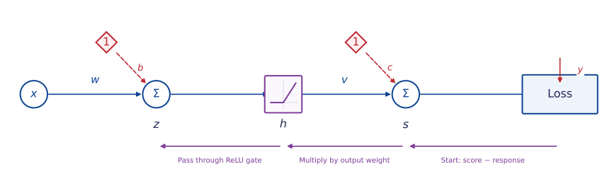{width=90%}

- **Forward:** compute and store the intermediate values.
- **Backward:** propagate the derivative of the loss towards the parameters.
- When a value feeds several branches, [add the contributions]{.purple} from those branches.

::: {.notes}
Draw a second outgoing edge from h to explain why contributions add. Distinguish
reusing a computed value from treating its different uses as independent parameters.
:::

## The chain rule, one local step at a time

Write $\delta_s=\partial\ell/\partial s$. For squared loss, $\delta_s=s-y$.

::: {.eqbox}
$$\begin{aligned}
\frac{\partial\ell}{\partial v}&=\delta_s h,
&\frac{\partial\ell}{\partial c}&=\delta_s,\\
\delta_z:=\frac{\partial\ell}{\partial z}&=\delta_s v\,\mathbf1_{\{z>0\}},
&\frac{\partial\ell}{\partial w}&=\delta_z x,
&\frac{\partial\ell}{\partial b}&=\delta_z.
\end{aligned}$$
:::

- Each step multiplies an incoming derivative by a **local derivative**.
- For ReLU, the derivative is $0$ for $z<0$ and $1$ for $z>0$.
- At $z=0$, ReLU has no derivative; a common computational convention uses $0$.

::: {.notes}
This convention does not make the complete network objective differentiable at
all parameter values. Use examples away from zero for ordinary gradient checks.
:::

## Backward propagation follows the connections

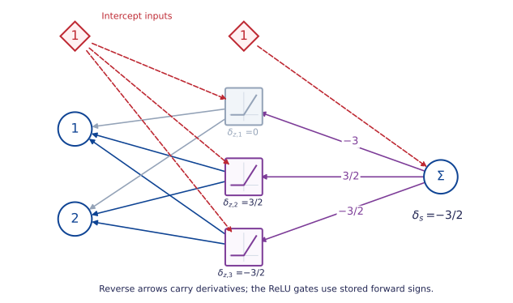{height=480px}

- With $y=1$ and squared loss, the output derivative is $s-y=-3/2$.
- Output weights transmit derivatives to hidden units; ReLU then passes or blocks them.
- Each edge gradient combines an [arriving derivative]{.purple} with its [stored input]{.blue}.

::: {.notes}
The reverse labels -3, 3/2, -3/2 are derivatives with respect to hidden outputs,
before the ReLU gate. The first gate turns -3 into zero because z_1=-1. The
post-gate derivatives are therefore 0,3/2,-3/2. Red dashed forward connections
retain the intercept inputs as architectural context; they are not reverse
derivative arrows. Backpropagation differentiates the computation, not inverts it.
:::

## One hidden layer: backward propagation

Let $z=Wx+b$, $h=\sigma(z)$ and $s=v^\top h+c$ for a scalar output.

::: {.eqbox title="One observation" colour="purple"}
$$\begin{aligned}
\delta_s&=\frac{\partial\ell}{\partial s},
&\nabla_v\ell&=\delta_s h,
&\frac{\partial\ell}{\partial c}&=\delta_s,\\
\delta_z&=(v\delta_s)\odot\sigma'(z),
&\nabla_W\ell&=\delta_z x^\top,
&\nabla_b\ell&=\delta_z.
\end{aligned}$$
:::

- $\odot$ denotes coordinatewise multiplication.
- $\delta_z\in\R^m$ and $\delta_zx^\top\in\R^{m\times d}$.
- The gradient of each parameter array has the [same shape]{.blue} as that array.

::: {.notes}
Derive the (j,k) entry: d ell/d W_jk = delta_z,j x_k.
This is an outer product, not an inner product. Use the numerical example as
a consistency check for the derived rule, rather than an arithmetic exercise.
:::

## The forward-pass example, continued

For the earlier input $x=(1,2)^\top$,

$$z=(-1,2,1)^\top,\quad h=(0,2,1)^\top,\quad
v=(2,-1,1)^\top,\quad s=-\tfrac12.$$

Take $y=1$ and squared loss. Then $\delta_s=s-y=-\tfrac32$.

::: {.eqbox}
$$\nabla_v\ell=\begin{pmatrix}0\\-3\\-3/2\end{pmatrix},\quad
\delta_z=\begin{pmatrix}0\\3/2\\-3/2\end{pmatrix},\quad
\nabla_W\ell=\begin{pmatrix}0&0\\3/2&3\\-3/2&-3\end{pmatrix}.$$
:::

Also $\nabla_b\ell=\delta_z$ and $\partial\ell/\partial c=-3/2$.

The first hidden unit contributes zero parameter gradient [for this observation]{.purple}.

## Several layers: the backward recursion

Write $z^{(\ell)}=W^{(\ell)}h^{(\ell-1)}+b^{(\ell)}$ and
$h^{(\ell)}=\sigma_\ell(z^{(\ell)})$, for $\ell=1,\ldots,L$.
The output scores are $s=W^{(L+1)}h^{(L)}+b^{(L+1)}$.

::: {.eqbox title="Start at the output, then move backwards"}
$$\begin{aligned}
\delta^{(L+1)}&=\nabla_s\ell,\\
\delta^{(\ell)}&=\left((W^{(\ell+1)})^\top\delta^{(\ell+1)}\right)
\odot\sigma_\ell'(z^{(\ell)}),\qquad \ell=L,\ldots,1.
\end{aligned}$$
:::

For $\ell=1,\ldots,L+1$,

$$\nabla_{W^{(\ell)}}\ell=\delta^{(\ell)}(h^{(\ell-1)})^\top,
\qquad \nabla_{b^{(\ell)}}\ell=\delta^{(\ell)}.$$

Each intermediate derivative is reused rather than recomputed for every parameter.

## From one observation to a batch

For a batch $B$ of size $b$,

::: {.eqbox}
$$g_B=\nabla_\theta\left[\frac1b\sum_{i\in B}\ell(y_i,f_\theta(x_i))\right]
=\frac1b\sum_{i\in B}\nabla_\theta\ell(y_i,f_\theta(x_i)).$$
:::

- Compute each observation's forward values and backward contributions.
- Average the contributions; matrix operations evaluate many observations together.
- Add a penalty gradient if the training objective includes regularisation.

For $J(\theta)=\widehat R_n(\theta)+\frac\lambda2\sum_\ell\|W^{(\ell)}\|_F^2$,
the additional gradient for $W^{(\ell)}$ is $\lambda W^{(\ell)}$.

## Automatic differentiation

**Reverse-mode automatic differentiation** applies the chain rule to a recorded computation.

- Backpropagation is its application to the network's loss.
- It uses local derivative rules, rather than symbolic expansion of a huge expression.
- One reverse pass obtains derivatives with respect to all parameters of a scalar loss.
- Stored forward values cost memory; recomputing selected values trades time for memory.

::: {.box title="A useful independent check"}
Away from nondifferentiable points,

$$\frac{\partial J}{\partial\theta_j}\approx
\frac{J(\theta+\varepsilon e_j)-J(\theta-\varepsilon e_j)}{2\varepsilon}.$$

Check a small example with several choices of $\varepsilon$; very small steps amplify rounding error.
:::

## Exercise: when gradient checks disagree

::: {#exr-nn-backprop name="A differentiable function built from ReLU kinks" block-style="6"}
Define $r(\theta)=\operatorname{ReLU}(\theta)-\operatorname{ReLU}(-\theta)$ and $J(\theta)=\tfrac12(r(\theta)-1)^2$.

1. Simplify $r$ and obtain the mathematical derivative $J'(0)$.
2. Apply the local backpropagation rules to the **unsimplified graph**, using derivative $0$ for each ReLU at zero. Explain the discrepancy.
3. What does a centred finite-difference check return at zero? Does the discrepancy establish that the implementation is wrong? Explain which hypothesis of the ordinary chain rule fails.
:::

::: {.notes}
Allow 8 minutes. r(theta)=theta everywhere, so J'(0)=-1. In the unsimplified
graph, the chosen derivative of each ReLU at zero is zero; the mechanically
propagated derivative of r and then J is zero. For any epsilon!=0, the centred
finite difference of J at zero is exactly -1 in exact arithmetic.
The primitive rules follow their specified convention, but that convention need
not give the derivative of a composite function at a point where intermediate
operations are nondifferentiable. The ordinary differentiable chain rule does
not apply there, even though cancellation makes the final function differentiable.
Equivalent computational graphs can therefore give different reported gradients
at such points. Check smooth points to distinguish a coding error from this issue;
for this particular expression, replacing r by theta removes the artificial kinks.
:::

# 3. Training neural networks {section-time="70"}

## The empirical objective is usually nonconvex

Even a small network can contain products of trainable parameters and changing activation patterns.

- Convexity of the loss in the [output score]{.blue} does not imply convexity in [all parameters]{.purple}.
- Different initialisations can lead to different fitted functions.
- A small gradient does not certify a global minimum.

## Exercise: a redundant parametrisation

::: {#exr-nn-nonconvex name="Parametrisation changes optimisation geometry" block-style="6"}
Consider $J(v,w)=\tfrac12(vw-1)^2$.

1. Characterise all stationary points and classify them. Explain why exact gradient descent initialised at $(0,0)$ cannot move.
2. At a minimiser with $vw=1$, show that the Hessian has eigenvalues $0$ and $v^2+w^2$. Relate the zero eigenvalue to the set of equivalent parameters.
3. Compare $(v,w)=(a,a^{-1})$ as $a>0$ varies. Why can identical predictions require very different stable learning rates? Compare with optimising the single parameter $u=vw$.
:::

::: {.notes}
Allow 10 minutes; use the Hessian calculation as a follow-up if needed.
The gradient is ((vw-1)w,(vw-1)v), so stationary points are vw=1 and the origin.
The former are global minima of value zero. The origin is a saddle: along v=w=t
its value is 1/2-t^2+t^4/2; along v=-w=t its value is 1/2+t^2+t^4/2.
At a minimum the Hessian is (w,v)^T(w,v), with eigenvalues zero and w^2+v^2.
Its zero-eigenvalue direction (v,-w) leaves the product vw unchanged to first order.
The nonzero local curvature at (a,1/a) is a^2+a^-2 and is unbounded.
Along the Hessian eigenvector (w,v), the local gradient-descent multiplier is
1-eta*(a^2+a^-2), with magnitude below one only if 0<eta<2/(a^2+a^-2).
Along the zero-eigenvalue direction the multiplier is one. This is a local statement,
not a global convergence guarantee. In u, the loss is quadratic with curvature one;
updates in (v,w) do not induce ordinary gradient descent in u with a fixed step.
:::

## Mini-batch stochastic gradient descent

For a uniformly sampled batch $B_t$ of $b$ training indices,

::: {.eqbox}
$$g_t=\frac1b\sum_{i\in B_t}\nabla_\theta\ell_i(\theta_t),
\qquad \theta_{t+1}=\theta_t-\eta_t g_t.$$
:::

- **Batch size:** observations used for one update.
- **Epoch:** one pass through the training data.
- Full-batch gradient descent uses all $n$ observations for each update.

If the batch is sampled independently of $\theta_t$ from the full dataset,
$\mathbb E[g_t\mid\theta_t]=\nabla\widehat R_n(\theta_t)$.

Shuffling once per epoch is common; its successive batches are dependent.

## Batch size changes the gradient noise

At a fixed $\theta$, let $G$ be the gradient from a uniformly sampled training observation.
For $b$ independent samples with replacement,

::: {.eqbox}
$$\operatorname{Cov}\!\left(\frac1b\sum_{j=1}^bG_j\right)
=\frac1b\operatorname{Cov}(G).$$
:::

- Larger batches reduce sampling noise but require more work per update.
- Smaller batches permit more frequent updates and noisier loss trajectories.
- Hardware efficiency and statistical efficiency need not favour the same batch size.

::: {.notes}
The identity conditions on the dataset and fixed parameters. Sampling without
replacement has a finite population correction; a shuffled epoch is not a sequence
of independent draws from the entire dataset.
:::

## A training loop



$$\theta\leftarrow\theta-\eta g.$$

The batch loss is an **average**. Summing it instead changes the effective step size when the batch size changes.

## Learning rates

For a quadratic $J(\theta)=\tfrac12\theta^\top A\theta$, with $A$ positive definite,
gradient descent evolves separately along its eigenvectors:

::: {.eqbox}
$$u_{t+1,j}=(1-\eta\lambda_j)u_{t,j},
\qquad 0<\eta<\frac{2}{\lambda_{\max}(A)}.$$
:::

- Too small: slow movement along directions of low curvature.
- Too large: oscillation or divergence along directions of high curvature.
- Networks are not fixed quadratics, but local curvature still affects useful step sizes.
- A decreasing schedule can reduce late-stage fluctuations; it cannot repair an incorrect gradient.

## Momentum

Let $u_0=0$ and $0\leq\mu<1$:

::: {.eqbox colour="purple"}
$$u_{t+1}=\mu u_t+g_t,\qquad
\theta_{t+1}=\theta_t-\eta_tu_{t+1}.$$
:::

- Persistent gradient directions accumulate in $u_t$.
- Alternating contributions can partly cancel.
- Momentum introduces another parameter and can also overshoot.

Some implementations use $(1-\mu)g_t$ in the first equation; the learning-rate scaling then differs.

## Adam: adaptive coordinate scales

Starting from $m_0=v_0=0$, for $t\geq1$:

::: {.eqbox}
$$\begin{aligned}
m_t&=\beta_1m_{t-1}+(1-\beta_1)g_t,
&v_t&=\beta_2v_{t-1}+(1-\beta_2)(g_t\odot g_t),\\
\widehat m_t&=\frac{m_t}{1-\beta_1^t},
&\widehat v_t&=\frac{v_t}{1-\beta_2^t},\\
\theta_t&=\theta_{t-1}-\eta_t\frac{\widehat m_t}{\sqrt{\widehat v_t}+\epsilon}.
\end{aligned}$$
:::

- Here $g_t$ is evaluated at $\theta_{t-1}$; all divisions and square roots are coordinatewise.
- $m_t$ smooths gradients; $v_t$ estimates their uncentred second moments.
- The denominators $1-\beta_j^t$ correct the initial zero-state bias.

Source: [Kingma and Ba, *Adam*](https://arxiv.org/abs/1412.6980). It remains necessary to choose a learning rate and monitor training.

::: {.notes}
epsilon is a small positive stabiliser, distinct from approximation tolerances
later in the deck.
Do not interpret adaptive scaling as a guarantee of convergence or good prediction.
:::

## Why initialise hidden units differently?

If two hidden units start with identical incoming weights, biases and outgoing weights,
they receive identical updates under deterministic gradient descent.

- The symmetry can prevent the units from learning different features.
- Initialise weights randomly; biases can often start at zero.
- Random weights must also have an appropriate **scale**.

::: {.eqbox title="A variance calculation"}
$$z=\sum_{j=1}^q w_jh_j,\qquad
\operatorname{Var}(z)=q\operatorname{Var}(w_j)\mathbb E[h_j^2].$$
:::

This identity assumes independent, centred weights with common variance, independent of the inputs, and common input second moments.

## Initialisation and gradient propagation

The backward recursion repeatedly multiplies by weight matrices and activation derivatives.

- Sigmoid derivatives are at most $1/4$ and approach zero in saturated regions.
- Products of small factors can cause [vanishing gradients]{.blue}.
- Large matrix gains can cause [exploding gradients]{.red}.
- A ReLU unit with negative pre-activation on every training input may receive zero data gradient.

::: {.box title="Variance scaling for ReLU"}
For approximately symmetric pre-activations, $\mathbb E[\operatorname{ReLU}(z)^2]=\tfrac12\mathbb E[z^2]$.
This motivates $\operatorname{Var}(w_j)\approx2/q$ for $q$ incoming units.
:::

This is an initialisation heuristic based on moment assumptions, not a guarantee that every layer remains well conditioned.

## Scale the inputs using training data

For feature $j$, calculate its training mean $\bar x_j$ and standard deviation $s_j$:

::: {.eqbox}
$$\widetilde x_j=\frac{x_j-\bar x_j}{s_j}.$$
:::

- Reuse these same values for validation, test and future observations.
- Remove or explicitly handle constant features ($s_j=0$).
- Similar input scales can improve the geometry of optimisation.
- For regression, response scaling can also help; transform predictions back to the original units.

::: {.notes}
Input scaling does not remove correlations or guarantee good conditioning.
Relate this to the dependence of optimisation on parametrisation.
:::

## A reproducible regression experiment

Generate $X\sim\operatorname{Unif}[-1,1]$ and

$$Y=\sin(\pi X)+0.3\cos(3\pi X)+\varepsilon,\qquad
\varepsilon\sim N(0,0.2^2),\quad \varepsilon\perp X.$$

- Independent training, validation and test sets: $60$, $120$ and $500$ observations.
- One hidden layer with $32$ tanh units and a scalar affine output.
- Adam, learning rate $0.01$, batch size $20$, $1500$ epochs.
- Training input scaling; fixed random seeds for reproducibility.

The displayed results are computed in advance. The full NumPy implementation is in
[`codes/nn_experiments.py`](codes/nn_experiments.py).

## Python: the batch gradient



Here rows of $X$ are observations. The array `W` stores hidden-unit weights in **columns**, so its transpose is the mathematical $W$ used earlier.

## Training loss and fitted function

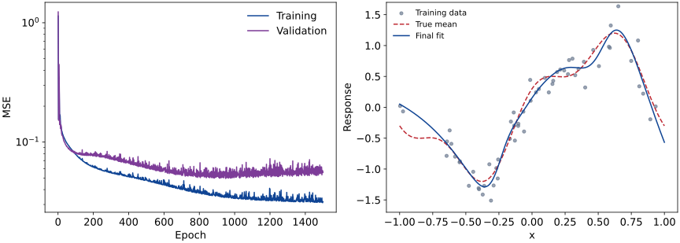{width=95%}

- The gradient uses half mean squared error; the plotted **MSE** omits the factor $1/2$.
- A falling training loss verifies progress on the fitted objective.
- Validation error measures performance on observations excluded from parameter updates.

::: {.notes}
Discuss whether remaining error could come from noise, model restrictions or
incomplete optimisation, and what additional evidence would distinguish them.
High losses on both subsets can have optimisation or capacity causes; a growing
gap suggests a different investigation. Avoid diagnosing solely from one curve.
:::

## A curved binary decision boundary

:::: {.columns}
::: {.column width="43%"}

For $X\sim\operatorname{Unif}([-1,1]^2)$, generate

$$\Pr(Y=1\mid X=x)=\operatorname{sigmoid}(12(\|x\|^2-0.5)).$$

- One hidden layer: 16 tanh units.
- Binary cross-entropy; full-batch Adam, learning rate $0.02$.
- 300 training and 150 validation observations; 1200 epochs.
- Select the epoch using validation cross-entropy.

:::
::: {.column width="57%"}

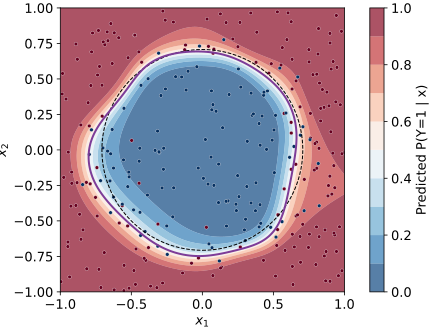{width=100% fig-alt="Fitted class probabilities for a two-dimensional classification problem. The purple curve is the fitted probability-one-half boundary; the dashed circle is the population boundary."}

:::
::::



::: {.notes}
Use this as a comparison with the regression example, or as a short discussion
exercise. Labels remain random near the population boundary, so perfect accuracy
is not expected. Reproduce with codes/nn_classification.py.
:::

## Exercise: batch size, stability and noise

::: {#exr-nn-training name="Batch size cannot fix an unstable step" block-style="6"}
For $J(\theta)=\tfrac\kappa2\theta^2$, $\kappa>0$, model a batch gradient by
$g_t=\kappa\theta_t+\xi_t$, where the $\xi_t$ are independent, centred, independent of $\theta_0$, and have variance $\sigma^2/b>0$.

1. Under $\theta_{t+1}=\theta_t-\eta g_t$, derive recursions for the mean and variance. Which step sizes make the mean tend to zero and the variance stay bounded for every deterministic initial value?
2. Derive the limiting variance and interpret its dependence on $b$ and $\eta$.
3. Assess the rule “multiply the learning rate by the batch-size factor”. Can a larger batch repair an unstable step? What changes if the budget is a fixed number of individual gradient evaluations?
:::

::: {.notes}
Allow 10 minutes. Put rho=1-eta*kappa. Then E theta_(t+1)=rho E theta_t and
V_(t+1)=rho^2 V_t+eta^2 sigma^2/b. Both requirements hold precisely for
0<eta*kappa<2, for positive eta and the stated nonzero noise variance.
At the endpoints, the mean need not converge and/or noise accumulates without bound.
The limiting variance is eta*sigma^2/[b*kappa*(2-eta*kappa)].
At fixed eta, more samples reduce the stochastic error floor, not the curvature
stability restriction. If eta=c*b, the variance becomes
c*sigma^2/[kappa*(2-c*b*kappa)]: it increases towards instability as b grows.
For small eta*kappa, keeping eta/b fixed approximately preserves the noise floor,
which helps explain the heuristic's limited range. With a budget N, only floor(N/b)
updates are possible, so a stationary comparison alone does not describe finite-budget error.
:::

# 4. Regularisation and generalisation {section-time="70"}

## Error on new observations

Let $(X,Y)$ be a fresh observation from the population of interest.

::: {#def-nn-population-risk name="Population risk"}
For a prediction rule $f$, its population risk is

$$R(f)=\mathbb E[\ell(Y,f(X))].$$
:::

- Empirical risk averages over the observed training sample.
- Population risk averages over new observations from the target distribution.
- A network can fit the training sample well and still have large population risk.

The [generalisation gap]{.purple} is $R(f_\theta)-\widehat R_n(\theta)$.
It need not be positive for every realised sample.

## Training, validation and test sets

| Subset | Use | Examples |
|:--|:--|:--|
| Training | Estimate parameters and preprocessing | Weights, biases, feature means |
| Validation | Choose modelling and training settings | Width, penalty, stopping epoch |
| Test | Evaluate the completed procedure | Final MSE or classification error |

- All three subsets should reflect the intended prediction problem.
- Repeated measurements from one subject should remain in the same subset when predicting for new subjects.
- Forecasting requires respecting time order.
- Repeatedly choosing models from test results turns the test set into a validation set.

::: {.notes}
Distinguish independent observations from independent rows in a file. The
new-person exercise makes the prediction target and dependence explicit.
:::

## Capacity and overfitting

A larger network can use more features to explain the training observations, including their noise.

:::: {.columns}
::: {.column width="43%"}

- **Underfitting:** restricted features or incomplete optimisation can leave both errors high.
- **Overfitting:** fitting details of the sample can worsen new-observation error.
- Parameter count alone does not determine generalisation.
- Architecture, data, optimisation and regularisation act together.

:::
::: {.column width="57%"}

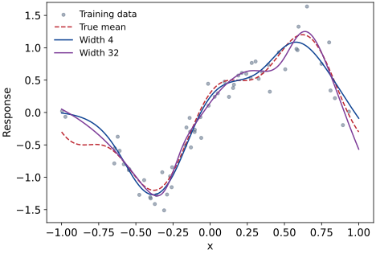{width=100%}

:::
::::

The curves show the last training epoch, without a weight penalty.

## Read learning curves carefully

- A persistent training–validation gap suggests that fitting the sample and predicting new observations differ.
- Both losses high: inspect optimisation as well as model capacity.
- Validation loss is noisy; one increase is weak evidence for a trend.
- Compare the same metric on both subsets, with the same inference behaviour.

::: {.box title="More data is a separate experiment"}
A loss-versus-epoch curve varies training time. A loss-versus-sample-size curve varies the amount of training data.
They answer different questions.
:::

::: {.notes}
Training loss containing a penalty cannot be directly compared with unpenalised
validation MSE. Point out that the selected epoch and selected architecture are
both data-dependent choices.
:::

## Penalise large weights

For $\lambda\geq0$, consider

::: {.eqbox title="L2 regularisation" colour="purple"}
$$J_\lambda(\theta)=\frac1n\sum_{i=1}^n\ell(y_i,f_\theta(x_i))
+\frac\lambda2\sum_{\ell=1}^{L+1}\|W^{(\ell)}\|_F^2.$$
:::

- $\|W\|_F^2$ is the sum of squared entries of $W$.
- Biases are unpenalised in this convention.
- The penalty discourages large weights; it does not directly count active neurons.
- Select $\lambda$ using validation performance.

For ordinary SGD, the weight update is
$W\leftarrow(1-\eta\lambda)W-\eta g_{\mathrm{data}}$.

With adaptive scaling, adding an L2 gradient and applying separate weight decay are generally different operations.

## Early stopping

1. Evaluate validation error after each epoch.
2. Save the parameters whenever validation error improves.
3. Stop after a chosen number of epochs without improvement (**patience**).
4. Restore the parameters with the smallest recorded validation error.

::: {.eqbox}
$$t_*\in\operatorname*{arg\,min}_{t\in\{1,\ldots,T\}}
\widehat R_{\mathrm{val}}(\theta_t).$$
:::

- Training time becomes a model-selection parameter.
- The selected validation error is optimistic because it was minimised over many checkpoints.
- An untouched test set assesses the selected procedure.

::: {.notes}
The accompanying experiment runs a fixed epoch budget and retrospectively selects
its best checkpoint. It demonstrates checkpoint selection, without a patience rule.
:::

## Dropout changes the training computation

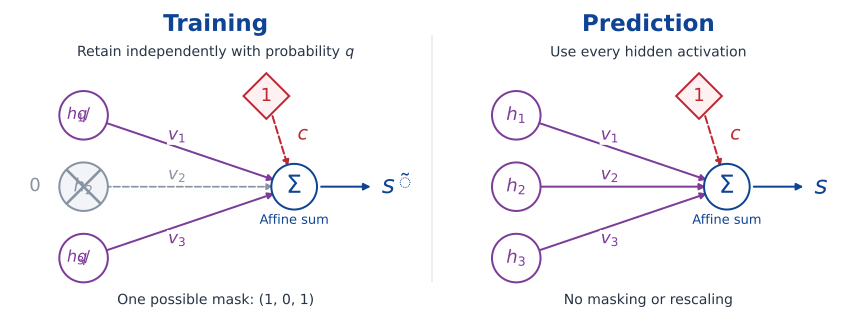{height=410px}

- **Training:** randomly suppress activations and rescale the retained ones by $1/q$.
- **Prediction:** use every activation at its ordinary scale.
- $q$ is the retention probability; the output intercept remains present in both computations.

::: {.notes}
The picture shows one possible mask, not a fixed pattern used on every observation.
The h values are the outputs of hidden activations, whatever their activation
functions. Dropout acts on those values; it is not another activation function.
The following slide states exactly which conditional mean is preserved.
:::

## Dropout: random hidden-unit masks

During training, let $M_j\sim\operatorname{Bernoulli}(q)$ independently, where $q\in(0,1]$ is the **retention probability**.

::: {.eqbox}
$$\widetilde h_j=\frac{M_j}{q}h_j,
\qquad \mathbb E[\widetilde h_j\mid h_j]=h_j.$$
:::

- Randomly mask hidden activations during each training evaluation.
- The factor $1/q$ preserves their conditional mean.
- At prediction time, use the unmasked activations $h_j$.
- Tune the dropout rate $1-q$ using validation data.

For a nonlinear downstream map $g$, generally
$\mathbb E[g(\widetilde h)]\ne g(\mathbb E[\widetilde h])$.
The deterministic prediction is not generally the exact average over masked networks.

::: {.notes}
Training and evaluation modes are different. The dropout exercise derives the
variance effect and explains why preserving an activation mean does not preserve
expected loss.
:::

## Exercise: what does dropout penalise?

::: {#exr-nn-dropout name="Dropout as a feature-dependent penalty" block-style="6"}
Fix $h\in\R^m$, $y\in\R$ and $s=c+v^\top h$. Let
$\widetilde s=c+\sum_j v_jM_jh_j/q$, where the $M_j$ are independent $\operatorname{Bernoulli}(q)$ variables, $0<q\leq1$.

1. Prove the identity

   $$\mathbb E_M\!\left[\tfrac12(\widetilde s-y)^2\right]
   =\tfrac12(s-y)^2+\frac{1-q}{2q}\sum_j v_j^2h_j^2.$$

2. Average over training observations with fixed hidden features. When does the additional term become an ordinary L2 penalty on $v$?
3. If the hidden features are also learned, is this still a fixed ridge penalty on the output weights? Explain what changes.
:::

::: {.notes}
Allow 8–10 minutes. Conditional on h,y and the parameters, E_M tilde_s=s.
The bias-variance identity and independent masks give
Var_M(tilde_s)=(1-q)/q * sum_j v_j^2 h_j^2, establishing the result.
Averaging yields a diagonal quadratic penalty with coefficient
(1-q)/(2q) times the empirical second moment of each feature. For q<1 it is
an ordinary common-coefficient L2 penalty if these moments are equal; q=1
removes the penalty. Zero feature moments yield zero penalty in that direction.
If hidden features depend on trainable parameters, those coefficients change
with the representation and their derivatives also contribute to training.
The identity remains exact pointwise, but does not reduce joint training to
ridge regression with fixed predictors. It uses an affine output and squared
loss; there is no corresponding quadratic expansion for arbitrary output maps
and losses. Connect this distinction with the model-versus-loss discussion.
:::

## Compare models using validation data

The regression experiment compares widths $4$ and $32$, with $\lambda=0$ or $0.01$.
Each candidate contributes its best validation checkpoint.



- Select the candidate with the smallest validation MSE.
- Evaluate only that selected candidate on the test set.
- Different samples and initialisations can change the ranking.

::: {.notes}
The model grid, epoch budget and seeds are fixed in the script. Test outcomes
are computed only after selection and do not enter the candidate comparison.
:::

## The selected checkpoint

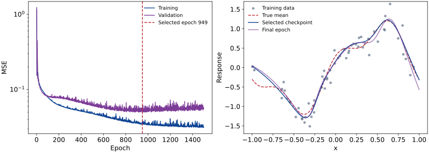{width=95%}

## Exercise: selection changes the reported error

::: {#exr-nn-checkpoint name="The cost of selecting a checkpoint" block-style="6"}
Condition on a training run producing $T$ fixed checkpoints, each with the same population risk $r$. On an independent validation set, their errors are $\widehat R_t=r+\varepsilon_t$, with $\mathbb E[\varepsilon_t]=0$.

1. Prove that $\mathbb E[\min_t\widehat R_t]\leq r$. Give a simple example with strict inequality. Must the errors be independent?
2. A researcher doubles the number of inspected checkpoints and obtains a smaller validation minimum. Does this establish improved prediction?
3. Let $t_*$ be selected by validation error. Explain why evaluation on an independent test set estimates $R(f_{t_*})$ without this selection bias.
:::

::: {.notes}
Allow 8–10 minutes. Assume the errors are integrable; no independence between
checkpoint errors is needed. Pointwise min_t Rhat_t <= Rhat_1, so expectations
give the bound. For two checkpoints take epsilon_1=Z, epsilon_2=-Z, with Z
uniform on {-a,a}, 0<a<r. Each estimate is unbiased but their minimum is r-a.
These perfectly dependent errors are also a valid illustration of strict bias.
Adding candidates cannot increase the realised minimum, even when all risks
remain exactly r. Lower selected validation error alone therefore proves nothing
about improvement in true risk. Conditional on training, validation and the selected
predictor, an independent identically distributed test sample has expected average
loss R(f_tstar). It still has sampling error; choosing again based on that test
set would reintroduce selection bias. Data-adaptive training checkpoints need a
more careful analysis; the fixed-candidate example already disproves the claim.
:::

## Exercise: prediction for new people

::: {#exr-nn-leakage name="The split defines the prediction problem" block-style="6"}
Suppose $Y_{ij}=A_i+\varepsilon_{ij}$ for person $i$ and measurement $j$.
All person effects and errors are independent and centred, with variances $\sigma_A^2$ and $\tau^2$. Only person identity is available as a predictor.

1. For a person with $m$ training measurements, predict a fresh measurement by their training mean. Derive its mean squared prediction error.
2. For a new person with no measurements, derive the minimum MSE of a constant prediction. When can a random split of rows give a misleading impression of performance on new people?
3. Design a splitting and model-selection procedure for the **new-person** target, including preprocessing, stopping epochs and final assessment.
:::

::: {.notes}
Allow 10 minutes. For an observed person, the prediction error is the mean of m
training errors minus a fresh independent error, so its MSE is tau^2(1+1/m).
For a new person the centred response has variance sigma_A^2+tau^2; the best
constant is zero. Their difference is sigma_A^2-tau^2/m, so row splitting can
look much better when between-person variation is large. It is not intrinsically
invalid: it addresses another target, prediction for already observed people.
For new people, split by person before fitting anything, keep all measurements
of a person together, fit preprocessing on training people only, select architecture
and stopping epoch with validation people, and assess on untouched test people.
For cross-validation, keep this grouping and refit preprocessing inside every fold.
If persons have unequal numbers of measurements, also specify whether the metric
weights persons or rows equally, according to the deployment target.
:::

# 5. Expressiveness and limitations {section-time="70"}

## A ReLU unit changes a slope

For a scalar input, $\operatorname{ReLU}(x-t)$ is zero below $t$ and has slope one above $t$.

::: {.eqbox}
$$g(x)=a+bx+\sum_{j=1}^m c_j\operatorname{ReLU}(x-t_j).$$
:::

For ordered knots $t_1<\cdots<t_m$:

- $b$ is the slope before the first knot.
- $c_j$ is the **change in slope** at $t_j$.
- $a$ fixes the vertical position.

The affine term can also be represented by ReLU units because
$x=\operatorname{ReLU}(x)-\operatorname{ReLU}(-x)$.

## Represent a linear interpolant

Let $a=t_0<t_1<\cdots<t_N=b$, with prescribed values $f(t_j)$.
Define the interval slopes

$$d_j=\frac{f(t_{j+1})-f(t_j)}{t_{j+1}-t_j},\qquad j=0,\ldots,N-1.$$

::: {#prp-nn-spline name="Linear interpolation with ReLU" block-style="2"}
The continuous linear interpolant on $[a,b]$ is

$$g(x)=f(a)+d_0(x-a)
+\sum_{j=1}^{N-1}(d_j-d_{j-1})\operatorname{ReLU}(x-t_j).$$
:::

On each interval, the slope changes telescope to the required $d_j$.
Thus a one-hidden-layer ReLU network can represent this interpolant exactly.

## More knots, smaller approximation error

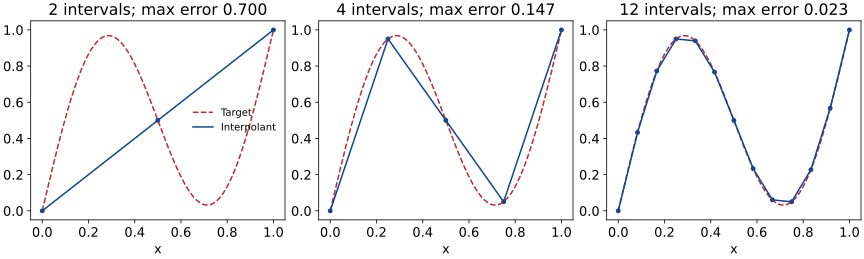{width=95%}

## Exercise: shape-constrained regression

::: {#exr-nn-interpolant name="Encode shape constraints in a network" block-style="6"}
For distinct ordered knots $t_1<\cdots<t_m$, consider

$$g(x)=a+bx+\sum_{j=1}^m c_j\operatorname{ReLU}(x-t_j).$$

Use this graphical criterion: a continuous piecewise-affine function is **convex** exactly when its slopes never decrease from left to right.

1. Find necessary and sufficient restrictions on $c_1,\ldots,c_m$ for $g$ to be convex.
2. Find necessary and sufficient inequalities on $b,c_1,\ldots,c_m$ for $g$ to be nondecreasing. Is convexity enough?
3. A convex function has nondecreasing consecutive secant slopes. Explain why its linear interpolant is convex. Would interpolating **noisy observations** preserve this property? How could fitting enforce it?
:::

::: {.notes}
Allow 10 minutes. The successive slopes are b, b+c_1, ..., b+sum c_j.
A continuous piecewise-affine function is convex exactly when these slopes are
nondecreasing; thus each slope change c_j must be nonnegative. Sufficiency also
follows from nonnegative sums of convex ReLU functions plus an affine function.
Nondecreasingness requires b+sum_(j<=k)c_j>=0 for every k=0,...,m, with empty sum
zero. Convexity alone does not suffice: g(x)=-x is convex and decreasing.
For convex f, the supplied secant-slope property means that the interpolant has
nonnegative slope changes. Noise can reverse the order of consecutive slopes:
even a constant target can give observations (0,0), (1,1), (2,0).
Restricting c_j>=0 during fitting imposes convexity globally, without requiring
exact interpolation; adding the prefix-slope inequalities imposes monotonicity.
These statements concern this ordered-hinge parametrisation. Unconstrained output
weights do not impose the desired shape. The affine term can be implemented with
two unrestricted ReLU units, as shown earlier.
:::

## An interpolation error bound {.scrollable}

Suppose the target satisfies the **Lipschitz condition** from Unit 1:

$$|f(x)-f(y)|\leq L|x-y|,\qquad x,y\in[a,b].$$

The output changes by at most $L$ times the change in input.

::: {#prp-nn-interpolation-bound name="Grid spacing controls interpolation error" block-style="2"}
If every grid interval has length at most $h$, the linear interpolant satisfies

$$|f(x)-g(x)|\leq\frac{Lh}{2}\qquad\text{for every }x\in[a,b].$$
:::

For a known $L>0$, choosing $h\leq2\varepsilon/L$ ensures error at most $\varepsilon$ everywhere on the interval.

::: {.proofbox title="The bound on one interval"}
For $x=(1-u)t_j+ut_{j+1}$, with $0\leq u\leq1$, the interpolant is
$g(x)=(1-u)f(t_j)+uf(t_{j+1})$. Write $\ell=t_{j+1}-t_j\leq h$. Then

$$\begin{aligned}
|f(x)-g(x)|
&\leq(1-u)|f(x)-f(t_j)|+u|f(x)-f(t_{j+1})|\\
&\leq(1-u)Lu\ell+uL(1-u)\ell\\
&=2Lu(1-u)\ell\leq Lh/2.
\end{aligned}$$

The last step uses $u(1-u)\leq1/4$.
:::

## Universal approximation on a bounded input box

::: {#thm-nn-universal name="Universal approximation by ReLU networks" block-style="2"}
Let $K=[a_1,b_1]\times\cdots\times[a_d,b_d]$ be a closed, bounded input box,
and let $f:K\to\R$ be continuous.
For every $\varepsilon>0$, there exist a finite $m$ and parameters such that

$$g(x)=c+\sum_{j=1}^m v_j\operatorname{ReLU}(w_j^\top x+b_j)$$

satisfies

$$|f(x)-g(x)|<\varepsilon\qquad\text{for every }x\in K.$$
:::

This is a special case of the nonpolynomial-activation result of
[Leshno, Lin, Pinkus and Schocken (1993)](https://pinkus.net.technion.ac.il/files/2021/02/neural.pdf).

The one-dimensional interpolation argument gives a constructive illustration; it is not a proof of the full multidimensional result.

## Read the quantifiers

- **For each target $f$ and tolerance $\varepsilon$:** a suitable network exists.
- **Finite width:** the required width may increase as the desired error decreases.
- **On $K$:** the error bound holds at every input in the chosen box; it gives no guarantee outside it.
- **Existence:** no training algorithm or sample size is specified.

## Exercise: average error and a sharp threshold

::::: {.columns}
:::: {.column width="62%"}
::: {#exr-nn-uat name="Approximation depends on the error metric" block-style="6"}
Let $X\sim\operatorname{Unif}[-1,1]$ and $f(x)=\mathbf1_{\{x\geq0\}}$.
The ramp $g_\delta$ agrees with $f$ outside $[-\delta,\delta]$, where $0<\delta<1$.

1. Construct the pictured ramp using **two ReLU units**. Specify the weights and intercepts.
2. Find $\mathbb E|f(X)-g_\delta(X)|$ using the shaded triangles. Does small average error guarantee small error at every input? Consider $x=0$.
3. How do the transition slope and your weights change when $\delta$ is halved? Does @thm-nn-universal apply to this target $f$?
:::
::::
:::: {.column width="38%"}
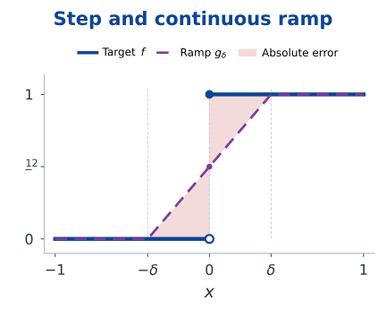{width=100% fig-alt="Blue step target and purple continuous ramp from zero at minus delta to one at delta. Two shaded triangles between them show the absolute error; the ramp equals one half at x=0."}
::::
:::::

::: {.notes}
Allow 10 minutes. Students need slopes, triangle areas and the uniform density 1/2.
Use g_delta(x)=[ReLU(x+delta)-ReLU(x-delta)]/(2*delta).
Choose input weights (1,1), hidden intercepts (delta,-delta), output weights
(1/(2*delta),-1/(2*delta)), and output intercept zero.
Each shaded triangle has base delta and height 1/2, so their combined area is
delta/2. Multiplying by the density 1/2 gives expected absolute error delta/4.
The average can therefore be made as small as desired by choosing delta,
but the error at x=0 remains 1/2. That single input has probability zero;
the picture also shows errors close to 1/2 on small neighbouring intervals.
The transition slope is 1/(2*delta). Halving delta doubles that slope and the
magnitudes of the output weights in this construction, while halving the hidden
intercept magnitudes. Other parametrisations can redistribute these changes.
The theorem requires a continuous target; the step has a jump, so it does not
apply. The exercise compares average and individual-input errors for this
explicit family, without asking for a theorem about all continuous approximants.
:::

## Depth can reuse a simple transformation

On $[0,1]$, define the tent map

$$T(x)=2\operatorname{ReLU}(x)-4\operatorname{ReLU}(x-1/2)
+2\operatorname{ReLU}(x-1).$$

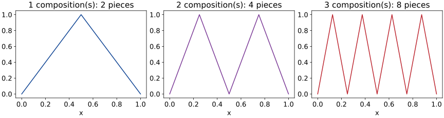{width=95%}

- $T^{\circ L}$ has $2^L$ affine pieces on $[0,1]$.
- Composition reuses the same small construction across $L$ hidden layers.
- A scalar-input network with one hidden layer and $m$ ReLU units has at most $m+1$ affine pieces.

::: {.notes}
The composition can be
implemented at width 3: the next layer applies the three affine arguments to
the previous layer's scalar linear combination. Adjacent segments have different
slopes, so exact shallow representation requires m >= 2^L-1. This is an exact
representation comparison for a particular function family, not a general learning theorem.
:::

## Expressiveness has costs

- More width or depth can increase the available representations.
- Greater depth can make gradient propagation and optimisation harder.
- A large function class can fit more sample noise.
- Approximation rates in several dimensions depend on regularity and structure.

For a uniform grid with $N$ intervals in each of $d$ coordinates, there are $(N+1)^d$ grid points.
An elementary grid construction can therefore become expensive as $d$ increases.

**Structure matters:** compositional targets can favour compositional architectures.

## Approximation, estimation and optimisation

Use squared loss $\ell(y,f(x))=\tfrac12(y-f(x))^2$, assume $\mathbb E[Y^2]<\infty$,
and let $f_*(x)=\mathbb E[Y\mid X=x]$.

::: {.eqbox}
$$R(f)-R(f_*)=\frac12\mathbb E[(f(X)-f_*(X))^2].$$
:::

For a fixed candidate class $\mathcal F$:

- **Approximation:** how close can functions in $\mathcal F$ get to $f_*$?
- **Estimation:** how accurately does the sample describe risks within $\mathcal F$?
- **Optimisation:** how closely does training minimise the empirical objective?

Even an exact representation of $f_*$ does not remove the irreducible noise $R(f_*)$.

## A bound separating the three difficulties

Suppose $\widetilde f\in\mathcal F$ satisfies
$\widehat R_n(\widetilde f)\leq\inf_{f\in\mathcal F}\widehat R_n(f)+\epsilon_{\rm opt}$.
Define

$$\Delta_n=\sup_{f\in\mathcal F}|R(f)-\widehat R_n(f)|.$$

Here $\inf$ describes the best risk level, possibly approached without being attained;
$\Delta_n$ is the smallest common upper bound on all these discrepancies, and may be infinite.

::: {#prp-nn-risk-bound name="An excess-risk bound" block-style="2"}
When the relevant risks and $\Delta_n$ are finite,

$$R(\widetilde f)-R(f_*)
\leq\underbrace{\inf_{f\in\mathcal F}R(f)-R(f_*)}_{\text{approximation}}
+\underbrace{2\Delta_n}_{\text{estimation control}}
+\underbrace{\epsilon_{\rm opt}}_{\text{optimisation}}.$$
:::

An unrestricted network class with unbounded squared loss need not have a useful finite $\Delta_n$.
Controlling the class and tails is part of a statistical argument.

::: {.notes}
This is an unpenalised empirical-risk statement; a penalised objective needs
a corresponding comparison including its penalty. The interpolation exercise
shows why finite uniform estimation control cannot be assumed for free.
:::

## Proof of the excess-risk bound

::: {.proofbox title="Compare with an arbitrary candidate"}
For any $f\in\mathcal F$,

$$\begin{aligned}
R(\widetilde f)
&\leq\widehat R_n(\widetilde f)+\Delta_n\\
&\leq\inf_{g\in\mathcal F}\widehat R_n(g)+\epsilon_{\rm opt}+\Delta_n\\
&\leq\widehat R_n(f)+\epsilon_{\rm opt}+\Delta_n\\
&\leq R(f)+\epsilon_{\rm opt}+2\Delta_n.
\end{aligned}$$

Take the infimum over $f\in\mathcal F$, then subtract $R(f_*)$.
The argument does not require the infimum to be attained.
:::

## Exercise: fitting every observation is not enough

::: {#exr-nn-error-sources name="Training loss cannot resolve an unobserved input" block-style="6"}
Let $Y=0$ and $X\in\{0,1,2\}$, with

$$\Pr(X=1)=p,\qquad\Pr(X=0)=\Pr(X=2)=\frac{1-p}{2},\qquad 0<p<1.$$

The realised training sample contains only inputs $0$ and $2$.
Let $T$ be the triangular network from @exr-nn-relu-tent and $f_H=HT$, for $H>0$.
Use loss $\ell(y,s)=\tfrac12(s-y)^2$.

1. Explain why the zero network and every $f_H$ minimise training loss. Can training loss distinguish them?
2. Compare their population risks. How large can the difference be as $H$ varies, even for small $p$?
3. Could better optimisation resolve this ambiguity? Suggest a parameter restriction or penalty that discourages large $H$. What would validation report if it also missed $X=1$?
:::

::: {.notes}
Allow 8–10 minutes. T is zero at 0 and 2 and equals one at 1.
Both the zero network and f_H have zero training loss, the smallest possible
squared loss. Their population risks are respectively 0 and p*H^2/2.
For any fixed p>0, the latter can exceed any specified amount by increasing H.
The problem is not approximation: the true zero regression function is available.
It is not failure to minimise training loss either: all these networks minimise it.
The sample contains no information at the input where the predictions differ.
In the notation of the preceding bound, the training/population risk discrepancy
has no finite common bound over this family, so Delta_n is infinite.
Bound all weights, or penalise their squared magnitudes: with fixed hidden units
the output weights are (H,-2H,H), whose squared sum is 6H^2. The all-zero network
fits equally well with no such penalty. A width bound alone does not solve this
example, since three hidden units suffice for every H.
A validation sample containing only 0 and 2 also gives all candidates zero loss.
For independent samples of n training and m validation inputs, the chance that
both samples miss 1 is (1-p)^(n+m); the stated training event is therefore possible.
This is a conditional example of missing coverage, not a claim that an optimiser
will choose a large H or that regularisation alone guarantees good prediction.
:::

# 6. Convolutional neural networks (optional) {section-time="70"}

## Images have spatial structure

A $28\times28$ greyscale image has $784$ pixel values.
A fully connected layer with $128$ hidden units has

$$784\times128+128=100\,480\quad\text{parameters}.$$

- Flattening preserves the pixel values but does not explicitly encode neighbourhoods.
- Local patterns can occur at many positions in an image.
- A convolutional layer applies the [same local rule]{.purple} at different positions.

::: {.box title="An architectural assumption"}
Nearby pixels and repeated local patterns are useful for prediction.
The architecture builds this assumption into its connections and shared weights.
:::

## A filter acting on a small patch

Consider an input array and a $2\times2$ filter:

$$X=\begin{pmatrix}1&2&0\\0&1&3\\2&1&0\end{pmatrix},\qquad
K=\begin{pmatrix}1&0\\0&-1\end{pmatrix}.$$

With unit stride, no padding and zero bias,

::: {.eqbox}
$$Z=\begin{pmatrix}
1-1&2-3\\0-1&1-0
\end{pmatrix}
=\begin{pmatrix}0&-1\\-1&1\end{pmatrix}.$$
:::

The same four filter weights are used at every output position.
An activation such as ReLU can then be applied to $Z$.

## Move the filter



The highlighted patch determines one output entry. Moving the patch changes the input values, while the filter weights remain fixed.

::: {.notes}
Use the supplied arithmetic to identify which coefficient is reused at
different positions. Discuss why sharing parameters changes the set of representable maps.
:::

## A convolutional layer with several channels

Let the input have $C_{\rm in}$ channels and use $C_{\rm out}$ filters of size $k_h\times k_w$.
For unit stride and no padding, using zero-based spatial indices,

::: {.eqbox}
$$z_{i,j,o}=b_o+
\sum_{c=1}^{C_{\rm in}}\sum_{u=0}^{k_h-1}\sum_{v=0}^{k_w-1}
K_{u,v,c,o}\,x_{i+u,j+v,c}.$$
:::

- Each output channel has its own filter and bias.
- A filter spans **all input channels**.
- Weights are shared across spatial positions, not across output channels.
- This unflipped operation is technically **cross-correlation**, conventionally called convolution in neural networks.

## Count the parameters

::: {.eqbox title="Convolutional parameters" colour="purple"}
$$\#\text{parameters}=C_{\rm out}(k_hk_wC_{\rm in}+1).$$
:::

For a $3\times3$ filter bank with one input channel and eight output channels:

$$8(3\times3\times1+1)=80.$$

- This count does not depend on image height or width.
- A larger image still requires more arithmetic and activation storage.
- Each bias is shared across all positions of its output channel.

## Padding and stride

- **Padding $p$:** add $p$ rows or columns on each side, often filled with zeros.
- **Stride $s$:** move the filter $s$ positions between evaluations.
- Assume no dilation and enough padded input for at least one filter placement.

::: {.eqbox title="Output height and width"}
$$H_{\rm out}=\left\lfloor\frac{H+2p_h-k_h}{s_h}\right\rfloor+1,
\qquad
W_{\rm out}=\left\lfloor\frac{W+2p_w-k_w}{s_w}\right\rfloor+1.$$
:::

For $H=W=28$, $k_h=k_w=3$, padding $1$ and stride $1$, the output remains $28\times28$.
With stride $2$, it becomes $14\times14$.

See [*Dive into Deep Learning*: padding and stride](https://d2l.ai/chapter_convolutional-neural-networks/padding-and-strides.html).

## Receptive fields grow through layers

A unit's **receptive field** is the set of input positions that can affect it.

- One $3\times3$ convolution with stride one sees a $3\times3$ patch.
- Two such layers see a $5\times5$ patch.
- Three see a $7\times7$ patch, away from boundaries.

For one spatial dimension, let $r_0=j_0=1$. With kernel size $k_\ell$, stride $s_\ell$ and no dilation,

::: {.eqbox}
$$r_\ell=r_{\ell-1}+(k_\ell-1)j_{\ell-1},
\qquad j_\ell=j_{\ell-1}s_\ell.$$
:::

$j_\ell$ is the distance in original-input coordinates between neighbouring layer-$\ell$ positions.

::: {.notes}
The formula gives the nominal receptive-field extent; boundary padding contains
no additional observed pixels. Distinguish receptive field from parameter count.
:::

## Pooling summarises a neighbourhood

A $2\times2$ max-pooling layer with stride $2$ maps

$$\begin{pmatrix}1&4&2&0\\3&2&1&5\\0&1&7&2\\2&3&4&1\end{pmatrix}
\quad\longmapsto\quad
\begin{pmatrix}4&5\\3&7\end{pmatrix}.$$

- Operates independently in each channel.
- Reduces spatial resolution and has no trainable weights.
- Average pooling uses the neighbourhood mean instead.
- Pooling discards information; small shifts can still change its output.

During backpropagation, max pooling routes a derivative to a selected maximising input; ties require a convention.

## A small image classifier

For a greyscale $28\times28$ image and ten classes:

| Layer | Output shape | Parameters |
|:--|:--|--:|
| Input | $28\times28\times1$ | $0$ |
| $3\times3$ convolution, 8 channels, padding 1; ReLU | $28\times28\times8$ | $80$ |
| $2\times2$ max pooling, stride 2 | $14\times14\times8$ | $0$ |
| $3\times3$ convolution, 16 channels, padding 1; ReLU | $14\times14\times16$ | $1168$ |
| $2\times2$ max pooling, stride 2 | $7\times7\times16$ | $0$ |
| Flatten | $784$ | $0$ |
| Affine scores for 10 classes | $10$ | $7850$ |

**Total:** $9098$ parameters. Fit the scores with softmax cross-entropy.
The final affine layer contains most of the parameters.

## Shared weights also share gradient contributions

For a filter coefficient, using the same unit-stride convention,

::: {.eqbox}
$$\frac{\partial\ell}{\partial K_{u,v,c,o}}
=\sum_{i,j}\frac{\partial\ell}{\partial z_{i,j,o}}\,x_{i+u,j+v,c}.$$
:::

- One coefficient affects many spatial outputs.
- The chain rule **adds** contributions from all those uses.
- Average over observations when the loss is a batch average.
- The same optimisers used for fully connected networks apply to these gradients.

::: {.notes}
Use the parameter counts to compare connectivity assumptions. Distinguish
reducing the number of parameters from reducing the number of computed activations.
:::

## A small convolutional experiment

Generate noisy $8\times8$ images containing a horizontal or vertical band at a random interior position.

- 200 training, 100 validation and 200 independent test images; noise standard deviation $0.3$.
- Four learned $3\times3$ filters, no padding, stride one; ReLU.
- Average each feature map over space; combine the four averages into one affine score.
- Binary cross-entropy; full-batch Adam at $0.02$ for 250 epochs; select by validation loss.

::: {.eqbox}
$$\#\text{parameters}=4(3\times3+1)+(4+1)=45.$$
:::

Both the filters and the output layer are trained. The executable NumPy example is in
[`codes/nn_classification.py`](codes/nn_classification.py).

## Predictions on synthetic images

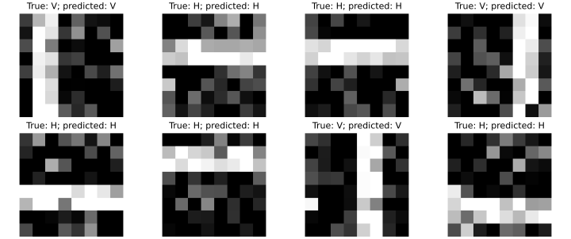{width=85%}



**H:** horizontal; **V:** vertical. Success on this task does not establish performance on natural images.

::: {.notes}
Use these results within the pooling/architecture discussion. Global averaging
preserves orientation evidence from the filters while discarding much location
information. Ask what would change if the target were the band position.
:::

## Equivariance is not invariance

- **Translation equivariance:** translating the input translates the feature map.
- **Translation invariance:** translating the input leaves the prediction unchanged.

On an infinite grid, a unit-stride convolution commutes with integer translations.
Finite boundaries and padding complicate this statement; striding restricts the compatible shifts.

Global spatial averaging can reduce sensitivity to position, but can also remove information needed for localisation.

::: {.box title="Choose structure to match the task"}
The location of a digit may be irrelevant for recognising it. The location of an abnormal region may be essential for finding it.
:::

::: {.notes}
A flatten-and-dense head is not inherently translation invariant. The following
exercise proves the relevant symmetry under explicit boundary assumptions and
constructs a counterexample for striding.
:::

## Exercise: symmetry can rule out the target

::: {#exr-nn-convolution name="What translation invariance makes impossible" block-style="6"}
On a circular signal of even length $n$, define $(Sx)_i=x_{i-1}$ and
$(Cx)_i=b+\sum_{u=0}^{k-1}K_u x_{i+u}$, with indices taken modulo $n$.

1. Prove that $C(Sx)=S(Cx)$ and that coordinatewise ReLU preserves this property.
2. Show that globally averaging these features makes any subsequent classifier invariant to $S$. Can it distinguish two translated copies whose labels depend on their locations?
3. Insert stride-two sampling **before** global averaging. Construct a counterexample to invariance under a one-position shift, even with circular boundaries.
:::

::: {.notes}
Allow 10–12 minutes. C(Sx)_i=b+sum K_u x_(i+u-1)=(Cx)_(i-1), and a
coordinatewise activation commutes with coordinate permutations. Composition
preserves equivariance; the average of a circularly shifted vector is unchanged.
A classifier depending only on those averages must assign translated copies
the same prediction. If labels vary along such an orbit, perfect classification
is impossible. This is a representational restriction, independent of optimisation.
For part 3, take C as the identity (k=1,K_0=1,b=0), a nonnegative unit impulse at
position zero, and retain positions 0,2,...,n-2. The averaged feature is 2/n;
a one-position shift moves the impulse to position one and the average becomes zero.
With these circular conventions a two-position shift remains compatible with
stride two. Boundaries have been made circular deliberately so they cannot explain
the counterexample. Extend the argument to several channels by averaging each separately.
:::

# Further reading

## References

- Christopher M. Bishop and Hugh Bishop, [*Deep Learning: Foundations and Concepts*](https://www.bishopbook.com/): neural-network models, learning and regularisation.
- Aston Zhang, Zachary C. Lipton, Mu Li and Alexander J. Smola, [*Dive into Deep Learning*](https://d2l.ai/): Chapters 5 (multilayer perceptrons), 7 (convolutional networks) and 12 (optimisation).
- Diederik P. Kingma and Jimmy Ba, [*Adam: A Method for Stochastic Optimization*](https://arxiv.org/abs/1412.6980): adaptive moment updates.
- Moshe Leshno, Vladimir Ya. Lin, Allan Pinkus and Shimon Schocken, [*Multilayer Feedforward Networks with a Nonpolynomial Activation Function Can Approximate Any Function*](https://pinkus.net.technion.ac.il/files/2021/02/neural.pdf): the general approximation theorem.
